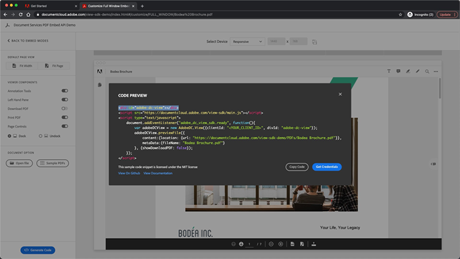

# Contrôlez l’expérience en ligne de votre PDF et collectez des analyses

Votre organisation publie-t-elle des mots de PDF sur votre site Web ? Découvrez comment utiliser l’API Adobe PDF Embed pour contrôler l’apparence, activer la collaboration et collecter des analyses sur la façon dont l’utilisateur interagit avec les PDF, y compris le temps passé sur une page et les recherches. Pour commencer ce tutoriel pratique en 4 parties, sélectionnez *Prise en main de l’API PDF Embed*.

<table style="table-layout:fixed">
<tr>
  <td>
    <a href="controlpdfexperience.md#part1">
        
    </a>
    <div>
    <a href="controlpdfexperience.md#part1"><strong>Première partie : prise en main de l’API PDF Embed</strong></a>
    </div>
  </td>
  <td>
    <a href="controlpdfexperience.md#part2">
        
    </a>
    <div>
    <a href="controlpdfexperience.md#part2"><strong>Partie 2 : ajout d’une API PDF Embed à une page web</strong></a>
    </div>
  </td>
  <td>
   <a href="controlpdfexperience.md#part3">
      
   </a>
    <div>
    <a href="controlpdfexperience.md#part3"><strong>Partie 3 : accès aux API Analytics</strong></a>
    </div>
  </td>
  <td>
   <a href="controlpdfexperience.md#part4">
      
   </a>
    <div>
    <a href="controlpdfexperience.md#part4"><strong>Partie 4 : ajout d’interactivité en fonction des événements</strong></a>
    </div>
  </td>
</tr>
</table>

## Partie 1 : Prise en main de l’API PDF Embed {#part1}

Dans la partie 1, découvrez comment commencer à utiliser tout ce dont vous avez besoin pour les parties 1 à 3. Vous allez commencer par obtenir des identifiants d’API.

**Ce dont vous avez besoin**

* Ressources de tutoriel [télécharger](https://github.com/benvanderberg/adobe-pdf-embed-api-tutorial)
* Adobe ID [en obtenir un ici](https://accounts.adobe.com/fr)
* Serveur Web (Nœud JS, PHP, etc.)
* Connaissances pratiques de HTML / JavaScript / CSS

**Ce que nous utilisons**

* Un serveur web de base (Nœud)
* Code Visual Studio
* GitHub

### Obtention des informations d’identification

1. Accédez au site web [Adobe.io](https://www.adobe.io/).
1. Cliquez sur **[!UICONTROL En savoir plus]** sous Créer des expériences de document attrayantes.

   

   Cela vous amène à la page d&#39;accueil [!DNL Adobe Acrobat Services].

1. Cliquez sur **[!UICONTROL Commencer]** dans la barre de navigation.

   Vous verrez une option dans **Commencer avec [!DNL Acrobat Services] API** pour **Créer de nouvelles informations d’identification** ou **Gérer les informations d’identification existantes**.

1. Cliquez sur le bouton **[!UICONTROL Commencer]** sous **[!UICONTROL Créer de nouvelles informations d&#39;identification]**.

   

1. Sélectionnez le bouton radio **[!UICONTROL API PDF Embed]** et ajoutez un nom d&#39;identification de votre choix et un domaine d&#39;application dans la fenêtre suivante.

   >[!NOTE]
   >
   >Ces informations d’identification ne peuvent être utilisées que sur le domaine d’application répertorié ici. Vous pouvez utiliser le domaine de votre choix.

   

1. Cliquez sur **[!UICONTROL Créer des informations d&#39;identification]**.

   La dernière page de l’Assistant vous fournit les informations d’identification du client. Laissez cette fenêtre ouverte afin de pouvoir y revenir et copier l’ID client (clé API) pour une utilisation ultérieure.

1. Cliquez sur **[!UICONTROL Afficher la documentation]** pour accéder à la documentation contenant des informations détaillées sur l&#39;utilisation de cette API.

   

## Partie 2 : Ajout d’une API PDF Embed à une page web {#part2}

Dans la deuxième partie, vous apprendrez à intégrer facilement l’API PDF Embed dans une page Web. Pour ce faire, vous utiliserez la démonstration en ligne de l’API Adobe PDF Embed pour créer votre code.

### Obtenir le code d’exercice

Nous avons créé du code que vous pouvez utiliser. Vous pouvez utiliser votre propre code, mais les démonstrations s’inscriront dans le contexte des ressources du tutoriel. Téléchargez l&#39;exemple de code [ici](https://github.com/benvanderberg/adobe-pdf-embed-api-tutorial).

1. Accédez au [[!DNL Adobe Acrobat Services] site web](https://www.adobe.io/apis/documentcloud/dcsdk/).

   ![Capture d&#39;écran du site web [!DNL Adobe Acrobat Services]](assets/ControlPDF_6.png)

1. Cliquez sur **[!UICONTROL API]** dans la barre de navigation, puis accédez à la page **[!UICONTROL API PDF Embed]** dans le lien déroulant.

   

1. Cliquez sur **[!UICONTROL Essayer la démonstration]**.

   Une nouvelle fenêtre apparaît avec le sandbox des développeurs pour l’API PDF Embed.

   

   Vous pouvez voir ici les options des différents modes d’affichage.

1. Cliquez sur les différents modes d’affichage pour Fenêtre entière, Conteneur dimensionné, En ligne et Lightbox.

   

1. Cliquez sur le mode d&#39;affichage **[!UICONTROL Fenêtre entière]**, puis sur le bouton **[!UICONTROL Personnaliser]** pour activer et désactiver les options.

   

1. Désactivez l&#39;option de PDF **[!UICONTROL Télécharger]**.
1. Cliquez sur le bouton **[!UICONTROL Générer du code]** pour afficher l&#39;aperçu du code.
1. Copiez l&#39;**[!UICONTROL ID client]** à partir de la fenêtre Informations d&#39;identification du client de la partie 1.

   

1. Ouvrez le fichier **[!UICONTROL Web]** -> **[!UICONTROL resources]** -> **[!UICONTROL js]** -> **[!UICONTROL dc-config.js]** dans votre éditeur de code.

   Vous verrez que la variable clientID est là.

1. Collez vos informations d’identification client entre les guillemets doubles pour définir l’ID client sur vos informations d’identification.

1. Revenez à l’aperçu du code sandbox développeur.

1. Copiez la deuxième ligne contenant le script d’Adobe :

   ```
   <script src=https://documentccloud.adobe.com/view-sdk/main.js></script>
   ```

   

1. Accédez à votre éditeur de code et ouvrez le fichier **[!UICONTROL Web]** -> **[!UICONTROL exercice]** -> **[!UICONTROL index.html]**.

1. Collez le code de script dans le `<head>` du fichier, ligne 18, sous le commentaire suivant : **TODO : EXERCICE 1 : INSERT EMBED API SCRIPT TAG**.

   

1. Revenez à l’aperçu du code sandbox développeur et copiez la première ligne de code contenant :

   ```
   <div id="adobe-dc-view"></div>
   ```

   

1. Accédez à votre éditeur de code et ouvrez le fichier **[!UICONTROL Web]** -> **[!UICONTROL exercice]** -> **[!UICONTROL index.html]**.

1. Collez le code `<div>` dans le `<body>` du fichier à la ligne 67 sous le commentaire **TODO : EXERCICE 1 : INSERT PDF EMBED API CODE**.

   

1. Revenez à l’aperçu du code sandbox développeur et copiez les lignes de code pour `<script>` ci-dessous :

   ```
   <script type="text/javascript">
       document.addEventListener("adobe_dc_view_sdk.ready",             function(){ 
           var adobeDCView = new AdobeDC.View({clientId:                     "<YOUR_CLIENT_ID>", divId: "adobe-dc-view"});
           adobeDCView.previewFile({
               content:{location: {url: "https://documentcloud.                adobe.com/view-sdk-demo/PDFs/Bodea Brochure.                    pdf"}},
               metaData:{fileName: "Bodea Brochure.pdf"}
           }, {showDownloadPDF: false});
       });
   </script>
   ```

1. Accédez à votre éditeur de code et ouvrez le fichier **[!UICONTROL Web]** -> **[!UICONTROL exercice]** -> **[!UICONTROL index.html]**.

1. Collez le code `<script>` dans `<body>` du fichier à la ligne 68 sous la balise `<div>`.

1. Modifiez la ligne 70 du même fichier **index.html** pour inclure la variable clientID créée précédemment.

   

1. Modifiez la ligne 72 du même fichier **index.html** pour mettre à jour l&#39;emplacement du fichier du PDF afin d&#39;utiliser un fichier local.

   Il en existe un dans les fichiers du tutoriel de **/resources/pdfs/whitepaper.pdf**.

1. Enregistrez vos fichiers modifiés et prévisualisez votre site Web en accédant à **`<your domain>`/Summit21/web/exercice/**.

   Le rendu du livre blanc technique doit s’afficher en mode Fenêtre complète dans votre navigateur.

## Partie 3 : Accès aux API Analytics {#part3}

Maintenant que vous avez réussi à créer une page web avec l’API PDF Embed qui restitue un PDF, dans la troisième partie, vous pouvez maintenant découvrir comment utiliser les événements JavaScript pour mesurer les analyses et comprendre comment les utilisateurs utilisent les PDF.

### Recherche de documentation

De nombreux événements JavaScript différents sont disponibles dans le cadre de l’API PDF Embed. Vous pouvez y accéder depuis la documentation [!DNL Adobe Acrobat Services].

1. Accédez au site [documentation](https://www.adobe.io/apis/documentcloud/dcsdk/docs.html).
1. Passez en revue les différents types d’événements disponibles dans le cadre de l’API. Ils sont utiles pour référence et seront également utiles pour vos projets futurs.

   

1. Copiez l’exemple de code répertorié sur le site web.

   Utilisez-le comme base de votre code et modifiez-le.

   

   ```
   const eventOptions = {
     //Pass the PDF analytics events to receive.
      //If no event is passed in listenOn, then all PDF         analytics events will be received.
   listenOn: [ AdobeDC.View.Enum.PDFAnalyticsEvents.    PAGE_VIEW, AdobeDC.View.Enum.PDFAnalyticsEvents.DOCUMENT_DOWNLOAD],
     enablePDFAnalytics: true
   }
   
   
   adobeDCView.registerCallback(
     AdobeDC.View.Enum.CallbackType.EVENT_LISTENER,
     function(event) {
       console.log("Type " + event.type);
       console.log("Data " + event.data);
     }, eventOptions
   );
   ```

1. Recherchez la section de code que vous avez ajoutée précédemment et qui ressemble au code ci-dessous, puis ajoutez le code ci-dessus après ce code dans **index.html** :

   

1. Chargez la page dans votre navigateur web et ouvrez la console pour afficher les sorties des différents événements de la console lorsque vous interagissez avec la visionneuse du PDF.

   

   

### Ajouter un commutateur pour capturer des événements

Maintenant que les événements sont sortis sur console.log, modifions le comportement en fonction de quels événements. Pour ce faire, vous allez utiliser un exemple de commutateur.

1. Accédez à **snippets/eventsSwitch.js** et copiez le contenu du fichier dans le code du tutoriel.

   

1. Collez le code dans la fonction d&#39;écouteur d&#39;événement.

   

1. Vérifiez que la console sort correctement lorsque la page est chargée et que vous interagissez avec la visionneuse du PDF.

### Adobe Analytics

Si vous souhaitez ajouter la prise en charge d’Adobe Analytics à votre visionneuse, vous pouvez suivre les instructions fournies sur le site web.

>[!IMPORTANT]
>
>Adobe Analytics doit déjà être chargé sur votre page Web dans l’en-tête.

Accédez à la [documentation Adobe Analytics](https://www.adobe.com/devnet-docs/dcsdk_io/viewSDK/howtodata.html#adobe-analytics) et vérifiez si Adobe Analytics est déjà activé sur votre page Web. Suivez les instructions pour configurer une suite de rapports.

### Google Analytics


L’API Adobe PDF Embed fournit une intégration prête à l’emploi avec Adobe Analytics. Cependant, comme tous les événements sont disponibles en tant qu’événements JavaScript, il est possible de les intégrer à Google Analytics en capturant les événements de PDF et en utilisant la fonction ga() pour ajouter l’événement à Adobe Analytics.

1. Accédez à **snippets/eventsSwitchGA.js** pour voir comment procéder à l&#39;intégration avec Google Analytics.
1. Passez en revue et utilisez ce code comme exemple si votre page web est suivie à l’aide d’Adobe Analytics et qu’elle est déjà incorporée à la page web.

   

## Partie 4 : Ajout d’interactivité en fonction des événements {#part4}

Dans la quatrième partie, vous apprendrez à superposer sur le visualiseur de votre PDF un paywall qui s&#39;affiche une fois que vous avez dépassé la deuxième page.

### Exemple de paywall

Accédez à cet [exemple de PDF derrière un paywall](https://www3.technologyevaluation.com/research/white-paper/the-forrester-wave-digital-decisioning-platforms-q4-2020.html). Dans cet exemple, vous apprendrez à ajouter de l’interactivité à une expérience de visionnage dans un PDF.

### Ajouter un code paywall

1. Accédez à snippets/paywallCode.html et copiez le contenu.
1. Recherchez `<!-- TODO: EXERCISE 3: INSERT PAYWALL CODE -->` dans exercise/index.html.

   

1. Collez le code copié après le commentaire.
1. Accédez à **snippets/paywallCode.js** et copiez le contenu.

   

1. Collez le code à cet emplacement.

### Essayer la démonstration avec Paywall

Vous pouvez maintenant voir la démonstration.

1. Rechargez **index.html** sur votre site Web.
1. Faites défiler la page vers le bas jusqu’à > 2.
1. Affichez la boîte de dialogue qui s’affiche pour demander à l’utilisateur de répondre après la deuxième page.

   

## Autres ressources

Des ressources supplémentaires sont disponibles [ici](https://www.adobe.io/apis/documentcloud/dcsdk/docs.html).
