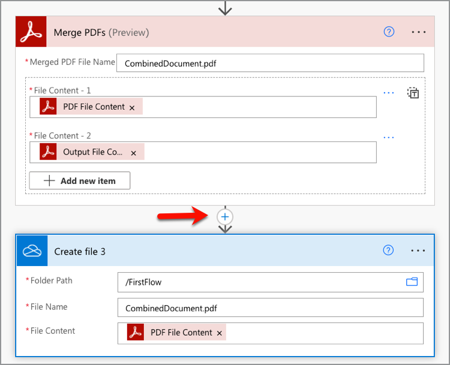

# Création de votre premier flux dans Microsoft Power Automate

Découvrez comment créer votre premier flux dans [Microsoft Power Automate](https://flow.microsoft.com/fr-fr/) à l&#39;aide du connecteur [Adobe PDF Services](https://us.flow.microsoft.com/en-us/connectors/shared_adobepdftools/adobe-pdf-services/).

Dans ce tutoriel pratique, découvrez comment :

* Convertir des documents Word en PDF
* Combinaison de documents PDF dans un seul PDF
* Protect d’un document avec mot de PDF

## Préparation

### Ce dont vous avez besoin

* **Informations d’identification de la version d’essai ou de production pour Adobe PDF Services**
En savoir plus sur l&#39;obtention et la configuration des informations d&#39;identification dans Microsoft Power Automate [ici](https://experienceleague.adobe.com/fr/docs/acrobat-services-learn/tutorials/pdfservices/getting-credentials-power-automate).
* **Microsoft Power Automate avec connecteurs Premium**
Découvrez comment vérifier le niveau de licence de Power Automate [ici](https://docs.microsoft.com/en-us/power-platform/admin/power-automate-licensing/types).
* **OneDrive**
Le connecteur de stockage OneDrive est utilisé dans ce tutoriel, mais vous pouvez le remplacer par n’importe quel connecteur de stockage.

### Fichiers exemples

Il existe deux [exemples de fichiers](assets/sample-assets.zip) que vous devez décompresser et charger sur OneDrive :

* WordDocument01.docx
* WordDocument02.docx

### Obtention des informations d’identification

Pour terminer ce tutoriel, vous devez disposer des informations d’identification déjà configurées dans Microsoft Power Automate pour Adobe PDF Services. Si vous n&#39;avez pas terminé cette étape, consultez les [instructions ici](https://experienceleague.adobe.com/fr/docs/acrobat-services-learn/tutorials/pdfservices/getting-credentials-power-automate).

## Partie 1 : Création d’un nouvel enchaînement et conversion de Word en PDF

### Création du flux

Dans cette partie, vous allez créer un flux dans [Microsoft Power Automate](https://flow.microsoft.com/fr-fr/) à l&#39;aide d&#39;un flux instantané, ajouter des paramètres, obtenir vos fichiers à partir de OneDrive et les convertir en PDF.

1. Accédez à [Microsoft Power Automate](https://flow.microsoft.com/fr-fr/) et connectez-vous avec vos identifiants.
1. Dans la barre latérale, sélectionnez **[!UICONTROL Créer]**.

   

1. Sélectionnez **[!UICONTROL Flux instantané]**.
1. Donnez un nom à votre flux.
1. Sous *Choisir comment déclencher ce flux*, sélectionnez **[!UICONTROL Déclencher manuellement un flux]**.
1. Sélectionnez **[!UICONTROL Créer]**.

### Obtenir le contenu des fichiers

Ensuite, récupérez le contenu des fichiers d’exemple.

>[!PREREQUISITES]
>
>Si vous n&#39;avez pas chargé les [fichiers d&#39;exemple](assets/sample-assets.zip) dans OneDrive, décompressez-les et chargez-les.


1. Dans [Power Automate](https://flow.microsoft.com/fr-fr/), sélectionnez **[!UICONTROL + Nouvelle étape]**.
1. Recherchez *OneDrive* dans la barre de recherche.
1. Sélectionnez votre compte OneDrive professionnel **ou**&#x200B;[!UICONTROL &#x200B; OneDrive &#x200B;]&#x200B;**pour choisir votre compte OneDrive professionnel ou personnel.**
1. Recherchez *Obtenir le contenu du fichier* dans la barre de recherche.
1. Dans le champ **[!UICONTROL Fichier]**, sélectionnez l’icône Dossier pour accéder au fichier *WordDocument01.docx* dans OneDrive.

   

### Convertir le fichier en PDF

Maintenant que vous disposez du contenu du fichier, vous pouvez convertir le document en PDF.

1. Dans [Power Automate](https://flow.microsoft.com/fr-fr/), sélectionnez **[!UICONTROL + Nouvelle étape]**.
1. Recherchez *Adobe PDF Services* dans la barre de recherche.
1. Sélectionnez **[!UICONTROL Services Adobe PDF]**.
1. Recherchez *Convertir Word en PDF* dans la barre de recherche.
1. Dans **[!UICONTROL Nom de fichier]**, nommez votre fichier comme souhaité, mais il doit se terminer par *.docx*. Cette extension est nécessaire pour convertir des documents Word en PDF.
1. Placez votre curseur dans le champ **[!UICONTROL Contenu du fichier]**.
1. À l&#39;aide du panneau **[!UICONTROL Contenu dynamique]**, sélectionnez **[!UICONTROL Contenu du fichier]**.

   

### Enregistrement du fichier dans OneDrive

Une fois le document généré, enregistrez à nouveau le fichier dans OneDrive.

1. Dans [Microsoft Power Automate](https://flow.microsoft.com/fr-fr/), sélectionnez **[!UICONTROL + Nouvelle étape]**.
1. Recherchez *OneDrive* dans la barre de recherche.
1. Sélectionnez votre compte OneDrive professionnel **ou**&#x200B;[!UICONTROL &#x200B; OneDrive &#x200B;]&#x200B;**pour choisir votre compte OneDrive professionnel ou personnel.**
1. Recherchez *Obtenir le contenu du fichier* dans la barre de recherche.
1. Recherchez *Créer un fichier* dans la barre de recherche.
1. Sélectionnez **[!UICONTROL Créer un fichier]**.
1. Dans le champ **[!UICONTROL Chemin du dossier]**, sélectionnez l&#39;icône de dossier pour spécifier où enregistrer le fichier dans OneDrive.
1. Dans **[!UICONTROL Nom de fichier]**, nommez votre fichier comme souhaité, mais il doit se terminer par *.docx*. Cette extension est nécessaire pour convertir des documents Word en PDF.
1. Dans le champ **[!UICONTROL Contenu du fichier]**, utilisez le panneau **[!UICONTROL Contenu dynamique]** pour insérer la variable Contenu du fichier du PDF.

### Essayer le flux

1. En haut à gauche, sélectionnez **[!UICONTROL Sans titre]** pour renommer l&#39;enchaînement.
1. Sélectionnez **[!UICONTROL Enregistrer]**.
1. Sélectionnez **[!UICONTROL Test]**.
1. Sélectionnez **[!UICONTROL Manuellement]**, puis **[!UICONTROL Enregistrer et tester]**.
1. Sélectionnez **[!UICONTROL Continuer]**.
1. Sélectionnez **[!UICONTROL Flux d&#39;exécution]**.

Dans le dossier OneDrive, vous devriez maintenant voir le PDF converti.


## Partie 2 : Génération d’un document dynamique à partir d’un modèle

Cette partie s&#39;appuie sur la partie 1 et utilise le modèle *Générer le document à partir de Word* pour fusionner dynamiquement les données dans votre document.

### Révision du modèle de document

Ouvrez *WordDocument02_.docx* à partir de vos fichiers d&#39;exemple dans OneDrive. Le document Word contient plusieurs balises de texte différentes qui représentent les emplacements où les données sont renseignées dans le document.

### Ajouter des paramètres au déclencheur

Pour que des données dynamiques soient insérées dans le document, vous devez créer quelques paramètres pour que le déclencheur demande des valeurs.

1. Lors de la modification de votre flux, sélectionnez **[!UICONTROL Déclencher manuellement un flux]** pour développer l’action.
1. Sélectionnez **[!UICONTROL Ajouter une entrée]**.
1. Sélectionnez **[!UICONTROL Texte]**.
1. Nommez le champ *Prénom*.

Répétez les étapes 2 à 4 pour ajouter les champs suivants :

* Nom
* Salaire


### Obtention du contenu d’un fichier de modèle

Pour générer un document, vous devez d’abord obtenir le contenu du fichier du modèle Word.

1. Dans Power Automate, sélectionnez + **[!UICONTROL Nouvelle étape]**.
1. Recherchez *OneDrive* dans la barre de recherche.
1. Sélectionnez votre compte OneDrive professionnel **ou**&#x200B;[!UICONTROL &#x200B; OneDrive &#x200B;]&#x200B;**pour choisir votre compte OneDrive professionnel ou personnel.**
1. Recherchez *Obtenir le contenu du fichier* dans la barre de recherche.
1. Dans le champ **[!UICONTROL Fichier]**, sélectionnez l’icône Dossier pour accéder au fichier *WordDocument02.docx* dans OneDrive.


### Générer un document à partir d’un modèle

1. Dans Power Automate, sélectionnez **[!UICONTROL + Nouvelle étape]**.
1. Recherchez *Adobe PDF Services* dans la barre de recherche.
1. Sélectionnez **[!UICONTROL Services Adobe PDF]**.
1. Sélectionnez l&#39;action **[!UICONTROL Générer le document à partir du modèle Word]** .
1. Dans le champ **[!UICONTROL Nom du fichier de modèle]**, nommez votre fichier comme souhaité, mais il doit se terminer par *.docx*.

#### Fusionner les données

À l&#39;aide de l&#39;action *Générer le document à partir du modèle Word*, vous pouvez fusionner des données dans votre document à partir de l&#39;une des différentes variables précédemment dans l&#39;enchaînement à l&#39;aide du contenu dynamique.

Copiez les données JSON ci-dessous dans le champ **Fusionner les données** :

```
{
    "FirstName": "",
    "LastName": "",
    "Salary": ""
}
```

1. Placez votre curseur dans le champ entre les deux guillemets pour la valeur *FirstName*.
1. À l&#39;aide du panneau **[!UICONTROL Contenu dynamique]**, insérez la valeur *Prénom* à partir du déclencheur manuel d&#39;une action de flux.

   

1. Répétez les étapes 7 à 8 pour les champs **[!UICONTROL Nom]** et **[!UICONTROL Salaire]**.
1. Dans le champ **[!UICONTROL Contenu du fichier modèle]**, utilisez le panneau **[!UICONTROL Contenu dynamique]** pour insérer la valeur **[!UICONTROL Contenu de fichier]** à partir de l&#39;étape *Obtenir le contenu du fichier*.


>[!TIP]
>
>L&#39;action *Générer le document à partir du modèle Word* utilise l&#39;API Adobe Document Generation. Pour en savoir plus sur la création de modèles, voici quelques ressources :
>
>* [En savoir plus sur Adobe Document Generation](https://developer.adobe.com/document-services/apis/doc-generation/)
>* Baliseur de génération de document [Adobe pour Microsoft Word](https://appsource.microsoft.com/en-US/product/office/WA200002654)
>* [Documentation API Adobe Document Generation](https://developer.adobe.com/document-services/docs/overview/document-generation-api/)

### Enregistrement du fichier dans OneDrive

Une fois le document généré, vous pouvez réenregistrer le fichier dans OneDrive.

1. Dans Power Automate, sélectionnez **+ [!UICONTROL Nouvelle étape]**.
1. Recherchez *OneDrive* dans la barre de recherche.
1. Sélectionnez votre compte OneDrive professionnel **ou**&#x200B;[!UICONTROL &#x200B; OneDrive &#x200B;]&#x200B;**pour choisir votre compte OneDrive professionnel ou personnel.**
1. Recherchez *Créer un fichier* dans la barre de recherche.
1. Sélectionnez **[!UICONTROL Créer un fichier]**.
1. Dans le champ **[!UICONTROL Chemin du dossier]**, sélectionnez l&#39;icône de dossier pour spécifier où enregistrer le fichier dans OneDrive.
1. Dans le champ **[!UICONTROL Nom de fichier]**, définissez le nom du fichier. Étant donné que la sortie est un PDF, votre nom de fichier doit se terminer par l’extension .pdf.
1. Utilisez le panneau **[!UICONTROL Contenu dynamique]** pour insérer la variable Contenu du fichier du PDF dans le champ **[!UICONTROL Contenu du fichier]**.

### Essayer le flux


1. Sélectionnez **[!UICONTROL Enregistrer]**.
1. Sélectionnez **[!UICONTROL Test]**.
1. Sélectionnez **[!UICONTROL Manuellement]**, puis **[!UICONTROL Enregistrer et tester]**.
1. Sélectionnez **[!UICONTROL Continuer]**.
1. Saisissez des valeurs pour *Prénom*, *Nom* et *Salaire*.
1. Sélectionnez **[!UICONTROL Flux d&#39;exécution]**.

Dans le dossier OneDrive, vous voyez maintenant un PDF généré à partir du document Word. Lorsque vous ouvrez le document du PDF dans OneDrive, vous constatez que les données sont fusionnées dans les emplacements des balises de texte.


## Partie 3 : Combiner le PDF en un seul

Maintenant que vous avez généré et converti un document Word en PDF, la partie suivante consiste à regrouper plusieurs documents PDF.

>[!NOTE]
>
>Lors des actions précédentes, vous avez enregistré une copie du document en tant que fichier dans OneDrive. Pour utiliser des outils tels que Fusionner les PDF, vous n’avez pas besoin d’enregistrer le fichier dans OneDrive. Au lieu de cela, vous pouvez transmettre la sortie directement d’une action à l’autre, ce qui est préférable à un enregistrement dans OneDrive après chaque action. Toutefois, à des fins de démonstration, vous enregistrez ces fichiers dans OneDrive.

### Ajout d’une étape de PDF de fusion

1. Lors de la modification de votre flux, sélectionnez **[!UICONTROL + Étape suivante]** pour ajouter une action à la fin de votre flux.
1. Recherchez *Adobe PDF Services* dans la barre de recherche.
1. Sélectionnez **[!UICONTROL Services Adobe PDF]**.
1. Sélectionnez l&#39;action **[!UICONTROL Fusionner les PDF]**.
1. Dans le champ **[!UICONTROL Nom du fichier du PDF de fusion]**, saisissez le nom de fichier souhaité (c&#39;est-à-dire *CombinedDocument.pdf*).
1. Dans le champ **[!UICONTROL Contenu du fichier -1]**, utilisez le panneau **[!UICONTROL Contenu dynamique]** pour insérer la valeur *Contenu du fichier PDF* à partir de l&#39;étape **[!UICONTROL Convertir Word en PDF]**.
1. Pour ajouter le document suivant, sélectionnez **+ [!UICONTROL ajouter un nouvel élément]**.
1. Dans le champ **[!UICONTROL Contenu du fichier - 2]**, utilisez le panneau **[!UICONTROL Contenu dynamique]** pour insérer la valeur **[!UICONTROL Contenu du fichier de sortie]** à partir de l&#39;étape *Générer le document à partir du modèle Word*.


### Enregistrer le PDF fusionné dans OneDrive

Une fois le document combiné, vous pouvez le réenregistrer dans OneDrive.

1. Dans Power Automate, sélectionnez **+ [!UICONTROL Nouvelle étape]**.
1. Recherchez *OneDrive* dans la barre de recherche.
1. Sélectionnez votre compte OneDrive professionnel **ou**&#x200B;[!UICONTROL &#x200B; OneDrive &#x200B;]&#x200B;**pour choisir votre compte OneDrive professionnel ou personnel.**
1. Recherchez *Créer un fichier* dans la barre de recherche.
1. Sélectionnez **[!UICONTROL Créer un fichier]**.
1. Dans le champ **[!UICONTROL Chemin du dossier]**, sélectionnez l&#39;icône de dossier pour spécifier où enregistrer le fichier dans OneDrive.
1. Dans le champ **[!UICONTROL Nom de fichier]**, définissez le nom du fichier. Étant donné que la sortie est un PDF, votre nom de fichier doit se terminer par .pdf.
1. Dans le champ **[!UICONTROL Contenu du fichier]**, utilisez le panneau **[!UICONTROL Contenu dynamique]** pour insérer la valeur *Contenu du fichier de PDF* à partir de l&#39;étape **[!UICONTROL Fusionner les PDF]**.

   

### Essayer le flux

1. Sélectionnez **[!UICONTROL Enregistrer]**.
1. Sélectionnez **[!UICONTROL Test]**.
1. Sélectionnez **[!UICONTROL Manuellement]**, puis **[!UICONTROL Enregistrer et tester]**.
1. Sélectionnez **[!UICONTROL Continuer]**.
1. Saisissez des valeurs pour *Prénom*, *Nom* et *Salaire*.
1. Sélectionnez **[!UICONTROL Flux d&#39;exécution]**.

Dans le dossier OneDrive, le PDF associé aux pages des premier et deuxième documents s’affiche.

## Partie 4 : document Protect PDF

Après avoir généré votre document, vous pouvez le protéger contre les modifications en incluant une étape supplémentaire avant l’enregistrement dans OneDrive.

### Protéger un PDF

1. Lors de la modification de votre flux dans Power Automate, sélectionnez **+** entre l’action **[!UICONTROL Fusionner les PDF]** et l’action **[!UICONTROL Créer un fichier 3]**.

   

1. Sélectionnez **[!UICONTROL Ajouter une action]**.
1. Recherchez *Adobe PDF Services* dans la barre de recherche.
1. Sélectionnez **[!UICONTROL Services Adobe PDF]**.
1. Sélectionnez l&#39;action **[!UICONTROL Protect PDF dans Affichage]**.
1. Dans le champ **[!UICONTROL Nom de fichier]**, définissez le nom sur le nom souhaité, à condition qu&#39;il se termine par une extension .pdf.
1. Définissez le champ **[!UICONTROL Mot de passe]** sur le mot de passe spécifié pour ouvrir le document.
1. Dans le champ **[!UICONTROL Contenu du fichier]**, utilisez le panneau **[!UICONTROL Contenu dynamique]** pour insérer la valeur *Contenu du fichier de PDF* à partir de l&#39;étape **[!UICONTROL Fusionner les PDF]**.

### Mettre à jour l’enregistrement dans OneDrive

Une fois le document protégé, vous pouvez réenregistrer le fichier dans OneDrive. Dans cet exemple, vous mettez à jour l&#39;action préexistante **Créer un fichier 3** avec une nouvelle valeur *Contenu du fichier*.

1. Sélectionnez votre curseur dans le champ **[!UICONTROL Contenu du fichier]** dans l&#39;action **[!UICONTROL Créer un fichier 3]**.
1. Utilisez le panneau **[!UICONTROL Contenu dynamique]** pour insérer la valeur *Contenu du fichier de PDF* à partir de l&#39;étape **Affichage du PDF Protect**.

### Essayer le flux

1. Sélectionnez **[!UICONTROL Enregistrer]**.
1. Sélectionnez **[!UICONTROL Test]**.
1. Sélectionnez **[!UICONTROL Manuellement]**, puis **[!UICONTROL Enregistrer et tester]**.
1. Sélectionnez **[!UICONTROL Continuer]**.
1. Saisissez des valeurs pour *Prénom*, *Nom* et *Salaire*.
1. Sélectionnez **[!UICONTROL Flux d&#39;exécution]**.

Dans le dossier OneDrive, le mot de PDF associé vous invite à saisir un mot de passe pour afficher le document.

## Prochaines étapes

Dans ce tutoriel, vous avez converti un document Word en mot de PDF, généré un document à partir de données, fusionné des documents et protégé par un mot de passe. Pour en savoir plus, explorez certaines des autres actions disponibles dans le connecteur Adobe PDF Services de Microsoft Power Automate :

* Affichez les modèles précréés disponibles dans Microsoft Power Automate.
* Consultez les [articles](https://medium.com/adobetech/tagged/microsoft-power-automate) du blog Adobe Tech.
* Consultez la [documentation](https://developer.adobe.com/document-services/docs/overview/document-generation-api/) pour l&#39;API Adobe Document Generation.
