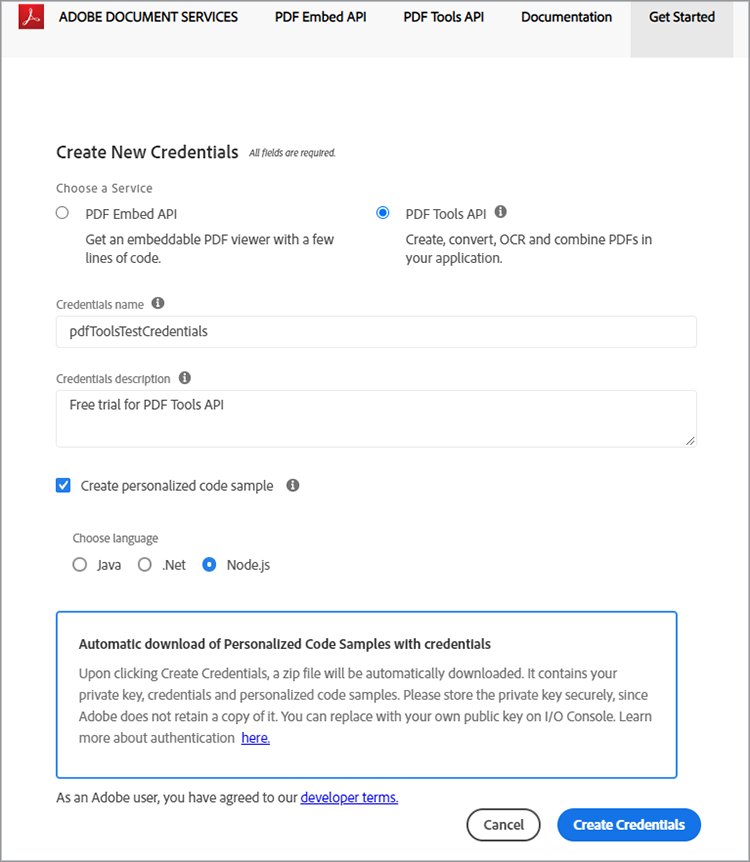

# Créez un PDF à partir de HTML ou MS Office en quelques minutes avec l’API des services de PDF et Node.js


La numérisation des workflows de documents n’a jamais été aussi facile avec la nouvelle API Adobe PDF Services, qui offre aux développeurs une liberté illimitée pour choisir entre plusieurs services puissants de manipulation de PDF afin de répondre aux besoins des workflows métier complexes. Les architectures complexes, les stratégies de mise en œuvre et l&#39;accélération technologique peuvent être rationalisées grâce à ces services Web basés sur le cloud.

Dans l’API des services de PDF, plusieurs services sont disponibles pour la création et la manipulation de PDF ou l’exportation du PDF vers MS Office et d’autres formats.

* Créez un fichier de PDF à partir de HTML statique ou dynamique, MS Word, PowerPoint, Excel, etc
* Export PDF dans MS Word, PowerPoint, Excel et plus encore
* ROC pour reconnaître le texte dans les fichiers du PDF et activer la recherche dans les documents
* Mot de PDF Protect avec mot de passe lors de l’ouverture de documents
* Combiner des pages ou des documents de PDF PDF dans un seul PDF
* Compresser les mots de PDF pour réduire la taille du partage par e-mail ou en ligne
* Linéariser pour optimiser un PDF afin de l’afficher rapidement sur le web
* Organiser les pages du PDF avec des services d’insertion, de remplacement, de réorganisation, de suppression et de rotation

Les développeurs peuvent démarrer en quelques minutes grâce aux fichiers d’exemple prêts à l’emploi fournis pour accéder à tous les services web disponibles. Voici comment commencer.

## Obtention des informations d’identification et téléchargement des fichiers d’exemple

La première étape consiste à obtenir un identifiant (clé API) pour déverrouiller l’utilisation. [Inscrivez-vous ici](https://www.adobe.com/go/dcsdks_credentials) à l’essai gratuit et cliquez sur « Commencer » pour créer vos nouvelles informations d’identification.


Il est important de choisir un « compte personnel » pour s’inscrire à l’essai gratuit :


À l’étape suivante, vous choisirez le service d’API des services de PDF, puis vous ajouterez un nom et une description pour vos informations d’identification.

Il existe une case à cocher pour « Créer un exemple de code personnalisé ». Sélectionnez cette option pour que vos nouvelles informations d’identification soient automatiquement ajoutées à vos fichiers d’exemple, en ignorant l’étape manuelle.

Ensuite, choisissez Node.js comme langue pour recevoir les échantillons spécifiques à Node.js et cliquez sur le bouton « Créer des informations d’identification ».



Vous recevrez un fichier .zip à télécharger appelé PDFToolsSDK-Node.jsSamples.zip qui peut être enregistré sur votre système de fichiers local.

## Ajout de vos informations d’identification aux exemples de code

Si vous avez choisi l’option « Créer un exemple de code personnalisé », vous n’avez pas besoin d’ajouter manuellement votre ID client aux fichiers d’exemples de code. Vous pouvez ignorer l’étape suivante et accéder directement à la section Exemples de code en cours d’exécution ci-dessous.

Si vous n’avez pas choisi l’option « Créer un exemple de code personnalisé », vous devez copier l’ID client (clé API) à partir de la console Adobe.io :


Décompressez le contenu de PDFToolsSDK-Node.jsSamples.zip.

Accédez au répertoire racine sous le dossier adobe-dc-pdf-tools-sdk-node-samples.

Ouvrez pdftools-api-credentials.json avec n&#39;importe quel éditeur de texte ou IDE.

Collez les informations d’identification dans le champ de l’ID client dans le code :

```javascript
{
 "client_credentials": {
  "client_id": "abcdefghijklmnopqrstuvwxyz",
```

Enregistrez le fichier et passez à l’étape suivante pour exécuter les exemples de code.

## Exécution de votre premier échantillon de code

À l’aide de l’invite de commande, accédez au répertoire racine situé sous le dossier adobe-dc-pdf-tools-sdk-node-samples.

Tapez npm install :

C:\Temp\PDFToolsAPI\adobe-dc-pdf-tools-sdk-node-samples>installation npm

Vous êtes maintenant prêt à exécuter les fichiers d’exemple !

Pour votre premier exemple, créez un PDF :

Toujours dans l’invite de commande, exécutez l’exemple de création de PDF avec la commande suivante :

C:\Temp\PDFToolsAPI\adobe-dc-pdf-tools-sdk-node-samples>nœud src/createpdf/create-pdf-from-docx.js

Exemple de sortie :


Votre PDF sera créé à l’emplacement indiqué dans la sortie, qui est par défaut le répertoire pdfServicesSdkResult.

## Ressources et étapes suivantes

* Pour obtenir une aide et une assistance supplémentaires, consultez le forum de la communauté des [[!DNL Acrobat Services] API](https://community.adobe.com/t5/document-cloud-sdk/bd-p/Document-Cloud-SDK?page=1&amp;sort=latest_replies&amp;filter=all) d&#39;Adobe

API des services de PDF [Documentation](https://www.adobe.com/go/pdftoolsapi_doc)

* [FAQ](https://community.adobe.com/t5/contentarchivals/contentarchivedpage/message-uid/10726197) pour les questions API des services PDF

* [Contactez-nous](https://www.adobe.com/go/pdftoolsapi_requestform) pour toute question sur les licences et les prix

* Articles connexes :
  [La nouvelle API PDF Services offre encore plus de fonctionnalités pour les workflows de documents](https://community.adobe.com/t5/acrobat-services-api-discussions/new-pdf-tools-api-brings-more-capabilities-for-document-services/m-p/11294170)

  [Version de juillet de [!DNL Adobe Acrobat Services] : services PDF Embed et PDF](https://medium.com/adobetech/july-release-of-adobe-document-services-pdf-embed-and-pdf-tools-17211bf7776d)
