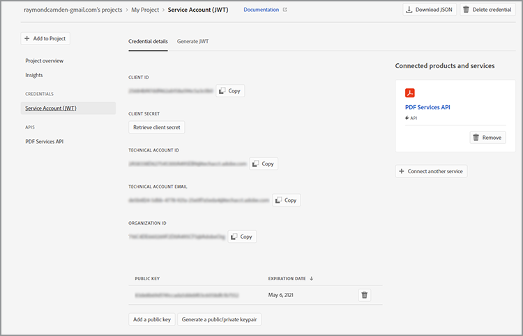
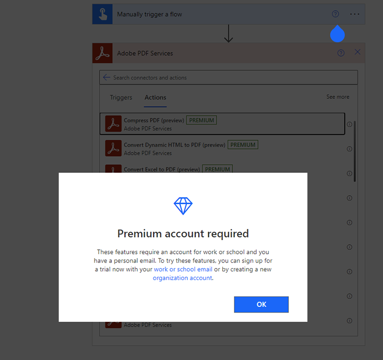

# Obtention des informations d’identification pour Microsoft Power Automate

[Microsoft Power Automate](https://powerautomate.microsoft.com/) offre aux développeurs et aux développeurs citoyens un moyen efficace de créer des processus automatisés puissants pour améliorer leurs activités sans écrire de code. Le connecteur [Adobe PDF Services](https://us.flow.microsoft.com/en-us/connectors/shared_adobepdftools/adobe-pdf-services/), dans le cadre de [[!DNL Adobe Acrobat Services]](https://developer.adobe.com/document-services), permet aux utilisateurs d’effectuer l’une des actions disponibles dans l’API Adobe PDF Services dans Microsoft Power Automate.

Dans ce tutoriel, découvrez comment obtenir des informations d’identification pour commencer à utiliser ou à tester les services Adobe PDF. Selon que vous êtes un utilisateur de la version d’évaluation ou un client existant, ce tutoriel décrit les étapes à suivre pour obtenir des informations d’identification.

## Comment les utilisateurs de Microsoft Power Automate peuvent-ils commencer à utiliser le connecteur Adobe PDF Services ?

Les utilisateurs Microsoft Power Automate existants peuvent [obtenir des informations d’identification de version d’essai](https://www.adobe.com/go/powerautomate_getstarted_fr) pour les services Adobe PDF. Le lien ci-dessus est un lien d’inscription spécial pour vous aider dans ce processus, destiné spécifiquement aux utilisateurs de Microsoft Power Automate.


>[!IMPORTANT]
> Si vous vous connectez pour une version d’essai, vous devez utiliser un Adobe ID et non un Enterprise ID. Si vous n’êtes pas actuellement abonné à l’API Adobe PDF Services et que vous tentez de vous connecter avec votre Enterprise ID, vous pouvez obtenir une erreur d’autorisation, car votre entreprise ne vous a pas autorisé à utiliser l’API Adobe PDF Services. Pour cette raison, il est recommandé d’utiliser un Adobe ID personnel gratuit.
>

1. Une fois connecté, vous êtes invité à sélectionner un nom pour vos nouvelles informations d’identification. Saisissez votre *nom d&#39;identification*.
1. Cochez la case pour accepter les conditions du développeur.
1. Sélectionnez **[!UICONTROL Créer des informations d&#39;identification]**.

   

Ces informations d’identification couvrent cinq valeurs différentes :

* ID client (clé API)
* Clé secrète client
* ID d’organisation
* ID de compte technique
* Base64 (clé privée codée)


Un fichier JSON contenant toutes ces valeurs est également automatiquement téléchargé sur votre système. Ce fichier est nommé `pdfservices-api-pa-credentials.json` et se présente comme suit :

```json
{
 "client_id": "client id value",
 "client_secret": "client secret value",
 "organization_id": "organized id value",
 "account_id": "account id value",
 "base64_encoded_private_key": "base64 version of the private key"
}
```

Stockez ce fichier dans un emplacement sécurisé, car il n’est pas possible d’obtenir à nouveau une copie de la clé privée.

### Ajouter une connexion dans Microsoft Power Automate

Maintenant que vous disposez de vos identifiants, vous pouvez commencer à les utiliser dans les flux Microsoft Power Automate.

1. Dans le menu de la barre latérale, ouvrez le menu **[!UICONTROL Données]** et sélectionnez **Connexions** :

   

1. Sélectionnez **+ [!UICONTROL Nouvelle connexion]**.

1. L’écran suivant affiche une liste des types de connexion possibles. Dans le coin supérieur droit, saisissez « adobe » pour filtrer les options :

   

1. Sélectionnez **[!UICONTROL Services Adobe PDF (aperçu)]**.
1. Dans la fenêtre modale, entrez les cinq valeurs générées précédemment. Sélectionnez **[!UICONTROL Créer]** lorsque vous avez terminé.

   

Vous êtes maintenant prêt à utiliser les services Adobe PDF dans Microsoft Power Automate.

### Accès aux informations d’identification après leur création

Si vous avez déjà créé des informations d&#39;identification et égaré les informations d&#39;identification téléchargées, vous pouvez les récupérer à nouveau dans [Adobe Developer Console](https://developer.adobe.com/console).

1. Après vous être connecté à [Adobe Developer Console](https://developer.adobe.com/console), recherchez d&#39;abord votre projet et sélectionnez-le.
1. Dans le menu de gauche sous *Informations d&#39;identification*, sélectionnez **Compte de service (JWT)** :

   

1. Notez les cinq valeurs présentées ici : *ID client*, *secret client*, *ID de compte technique*, *E-mail de compte technique* et *ID d’organisation*.

Malheureusement, vous ne pouvez pas télécharger la clé privée précédente, mais vous pouvez utiliser le bouton « Générer une paire de clés publique/privée » pour en créer une nouvelle.

## Utilisation d’informations d’identification Adobe PDF Services existantes

Si vous disposez déjà d&#39;identifiants d&#39;API Adobe PDF Services générés à partir du site Web [!DNL Adobe Acrobat Services], vous pouvez les utiliser avec Microsoft Power Automate. Si vous avez téléchargé un SDK lors de votre inscription, vos informations d’identification existantes se présentaient sous la forme d’un fichier JSON probablement nommé `pdfservices-api-credentials.json`. Ce fichier JSON contient les cinq clés nécessaires à la création de vos informations de connexion. Copiez chaque valeur du fichier JSON dans le champ de connexion correspondant.

Votre valeur de clé privée provient d&#39;un deuxième fichier nommé `private.key`.

Vous pouvez également obtenir les valeurs de la console de développement Adobe comme décrit ci-dessus.

## Comment les utilisateurs de [!DNL Adobe Acrobat Services] peuvent-ils commencer à travailler avec Microsoft Power Automate ?

Pour commencer à utiliser Power Automate, accédez d’abord à <https://powerautomate.microsoft.com> et utilisez le bouton « Commencer gratuitement ». Si vous n’avez pas de compte Microsoft, vous devez en créer un. Une fois connecté, le tableau de bord Power Automate s’affiche.

Tableau de bord 

Comme décrit au début de ce tutoriel, créez un flux, ajoutez une étape et recherchez les services Adobe PDF. Sélectionnez une action et vous serez peut-être averti qu’un compte Premium est requis.



Comme le montre la capture d’écran ci-dessus, vous pouvez passer à un compte professionnel ou configurer un nouveau compte d’organisation. Une fois que vous l’avez fait, vous pouvez ajouter l’action Adobe PDF Services.

Pour en savoir plus sur la création de votre premier flux Microsoft Power Automate avec [!DNL Adobe Acrobat Services], consultez [Création de votre premier workflow dans Microsoft Power Automate](https://experienceleague.adobe.com/fr/docs/acrobat-services-learn/tutorials/pdfservices/create-workflow-power-automate).

## Autres ressources

Pour vous aider davantage, voici une liste de ressources supplémentaires :

* Les documents Adobe PDF Services Power Automate arrivent en premier : <https://docs.microsoft.com/en-us/connectors/adobepdftools/>. Ces ressources complètent ce que vous avez appris ici.
* Besoin d’exemples ? Vous trouverez de nombreux [modèles Power Automate](https://powerautomate.microsoft.com/en-us/connectors/details/shared_adobepdftools/adobe-pdf-services/) illustrant les services de PDF.
* Notre contenu vidéo en direct, [Paper Clips](https://www.youtube.com/playlist?list=PLcVEYUqU7VRe4sT-Bf8flvRz1XXUyGmtF), contient également des vidéos présentant l&#39;utilisation de Power Automate.
* Le [Blog sur les technologies d&#39;Adobe](https://medium.com/adobetech/tagged/microsoft-power-automate) contient de nombreux articles sur l&#39;utilisation de Power Automate.
* Enfin, n&#39;oubliez pas de consulter également la documentation de base des [services PDF](https://developer.adobe.com/document-services/docs/overview/).
