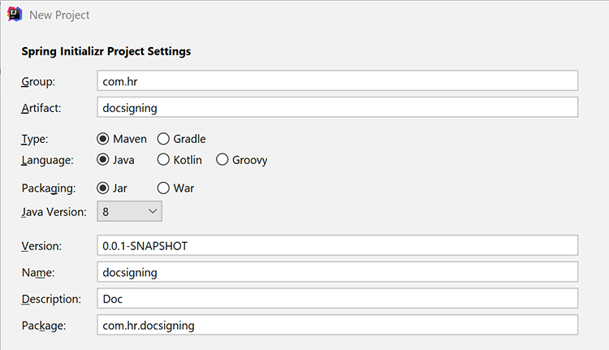

# Workflows de document de RH en Java


De nombreuses entreprises ont besoin de documentation concernant une nouvelle embauche, comme des accords sur le lieu de travail pour les employés travaillant à domicile. Traditionnellement, les entreprises géraient ces documents physiquement sous des formes difficiles à gérer et à stocker. Lors du passage aux documents électroniques, les fichiers de PDF sont un choix idéal car ils sont plus sécurisés et moins modifiables que les autres types de fichiers. De plus, ils prennent en charge les signatures numériques.

## Ce que vous pouvez apprendre

Dans ce tutoriel pratique, découvrez comment mettre en œuvre un formulaire de RH sur le Web qui enregistre un accord sur le lieu de travail dans un PDF avec signature dans une application Java Spring MVC.

## Ressources et API pertinentes

* [API PDF Services](https://opensource.adobe.com/pdftools-sdk-docs/release/latest/index.html)

* [API Adobe Sign](https://www.adobe.io/apis/documentcloud/sign.html)

* [Code de projet](https://github.com/dawidborycki/adobe-sign)

## Génération des identifiants d’API

Commencez par vous inscrire à l’essai gratuit de l’API Adobe PDF Services. Accédez au [site web de l&#39;Adobe](https://www.adobe.io/apis/documentcloud/dcsdk/gettingstarted.html?ref=getStartedWithServicesSDK) [3} et cliquez sur le bouton *Commencer* sous *Créer de nouvelles informations d&#39;identification*. ](https://www.adobe.io/apis/documentcloud/dcsdk/gettingstarted.html?ref=getStartedWithServicesSDK) L’essai gratuit fournit 1 000 transactions de document qui peuvent être utilisées sur six mois. Sur la page suivante (voir ci-dessous), sélectionnez le service (API des services PDF), définissez le nom des informations d’identification (par exemple, HRDocumentWFCredentials), puis saisissez une description.

Sélectionnez la langue (Java dans cet exemple) et cochez *Créer des exemples de code personnalisés*. La dernière étape permet de s’assurer que les échantillons de code contiennent déjà le fichier prérempli pdftools-api-credentials.json que vous utilisez, ainsi que la clé privée pour authentifier votre application dans l&#39;API.

Enfin, cliquez sur le bouton *Créer des informations d&#39;identification*. Cela génère les informations d’identification et les exemples commencent automatiquement à se télécharger.


Pour vous assurer que les informations d’identification fonctionnent, ouvrez les exemples téléchargés. Ici, vous utilisez IntelliJ IDEA. Lorsque vous ouvrez le code source, l&#39;environnement de développement intégré (IDE) demande le moteur de génération. Maven est utilisé dans cet exemple, mais vous pouvez également utiliser Gradle, selon vos préférences.

Ensuite, exécutez l&#39;objectif Maven `mvn clean install` pour créer les fichiers jar.

Enfin, exécutez l’exemple CombinePDF, comme indiqué ci-dessous. Le code génère le PDF dans le dossier de sortie.


## Création de l’application Spring MVC

En fonction des informations d’identification, créez l’application. Cet exemple utilise Spring Initialize.

Tout d’abord, configurez les paramètres du projet pour utiliser le langage Java 8 et le package Jar (voir la capture d’écran ci-dessous).



Ensuite, ajoutez Spring Web (à partir du Web) et Thymeleaf (à partir des moteurs de modèles) :


Après avoir créé le projet, accédez au fichier pom.xml et complétez la section des dépendances avec pdftools-sdk et log4j-slf4j-impl :

```
<dependencies>
    <dependency>
        <groupId>org.springframework.boot</groupId>
        <artifactId>spring-boot-starter-thymeleaf</artifactId>
    </dependency>
    <dependency>
        <groupId>org.springframework.boot</groupId>
        <artifactId>spring-boot-starter-web</artifactId>
    </dependency>

    <dependency>
        <groupId>org.springframework.boot</groupId>
        <artifactId>spring-boot-starter-test</artifactId>
        <scope>test</scope>
    </dependency>

</dependencies>
```

Ajoutez ensuite deux fichiers téléchargés avec l’exemple de code dans le dossier racine du projet :

* pdftools-api-credentials.json

* private.key

## Rendu d’un formulaire web

Pour afficher le formulaire web, modifiez l’application avec le responsable du traitement qui affiche le formulaire de données personnelles et gère la publication du formulaire. Vous devez donc d’abord modifier l’application avec la classe de modèles PersonForm :

```
package com.hr.docsigning;
import javax.validation.constraints.NotNull;
import javax.validation.constraints.Size;

public class PersonForm {
    @NotNull
    @Size(min=2, max=30)
    private String firstName;

    @NotNull
    @Size(min=2, max=30)
    private String lastName;

    public String getFirstName() {
            return this.firstName;
    }


    public void setFirstName(String firstName) {
            this.firstName = firstName;
    }

    public String getLastName() {
           return this.lastName;
    }

    public void setLastName(String lastName) {
            this.lastName = lastName;
    }

    public String GetFullName() {
           return this.firstName + " " + this.lastName;
    }
}
```

Cette classe contient deux propriétés : `firstName` et `lastName`. Utilisez également cette validation simple pour vérifier s’ils se situent entre 2 et 30 caractères.

Avec la classe de modèle, vous pouvez créer le contrôleur (voir PersonController.java à partir du code compagnon) :

```
package com.hr.docsigning;
import org.springframework.stereotype.Controller;
import org.springframework.validation.BindingResult;
import org.springframework.web.bind.annotation.GetMapping;
import org.springframework.web.bind.annotation.PostMapping;
import javax.validation.Valid;


@Controller
public class PersonController {
    @GetMapping("/")
    public String showForm(PersonForm personForm) {
        return "form";
    }
}
```

Le contrôleur n&#39;a qu&#39;une seule méthode : showForm. Il est responsable du rendu du formulaire à l’aide du modèle de HTML situé à l’adresse resources/templates/form.html :

```
<html>
<head>
    <link rel="stylesheet" href="https://www.w3schools.com/w3css/4/w3.css">
</head>
 
<body>
<div class="w3-container">
    <h1>HR Department</h1>
</div>
 
<form class="w3-panel w3-card-4" action="#" th:action="@{/}"
        th:object="${personForm}" method="post">
    <h2>Personal data</h2>
    <table>
        <tr>
            <td>First Name:</td>
            <td><input type="text" class="w3-input"
                placeholder="First name" th:field="*{firstName}" /></td>
            <td class="w3-text-red" th:if="${#fields.hasErrors('firstName')}"
                th:errors="*{firstName}"></td>
        </tr>
        <tr>
            <td>Last Name:</td>
            <td><input type="text" class="w3-input"
                placeholder="Last name" th:field="*{lastName}" /></td>
            <td class="w3-text-red" th:if="${#fields.hasErrors('lastName')}"
                th:errors="*{lastName}"></td>
        </tr>
        <tr>
            <td><button class="w3-button w3-black" type="submit">Submit</button></td>
        </tr>
    </table>
</form>
</body>
</html>
```

Pour le rendu de contenu dynamique, le moteur de rendu de modèle Thymeleaf est utilisé. Ainsi, après avoir exécuté l’application, vous devriez voir les éléments suivants :


## Génération du PDF avec du contenu dynamique

Maintenant, générez le document de PDF contenant le contrat virtuel en remplissant dynamiquement les champs sélectionnés après avoir rendu le formulaire de données personnelles. Plus précisément, vous devez renseigner les données de personne dans le contrat précréé.

Ici, pour simplifier, vous n’avez qu’un en-tête, un sous-en-tête et une constante de chaîne comme suit : « Ce contrat a été préparé pour \&lt;nom complet de la personne\> ».

Pour atteindre cet objectif, commencez par l&#39;exemple [Créer un PDF à partir du HTML dynamique](https://opensource.adobe.com/pdftools-sdk-docs/release/latest/howtos.html#create-a-pdf-from-dynamic-html) d&#39;Adobe. En analysant cet exemple de code, vous constatez que le processus de remplissage dynamique des champs de HTML fonctionne de la manière suivante.

Tout d’abord, vous devez préparer la page de HTML, qui contient du contenu statique et dynamique. La partie dynamique est mise à jour en utilisant JavaScript. Plus précisément, l’API des services de PDF injecte l’objet JSON dans votre HTML.

Vous obtenez ensuite les propriétés JSON à l’aide de la fonction JavaScript appelée lors du chargement du document de HTML. Cette fonction JavaScript met à jour les éléments DOM sélectionnés. Voici l’exemple qui renseigne l’élément span, contenant les données de la personne (voir src\\main\\resources\\contract\\index.html du code compagnon) :

```
<html>
<head>
    <link rel="stylesheet" href="https://www.w3schools.com/w3css/4/w3.css">
</head>
 
<body onload="updateFullName()">
    <script src="./json.js"></script>
    <script type="text/javascript">
        function updateFullName()
        {
            var document = window.document;
            document.getElementById("personFullName").innerHTML = String(
                window.json.personFullName);
        }
    </script>
 
    <div class="w3-container ">
        <h1>HR Department</h1>
 
        <h2>Contract details</h2>
 
        <p>This contract was prepared for:
            <strong><span id="personFullName"></span></strong>
        </p>
    </div>
</body>
</html>
```

Ensuite, vous devez compresser le HTML avec tous les fichiers JavaScript et CSS dépendants. L’API des services de PDF n’accepte pas les fichiers de HTML. Il nécessite plutôt un fichier zip comme entrée. Dans ce cas, vous stockez le fichier compressé dans src\\main\\resources\\contract\\index.zip.

Ensuite, vous pouvez compléter `PersonController` par une autre méthode qui traite les demandes du POST :

```
@PostMapping("/")
public String checkPersonInfo(@Valid PersonForm personForm,
    BindingResult bindingResult) {
    if (bindingResult.hasErrors()) {
        return "form";
    }
 
    CreateContract(personForm);
 
    return "contract-actions";
}
```

La méthode ci-dessus permet de créer un contrat de PDF à l’aide des données personnelles fournies et de rendre la vue des actions de contrat. Ce dernier fournit des liens vers le PDF généré et pour signer le PDF.

Maintenant, voyons comment fonctionne la méthode `CreateContract` (la liste complète est ci-dessous). La méthode repose sur deux champs :

* `LOGGER`, à partir de log4j, pour déboguer les informations sur les exceptions

* `contractFilePath`, contenant le chemin du fichier vers le PDF généré

La méthode `CreateContract` configure les informations d&#39;identification et crée le PDF à partir du HTML. Pour transmettre et remplir les données de la personne dans le contrat, utilisez l&#39;assistant `setCustomOptionsAndPersonData`. Cette méthode récupère les données de la personne dans le formulaire, puis les envoie au PDF généré via l’objet JSON expliqué ci-dessus.

En outre, `setCustomOptionsAndPersonData` indique comment contrôler l&#39;apparence du PDF en désactivant l&#39;en-tête et le pied de page. Une fois ces étapes terminées, enregistrez le fichier du PDF sur output/contract.pdf et supprimez éventuellement le fichier précédemment généré.

```
private static final Logger LOGGER = LoggerFactory.getLogger(PersonController.class);
private String contractFilePath = "output/contract.pdf"; 
private void CreateContract(PersonForm personForm) {
    try {
        // Initial setup, create credentials instance.
        Credentials credentials = Credentials.serviceAccountCredentialsBuilder()
                .fromFile("pdftools-api-credentials.json")
                .build();

        //Create an ExecutionContext using credentials 
       //and create a new operation instance.
        ExecutionContext executionContext = ExecutionContext.create(credentials);
        CreatePDFOperation htmlToPDFOperation = CreatePDFOperation.createNew();

        // Set operation input from a source file.
        FileRef source = FileRef.createFromLocalFile(
           "src/main/resources/contract/index.zip");
       htmlToPDFOperation.setInput(source);

        // Provide any custom configuration options for the operation
        // You pass person data here to dynamically fill out the HTML
        setCustomOptionsAndPersonData(htmlToPDFOperation, personForm);

        // Execute the operation.
        FileRef result = htmlToPDFOperation.execute(executionContext);

        // Save the result to the specified location. Delete previous file if exists
        File file = new File(contractFilePath);
        Files.deleteIfExists(file.toPath());

        result.saveAs(file.getPath());

    } catch (ServiceApiException | IOException | 
             SdkException | ServiceUsageException ex) {
        LOGGER.error("Exception encountered while executing operation", ex);
    }
}
 
private static void setCustomOptionsAndPersonData(
    CreatePDFOperation htmlToPDFOperation, PersonForm personForm) {
    //Set the dataToMerge field that needs to be populated 
    //in the HTML before its conversion
    JSONObject dataToMerge = new JSONObject();
    dataToMerge.put("personFullName", personForm.GetFullName());
 
    // Set the desired HTML-to-PDF conversion options.
    CreatePDFOptions htmlToPdfOptions = CreatePDFOptions.htmlOptionsBuilder()
        .includeHeaderFooter(false)
        .withDataToMerge(dataToMerge)
        .build();
    htmlToPDFOperation.setOptions(htmlToPdfOptions);
}
```

Lors de la génération du contrat, vous pouvez également fusionner les données dynamiques spécifiques à une personne avec des dispositions de contrat fixes. Pour ce faire, suivez l&#39;exemple [Créer un PDF à partir du HTML statique](https://opensource.adobe.com/pdftools-sdk-docs/release/latest/howtos.html#create-a-pdf-from-dynamic-html). Vous pouvez également [fusionner deux PDF](https://opensource.adobe.com/pdftools-sdk-docs/release/latest/howtos.html#create-a-pdf-from-static-html).

## Présentation du fichier de PDF en vue du téléchargement

Vous pouvez désormais présenter le lien au PDF généré pour que l’utilisateur puisse le télécharger. Pour ce faire, commencez par créer le fichier contract-actions.html (voir resources/templates contract-actions.html du code d’accompagnement) :

```
<html>
<head>
    <link rel="stylesheet" href="https://www.w3schools.com/w3css/4/w3.css">
</head>
 
<div class="w3-container ">
    <h1>HR Department</h1>
 
    <h2>Contract file</h2>
 
    <p>Click <a href="/pdf">here</a> to download your contract</p>
</div>
</body>
</html>
```

Ensuite, vous implémentez la méthode `downloadContract` dans la classe `PersonController` comme suit :

```
@RequestMapping("/pdf")
public void downloadContract(HttpServletResponse response)
{
    Path file = Paths.get(contractFilePath);
 
    response.setContentType("application/pdf");
    response.addHeader(
        "Content-Disposition", "attachment; filename=contract.pdf");

    try
    {
        Files.copy(file, response.getOutputStream());
        response.getOutputStream().flush();
    }
    catch (IOException ex) 
    {
        ex.printStackTrace();
    }
}
```

Après avoir exécuté l’application, vous obtenez le flux suivant. Le premier écran affiche le formulaire de données personnelles. Pour effectuer un test, remplissez-le avec les valeurs comprises entre 2 et 30 caractères :


Après avoir cliqué sur le bouton *Envoyer*, le formulaire est validé et le PDF génère en fonction du HTML (resources/contract/index.html). L’application affiche une autre vue (détails du contrat), dans laquelle vous pouvez télécharger le PDF :


Le PDF, après rendu dans le navigateur Web, se présente comme suit. À savoir, les données personnelles que vous avez saisies sont propagées au PDF :


## Activation des signatures et de la sécurité

Lorsque l’accord est prêt, Adobe Sign peut ajouter des signatures numériques représentant l’approbation. L’authentification Adobe Sign fonctionne un peu différemment d’OAuth. Voyons maintenant comment intégrer l’application à Adobe Sign. Pour ce faire, vous devez préparer le jeton d’accès pour votre application. Vous pouvez ensuite écrire le code client à l’aide du SDK Java Adobe Sign.

Pour obtenir un jeton d’autorisation, vous devez effectuer plusieurs étapes :

Commencez par enregistrer un [compte développeur](https://acrobat.adobe.com/fr/fr/sign/developer-form.html).

Créez l&#39;application CLIENT dans le [portail Adobe Sign](https://www.adobe.io/apis/documentcloud/sign/docs.html#!adobedocs/adobe-sign/master/gstarted/create_app.md).

Configurez OAuth pour l’application comme décrit [ici](https://www.adobe.io/apis/documentcloud/sign/docs.html#!adobedocs/adobe-sign/master/gstarted/configure_oauth.md) et [ici](https://secure.eu1.adobesign.com/public/static/oauthDoc.jsp). Notez votre identifiant client et votre secret client. Vous pouvez ensuite utiliser `https://www.google.com` comme URI de redirection et les portées suivantes :

* user_login : self

* agreement_read : account

* agreement_write : account

* agreement_send : account

Préparez une URL comme suit en utilisant votre ID client à la place de \&lt;ID_CLIENT\> :

```
https://secure.eu1.adobesign.com/public/oauth?redirect_uri=https://www.google.com
&response_type=code
&client_id=<CLIENT_ID>
&scope=user_login:self+agreement_read:account+agreement_write:account+agreement_send:account
```

Saisissez l’URL ci-dessus dans votre navigateur web. Vous êtes redirigé vers google.com et le code s’affiche dans la barre d’adresse sous la forme code=\&lt;VOTRE_CODE\>, pour
exemple :

```
https://www.google.com/?code=<YOUR_CODE>&api_access_point=https://api.eu1.adobesign.com/&web_access_point=https://secure.eu1.adobesign.com%2F
```

Notez les valeurs indiquées pour \&lt;VOTRE_CODE\> et api_access_point.

Pour envoyer une demande de POST HTTP qui vous fournit le jeton d’accès, utilisez les valeurs d’ID client, \&lt;VOTRE_CODE\> et de point d’accès_api. Vous pouvez utiliser [Postman](https://helpx.adobe.com/sign/kb/how-to-create-access-token-using-postman-adobe-sign.html) ou cURL :

```
curl --location --request POST "https://**api.eu1.adobesign.com**/oauth/token"
\\

\--data-urlencode "client_secret=**\<CLIENT_SECRET\>**" \\

\--data-urlencode "client_id=**\<CLIENT_ID\>**" \\

\--data-urlencode "code=**\<YOUR_CODE\>**" \\

\--data-urlencode "redirect_uri=**https://www.google.com**" \\

\--data-urlencode "grant_type=authorization_code"
```

L’exemple de réponse se présente comme suit :

```
{
    "access_token":"3AAABLblqZhByhLuqlb-…",
    "refresh_token":"3AAABLblqZhC_nJCT7n…",
    "token_type":"Bearer",
    "expires_in":3600
}
```

Notez votre jeton d’accès. Vous en avez besoin pour autoriser votre code client.

## Utilisation du SDK Adobe Sign Java

Une fois que vous disposez du jeton d’accès, vous pouvez envoyer des appels API REST à Adobe Sign. Pour simplifier ce processus, utilisez le SDK Adobe Sign Java. Le code source est disponible dans le référentiel GitHub [Adobe](https://github.com/adobe-sign/AdobeSignJavaSdk).

Pour intégrer ce pack à votre application, vous devez cloner le code. Ensuite, créez le pack Maven (pack mvn) et installez les fichiers suivants dans le projet (vous les trouverez dans le code d’accompagnement dans le dossier adobe-sign-sdk) :

* target/swagger-java-client-1.0.0.jar

* target/lib/gson-2.8.1.jar

* target/lib/gson-fire-1.8.0.jar

* target/lib/hamcrest-core-1.3.jar

* target/lib/junit-4.12.jar

* target/lib/logging-interceptor-2.7.5.jar

* target/lib/okhttp-2.7.5.jar

* target/lib/okio-1.6.0.jar

* target/lib/swagger-annotations-1.5.15.jar

Dans IntelliJ IDEA, vous pouvez ajouter ces fichiers en tant que dépendances à l&#39;aide de la *structure de projet* (structure de fichier/projet).

## Envoi du PDF pour signature

Vous pouvez maintenant envoyer l’accord pour signature. Pour ce faire, complétez d’abord le fichier contract-details.html avec un autre lien hypertexte vers la demande d’envoi :

```
<html>
<head>
    <link rel="stylesheet" href="https://www.w3schools.com/w3css/4/w3.css">
</head>
 
<div class="w3-container ">
    <h1>HR Department</h1>
 
    <h2>Contract file</h2>
 
    <p>Click <a href="/pdf"> here</a> to download your contract</p>
 
    
</div>
</body>
</html>
```

Ensuite, vous ajoutez un autre contrôleur, `AdobeSignController`, dans lequel vous implémentez `sendContractMethod` (voir le code compagnon). La méthode fonctionne comme suit :

Tout d&#39;abord, il utilise `ApiClient` pour obtenir le point de terminaison de l&#39;API.

```
ApiClient apiClient = new ApiClient();

//Default baseUrl to make GET /baseUris API call.
String baseUrl = "https://api.echosign.com/";
String endpointUrl = "/api/rest/v6";
apiClient.setBasePath(baseUrl + endpointUrl);

// Provide an OAuth Access Token as "Bearer access token" in authorization
String authorization = "Bearer ";

// Get the baseUris for the user and set it in apiClient.
BaseUrisApi baseUrisApi = new BaseUrisApi(apiClient);
BaseUriInfo baseUriInfo = baseUrisApi.getBaseUris(authorization);
apiClient.setBasePath(baseUriInfo.getApiAccessPoint() + endpointUrl);
```

Ensuite, la méthode utilise le fichier contract.pdf pour créer le document temporaire :

```
// Get PDF file
String filePath = "output/";
String fileName = "contract.pdf";
File file = new File(filePath + fileName);
String mimeType = "application/pdf";
 
//Get the id of the transient document.
TransientDocumentsApi transientDocumentsApi =
    new TransientDocumentsApi(apiClient);
TransientDocumentResponse response = transientDocumentsApi.createTransientDocument(authorization,
    file, null, null, fileName, mimeType);
String transientDocumentId = response.getTransientDocumentId();
```

Vous devez ensuite créer un accord. Pour ce faire, utilisez le fichier contract.pdf et définissez l’état de l’accord sur EN_COURS pour envoyer le fichier immédiatement. En outre, vous pouvez choisir la signature électronique :

```
// Create AgreementCreationInfo
AgreementCreationInfo agreementCreationInfo = new AgreementCreationInfo();
 
// Add file
FileInfo fileInfo = new FileInfo();
fileInfo.setTransientDocumentId(transientDocumentId);
agreementCreationInfo.addFileInfosItem(fileInfo);
 
// Set state to IN_PROCESS, so the agreement is be sent immediately
agreementCreationInfo.setState(AgreementCreationInfo.StateEnum.IN_PROCESS);
agreementCreationInfo.setName("Contract");
agreementCreationInfo.setSignatureType(AgreementCreationInfo.SignatureTypeEnum.ESIGN);
```

Ensuite, vous ajoutez les destinataires de l’accord comme suit. Vous ajoutez ici deux destinataires (voir les sections Employé et Responsable) :

```
// Provide emails of recipients to whom agreement is be sent
// Employee
ParticipantSetInfo participantSetInfo = new ParticipantSetInfo();
ParticipantSetMemberInfo participantSetMemberInfo = new ParticipantSetMemberInfo();
participantSetMemberInfo.setEmail("");
participantSetInfo.addMemberInfosItem(participantSetMemberInfo);
participantSetInfo.setOrder(1);
participantSetInfo.setRole(ParticipantSetInfo.RoleEnum.SIGNER);
agreementCreationInfo.addParticipantSetsInfoItem(participantSetInfo);
 
// Manager
participantSetInfo = new ParticipantSetInfo();
participantSetMemberInfo = new ParticipantSetMemberInfo();
participantSetMemberInfo.setEmail("");
participantSetInfo.addMemberInfosItem(participantSetMemberInfo);
participantSetInfo.setOrder(2);
participantSetInfo.setRole(ParticipantSetInfo.RoleEnum.SIGNER);
agreementCreationInfo.addParticipantSetsInfoItem(participantSetInfo);
```

Enfin, envoyez l’accord à l’aide de la méthode `createAgreement` à partir du SDK Adobe Sign Java :

```
// Create agreement using the transient document.
AgreementsApi agreementsApi = new AgreementsApi(apiClient);
AgreementCreationResponse agreementCreationResponse = agreementsApi.createAgreement(
    authorization, agreementCreationInfo, null, null);
 
System.out.println("Agreement sent, ID: " + agreementCreationResponse.getId());
```

Après avoir exécuté ce code, vous recevez un e-mail (à l’adresse spécifiée dans le code comme `<email_address>)` avec la demande de signature de l’accord. L’e-mail contient le lien hypertexte, qui dirige les destinataires vers le portail Adobe Sign pour effectuer la signature. Le document s&#39;affiche dans votre portail des développeurs Adobe Sign (voir l&#39;illustration ci-dessous) et vous pouvez également suivre le processus de signature par programme à l&#39;aide de la méthode [getAgreementInfo](https://github.com/adobe-sign/AdobeSignJavaSdk/blob/master/docs/AgreementsApi.md#getAgreementInfo).

Enfin, vous pouvez également protéger votre PDF par mot de passe à l&#39;aide de l&#39;API des services de PDF, comme indiqué dans ces [exemples](https://github.com/adobe/pdfservices-java-sdk-samples/tree/master/src/main/java/com/adobe/pdfservices/operation/samples/protectpdf).


## Marche à suivre

Comme vous pouvez le voir, en utilisant les démarrages rapides, vous pouvez mettre en œuvre un formulaire web simple pour créer un PDF approuvé en Java avec l’API Adobe PDF Services. Les API Adobe PDF s’intègrent parfaitement dans vos applications clientes existantes.

En poussant l’exemple plus loin, vous pouvez créer des formulaires que les destinataires peuvent signer à distance et en toute sécurité. Lorsque vous avez besoin de plusieurs signatures, vous pouvez même transmettre automatiquement les formulaires à plusieurs personnes dans un workflow. L&#39;intégration de vos employés est améliorée et votre service des RH vous aimera.

Consultez [[!DNL Adobe Acrobat Services]](https://www.adobe.io/apis/documentcloud/dcsdk/) pour ajouter dès aujourd&#39;hui une multitude de fonctionnalités de PDF à vos applications.
