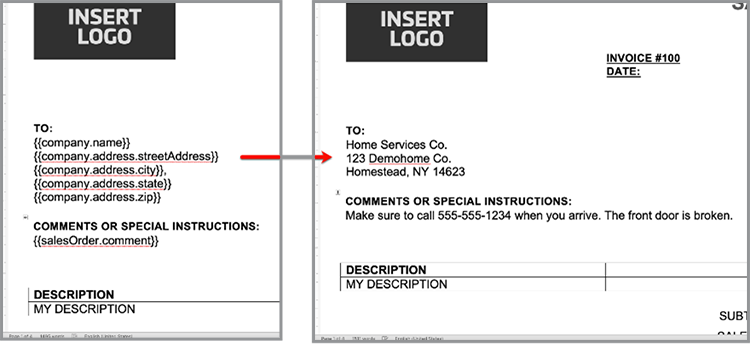

# Accélérez votre processus de vente


Des livres blancs aux contrats et accords, de nombreux documents sont nécessaires tout au long d&#39;un parcours d&#39;achat. Dans ce tutoriel, découvrez comment [[!DNL Adobe Acrobat Services]](https://developer.adobe.com/document-services/) peut intégrer des expériences documentaires tout au long de ce parcours pour accélérer les ventes.

## Générer des accords et des commandes client à partir de données

Les commandes ouvertes, les contrats et autres documents peuvent varier considérablement en fonction de critères spécifiques. Par exemple, un contrat de vente peut inclure uniquement certains termes basés sur des critères uniques, comme le fait d’être dans un pays ou un état spécifique ou d’inclure certains produits dans le cadre de l’accord. La création manuelle de ces documents ou la gestion de nombreuses variantes de modèle peuvent augmenter considérablement les coûts juridiques associés à la révision manuelle des modifications.

L&#39;[API Adobe Document Generation](https://developer.adobe.com/document-services/apis/doc-generation/) vous permet de prendre des données de votre système CRM ou d&#39;un autre système de données pour générer dynamiquement des documents commerciaux en fonction de ces données.

## Obtenir les informations d’identification

Commencez par vous inscrire pour obtenir des informations d’identification Adobe PDF Services gratuites :

1. Accédez [ici](https://documentcloud.adobe.com/dc-integration-creation-app-cdn/main.html) pour enregistrer vos informations d&#39;identification.
1. Connectez-vous à l’aide de votre Adobe ID.
1. Définissez votre nom d’identification (par exemple, Démonstration de commandes ouvertes).

   

1. Choisissez une langue pour télécharger votre exemple de code (par exemple, Node.js).
1. Vérifiez pour accepter les **[!UICONTROL conditions du développeur]**.
1. Sélectionnez **[!UICONTROL Créer des identifiants]**.
Un fichier est téléchargé sur votre ordinateur à l’aide d’un fichier ZIP contenant les fichiers d’exemple pdfservices-api-credentials.json et private.key pour l’authentification.

   

1. Sélectionnez **[!UICONTROL Obtenir le complément Microsoft Word]** ou accédez à [AppSource](https://appsource.microsoft.com/en-cy/product/office/WA200002654) pour l’installer.

   >[!NOTE]
   >
   >Pour installer le complément Word, vous devez être autorisé à installer des compléments dans Microsoft 365. Si vous ne disposez pas des autorisations nécessaires, contactez votre administrateur Microsoft 365.

## Vos données

Si vous extrayez des données d’un système de données spécifique, vous devez les exporter en tant que données JSON ou générer votre propre schéma. Ce scénario utilise l’ensemble de données d’exemple précréé suivant :

```
{
    "salesOrder": {
        "comment": "Make sure to call 555-555-1234 when you arrive. The front door is broken."
    },
    "company": {
        "name":"Home Services Co.",
        "address": {
            "city": "Homestead",
            "state": "NY",
            "zip": "14623",
            "streetAddress": "123 Demohome Street"
        }
    },
    "customer": {
        "address": {
            "city": "Seattle",
            "state": "WA",
            "zip": "98052",
            "streetAddress": "20341 Whitworth Institute 405 N. Whitworth"
        },
        "email": "mailto:jane-doe@xyz.edu",
        "jobTitle": "Professor",
        "name": "Jane Doe",
        "telephone": "(425) 123-4567",
        "url": "http://www.janedoe.com"
    },
    "tax": {
        "state":"WA",
        "rate": 0.08
    },
    "referencesOrder": [
        {
            "description": "Carpet Cleaning Service - 3BR 2BA",
            "totalPaymentDue": {
                "price": 359.54
            },
            "orderedItem": {
                "description": "Carpet Cleaning Service"
            }
        },
        {
            "description": "Home Cleaning Service - 3BR 2BA",
            "totalPaymentDue": {
                "price": 299.99
            },
            "orderedItem": {
                "description": "House Cleaning Service"
            }
        }
    ]
}
```

## Ajout de balises de base à un document

Ce scénario utilise un document de bon de commande qui peut être téléchargé [ici](https://github.com/benvanderberg/adobe-document-generation-samples/blob/main/SalesOrder/Exercise/SalesOrder_Base.docx?raw=true).


1. Ouvrez le document d&#39;exemple *SalesOrder.docx* dans Microsoft Word.
1. Si votre module externe Document Generation est installé, sélectionnez **[!UICONTROL Document Generation]** dans le ruban. Si vous ne voyez pas Génération de document dans votre ruban, suivez ces instructions.
1. Sélectionnez **[!UICONTROL Commencer]**.
1. Copiez les données d&#39;exemple JSON écrites ci-dessus dans le champ *Données JSON*.

   

Ensuite, accédez au panneau Balises de génération de document pour placer des balises dans le document.

1. Sélectionnez le texte à remplacer (par exemple, *NOM DE L&#39;ENTREPRISE*).
1. Dans le panneau *Balisage de génération de document*, recherchez « name ».
1. Dans la liste des balises, sélectionnez le nom sous Société.
1. Sélectionnez **[!UICONTROL Insérer du texte]**.

   

   Ce processus place une balise appelée {{company.name}}, car la balise se trouve sous le chemin dans le fichier JSON.

   ```
   {
   …
   "company": {
       "name":"Home Services Co.",
       …
   },
   …
   }
   ```

Répétez ces actions pour certaines balises supplémentaires du document, telles que STREET ADDRESS, CITY, STATE, ZIP, etc.

## Aperçu du document généré

Directement dans Microsoft Word, vous pouvez prévisualiser votre document généré en fonction des exemples de données JSON.

1. Dans le panneau *Balise Document Generation*, sélectionnez **[!UICONTROL Générer le document]**. La première fois, vous serez peut-être invité à vous connecter avec votre Adobe ID. Sélectionnez **[!UICONTROL Se connecter]** et remplissez les invites pour vous connecter avec vos informations d&#39;identification.

   

1. Sélectionnez **[!UICONTROL Afficher le document]**.

   

1. Une fenêtre de navigateur s’ouvre, vous permettant de prévisualiser les résultats du document.

   

Vous pouvez voir les balises du document qui ont été remplacées par les données des exemples de données d’origine.



## Ajouter un tableau au modèle

Dans le scénario suivant, ajoutez une liste de produits à un tableau dans le document.

1. Insérez votre curseur à l’endroit où le tableau doit être placé.
1. Dans le panneau *Balisage de génération de document*, sélectionnez **[!UICONTROL Avancé]**.
1. Développez **[!UICONTROL Tableaux et listes]**.
1. Dans le champ *Enregistrements de table*, sélectionnez *referencesOrder*, qui est un tableau qui répertorie tous les éléments du produit.
1. Dans le champ Sélectionner les enregistrements de colonne, saisissez pour inclure le champ *description* et *totalPaymentDue.price*.
1. Sélectionnez **[!UICONTROL Insérer un tableau]**.

   

Modifiez le tableau pour l’ajuster aux styles, tailles et autres paramètres comme tout autre tableau dans Microsoft Word.

## Ajouter un calcul numérique

Les calculs numériques permettent de calculer des sommes et d&#39;autres calculs à partir d&#39;une collection de données, telle qu&#39;une matrice. Dans ce scénario, ajoutez un champ pour calculer le sous-total.

1. Sélectionnez *$0.00* en regard du titre du sous-total.
1. Dans le panneau *[!UICONTROL Balise Document Generation]*, développez **[!UICONTROL Calculs numériques]**.
1. Sous *[!UICONTROL Sélectionner le type de calcul]*, choisissez **[!UICONTROL Agrégation]**.
1. Sous *[!UICONTROL Sélectionner le type]*, choisissez **[!UICONTROL Somme]**.
1. Sous *[!UICONTROL Sélectionner des enregistrements]*, choisissez **[!UICONTROL Ordre des références]**.
1. Sous *[!UICONTROL Sélectionner l&#39;élément pour effectuer l&#39;agrégation]**, choisissez **[!UICONTROL totalPaymentsDue.price]**.
1. Sélectionnez **[!UICONTROL Insérer un calcul]**.

Ce processus insère une balise de calcul qui fournit la somme des valeurs. Des calculs plus avancés peuvent être effectués à l’aide de calculs JSONata. Par exemple :

* Sous-total : `${{expr($sum(referencesOrder.totalPaymentDue.price))}}`
Calcule la somme de referencesOrder.totalPaymentDue.price.

* Taxe de vente : `${{expr($sum(referencesOrder.totalPaymentDue.price)*0.08)}}`
Calcule le prix et multiplie par 8 % pour calculer la taxe.

* Total dû : `${{expr($sum(referencesOrder.totalPaymentDue.price)*1.08)}}`
Calcule le prix et les multiples de 1,08 pour calculer le sous-total + la taxe.

## Ajouter des conditions conditionnelles

Les sections conditionnelles vous permettent d’inclure une phrase ou un paragraphe uniquement lorsqu’une certaine condition est remplie. Dans ce scénario, seule une section est incluse si elle correspond à un certain état.

1. Dans le document, recherchez la section intitulée *DÉCLARATIONS DE CONFIDENTIALITÉ EN CALIFORNIE*.
1. Sélectionnez la section avec votre curseur.

   

1. Dans le *[!UICONTROL Balisage de génération de document]*, sélectionnez **[!UICONTROL Avancé]**.
1. Développez **[!UICONTROL Contenu conditionnel]**.
1. Dans le champ *[!UICONTROL Sélectionner des enregistrements]*, recherchez et sélectionnez **[!UICONTROL customer.address.state]**.
1. Dans le champ *[!UICONTROL Sélectionner l&#39;opérateur]*, sélectionnez **=**.
1. Dans le champ *[!UICONTROL Valeur]*, saisissez *CA*.
1. Sélectionnez **[!UICONTROL Insérer une condition]**.

La section Californie apparaît uniquement dans le document généré si customer.address.state = CA.

Ensuite, sélectionnez la section pour DÉCLARATIONS DE CONFIDENTIALITÉ WASHINGTON et répétez les étapes ci-dessus, en remplaçant la valeur CA par WA.

## Ajouter une image dynamique

L’API Document Generation vous permet d’insérer des images de manière dynamique à partir de données. Cette fonction est utile lorsque vous avez différentes sous-marques et que vous souhaitez modifier des logos, des portraits ou des images pour les rendre plus pertinents pour un secteur d’activité donné.

Les images peuvent être transmises par une URL dans les données ou le contenu base64. Cet exemple utilise une URL.

1. Placez le curseur à l’endroit où vous souhaitez inclure une image.
1. Dans le panneau *[!UICONTROL Balisage de génération de document]*, sélectionnez **[!UICONTROL Avancé]**.
1. Développez **[!UICONTROL Images]**.
1. Dans le champ *[!UICONTROL Sélectionner des balises]*, choisissez **[!UICONTROL logo]**.
1. Dans le champ *[!UICONTROL Texte de remplacement facultatif]*, fournissez une description (c&#39;est-à-dire un logo). Ce processus insère un espace réservé pour l’image qui se présente comme suit :

   

Cependant, vous souhaitez définir l’image de manière dynamique sur une image qui se trouve déjà dans la mise en page, ce qui peut être fait comme suit :

1. Cliquez avec le bouton droit de la souris sur l’image d’espace réservé insérée.

   

1. Sélectionnez **[!UICONTROL Modifier le texte alternatif]**.
1. Dans le panneau, copiez le texte comme suit :
   `{ "location-path": "logo", "image-props": { "alt-text": "Logo" }}`
1. Sélectionnez dans le document une autre image à rendre dynamique.

   

1. Cliquez avec le bouton droit sur l&#39;image et sélectionnez **[!UICONTROL Modifier le texte de remplacement]**.
1. Collez la valeur dans le panneau.

Ce processus remplace l’image par une image qui se trouve dans la variable de logo dans les données.

## Ajout de balises pour Acrobat Sign

Adobe Acrobat Sign vous permet de capturer des signatures électroniques sur vos documents. Acrobat Sign offre un moyen simple de faire glisser et déposer des champs dans l’interface web. Vous pouvez également contrôler le placement des champs de signature et autres à l’aide d’une balise de texte. Grâce à la balise Adobe Document Generation, vous pouvez facilement placer ces champs de balise de texte.

1. Accédez à l’emplacement où une signature est requise dans le document type.
1. Insérez votre curseur à l’endroit où la signature est nécessaire.
1. Dans le panneau *[!UICONTROL Adobe Document Generation Tagger]*, sélectionnez **[!UICONTROL Adobe Sign]**.
1. Dans le champ *[!UICONTROL Spécifier le nombre de destinataires]*, définissez le nombre de destinataires (dans cet exemple, il s&#39;agit d&#39;un destinataire).
1. Dans le champ *[!UICONTROL Destinataires]*, sélectionnez **[!UICONTROL Signataire-1]**.
1. Dans le type *[!UICONTROL Champ]*, sélectionnez **[!UICONTROL Signature]**.
1. Sélectionnez **[!UICONTROL Insérer une balise de texte Adobe Sign]**.

Une balise est insérée dans le document.


Acrobat Sign propose plusieurs autres types de champs que vous pouvez placer, tels que les champs de date.
1. Dans le type *Champ*, sélectionnez **[!UICONTROL Date]**.
1. Déplacez le curseur sur l’emplacement Date dans le document.
1. Sélectionnez **[!UICONTROL Insérer une balise de texte Adobe Sign]**.


## Génération de votre accord

Vous avez balisé votre document et êtes prêt à commencer. Cette section explique comment générer un document à l’aide des exemples d’API Document Generation pour Node.js, mais ceux-ci fonctionneront dans toutes les langues.

Ouvrez le fichier pdfservices-node-sdk-samples-master qui a été téléchargé lors de l’enregistrement de vos informations d’identification. Les fichiers pdfservices-api-credentials.json et private.key doivent être inclus dans ces fichiers.

1. Ouvrez un Terminal pour installer des dépendances à l’aide de l’installation npm.
1. Copiez le fichier d’exemple data.json dans le dossier resources.
1. Copiez le modèle Word dans le dossier des ressources.
1. Créez un nouveau fichier dans le répertoire racine du dossier d’exemples appelé generate-salesOrder.js.

```
const PDFServicesSdk = require('@adobe/pdfservices-node-sdk');
const fs = require('fs');
const path = require('path');

var dataFileName = path.join('resources', '<INSERT JSON FILE');
var outputFileName = path.join('output', 'salesOrder_'+Date.now()+".pdf");
var inputFileName = path.join('resources', '<INSERT DOCX>');

//Loads credentials from the file that you created.
const credentials =  PDFServicesSdk.Credentials
    .serviceAccountCredentialsBuilder()
    .fromFile("pdfservices-api-credentials.json")
    .build();

// Setup input data for the document merge process
const jsonString = fs.readFileSync(dataFileName),
jsonDataForMerge = JSON.parse(jsonString);

// Create an ExecutionContext using credentials
const executionContext = PDFServicesSdk.ExecutionContext.create(credentials);

// Create a new DocumentMerge options instance
const documentMerge = PDFServicesSdk.DocumentMerge,
documentMergeOptions = documentMerge.options,
options = new documentMergeOptions.DocumentMergeOptions(jsonDataForMerge, documentMergeOptions.OutputFormat.PDF);

// Create a new operation instance using the options instance
const documentMergeOperation = documentMerge.Operation.createNew(options)

// Set operation input document template from a source file.
const input = PDFServicesSdk.FileRef.createFromLocalFile(inputFileName);
documentMergeOperation.setInput(input);

// Execute the operation and Save the result to the specified location.
documentMergeOperation.execute(executionContext)
.then(result => result.saveAsFile(outputFileName))
.catch(err => {
    if(err instanceof PDFServicesSdk.Error.ServiceApiError
        || err instanceof PDFServicesSdk.Error.ServiceUsageError) {
        console.log('Exception encountered while executing operation', err);
    } else {
        console.log('Exception encountered while executing operation', err);
    }
});
```

1. Remplacez `<INSERT JSON FILE>` par le nom du fichier JSON dans /resources.
1. Remplacez `<INSERT DOCX>` par le nom du fichier DOCX.
1. Pour l’exécuter, utilisez le Terminal pour exécuter le nœud generate-salesOrder.js.

Le fichier de sortie doit se trouver dans le dossier /output avec le document généré correctement.

## Autres options

Une fois votre document généré, vous pouvez effectuer des actions supplémentaires, telles que :

* Protection par mot de passe d’un document
* Compresser le PDF s’il y a de grandes images
* Capture de signatures électroniques sur le document

Pour en savoir plus sur certaines des autres actions disponibles, consultez les scripts du dossier /src dans les fichiers d’exemple. Vous pouvez également en savoir plus en consultant la documentation des différentes actions.

## Cas d’utilisation supplémentaires

[!DNL Adobe Acrobat Services] peut aider à rationaliser de nombreuses parties d&#39;un cycle de vente grâce aux workflows de documents numériques :

* Utilisez l’API Adobe PDF Embed pour intégrer des livres blancs et d’autres contenus sur les sites web, tout en mesurant et en collectant des analyses sur l’audience
* Utilisation d’Acrobat Sign pour capturer des signatures électroniques sur vos accords générés
* Extraction des données d’accord de vos documents de PDF à l’aide de l’API Adobe PDF Extract

## Formation continue

Vous souhaitez en savoir plus ? Jetez un œil à quelques autres façons d&#39;utiliser [!DNL Adobe Acrobat Services] :

* En savoir plus sur la [documentation](https://developer.adobe.com/document-services/docs/overview/)
* Voir d’autres tutoriels sur Adobe Experience League
* Utilisez les exemples de scripts du dossier /src pour voir comment tirer parti de PDF
* Suivez le [Blog sur les technologies d&#39;Adobe](https://medium.com/adobetech/tagged/adobe-document-cloud) pour obtenir les derniers conseils et astuces
* Abonnez-vous à [Paper Clips (diffusion mensuelle en direct)](https://www.youtube.com/playlist?list=PLcVEYUqU7VRe4sT-Bf8flvRz1XXUyGmtF) pour en savoir plus sur l&#39;automatisation à l&#39;aide de [!DNL Adobe Acrobat Services].
=======
* En savoir plus sur la [documentation](https://developer.adobe.com/document-services/docs/overview/)
* Voir d’autres tutoriels sur Adobe Experience League
* Utilisez les exemples de scripts du dossier /src pour voir comment tirer parti de PDF
* Suivez le [Blog sur les technologies d&#39;Adobe](https://medium.com/adobetech/tagged/adobe-document-cloud) pour obtenir les derniers conseils et astuces
* Abonnez-vous à [Paper Clips (diffusion mensuelle en direct)](https://www.youtube.com/playlist?list=PLcVEYUqU7VRe4sT-Bf8flvRz1XXUyGmtF) pour en savoir plus sur l&#39;automatisation à l&#39;aide de [!DNL Adobe Acrobat Services]
