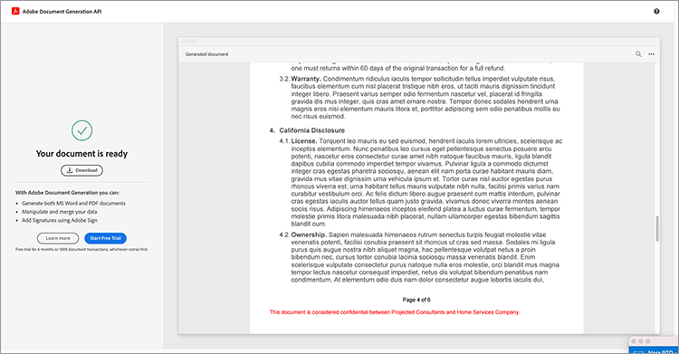

# Automatisation des workflows juridiques


Dans un scénario idéal, les conditions des accords sont acceptées sans aucune modification. Souvent, cependant, les accords doivent être personnalisés, ce qui nécessite ensuite un examen juridique. Les révisions juridiques entraînent des coûts importants et ralentissent le processus de livraison des termes de l’accord. L’utilisation de modèles prédéfinis qui changent en fonction de la langue approuvée aide les équipes juridiques à gérer et à exécuter les termes des accords de manière plus sécurisée.

Ce tutoriel utilise un accord légal qui varie d’un état à l’autre. Pour tenir compte de ces variations, un modèle d’accord avec des sections conditionnelles est créé. Celles-ci ne sont incluses que lorsque certains critères sont remplis. Le document généré peut être un document Word ou un document PDF. Vous pouvez également découvrir quelques méthodes de sécurisation de votre document à l’aide de l’API Adobe PDF Services ou d’Acrobat Sign.

## Obtenir les informations d’identification

Commencez par vous inscrire pour obtenir des informations d’identification Adobe PDF Services gratuites :

1. Accédez [ici](https://documentcloud.adobe.com/dc-integration-creation-app-cdn/main.html) pour enregistrer vos informations d&#39;identification.
1. Connectez-vous à l’aide de votre Adobe ID.
1. Définissez votre nom d’identification.

   

1. Choisissez une langue pour télécharger votre exemple de code (par exemple, Node.js).
1. Vérifiez pour accepter les **[!UICONTROL conditions du développeur]**.
1. Sélectionnez **[!UICONTROL Créer des identifiants]**.
Un fichier est téléchargé sur votre ordinateur à l’aide d’un fichier ZIP contenant les fichiers d’exemple pdfservices-api-credentials.json et private.key pour l’authentification.

   

1. Sélectionnez **[!UICONTROL Obtenir le complément Microsoft Word]** ou accédez à [AppSource](https://appsource.microsoft.com/en-cy/product/office/WA200002654) pour l’installer.

   >[!NOTE]
   >
   >Pour installer le complément Word, vous devez être autorisé à installer des compléments dans Microsoft 365. Si vous ne disposez pas des autorisations nécessaires, contactez votre administrateur Microsoft 365.

## Vos données

Dans ce scénario, des informations sont transmises pour aider à générer le document et indiquer si certaines sections doivent être incluses ou non :

```
{
    "customer": {
        "name": "Home Services Company",
        "street": "123 Any Street",
        "city": "Anywhere",
        "state": "CA",
        "zip": "12345",
        "country":"USA",
        "signer": {
            "email": "johnnyechostone@gmail.com",
            "firstName": "John",
            "lastName": "Echostone"
        }
    },
    "company": {
        "name": "Projected Consultants",
        "signer": {
            "email": "maryburostone@gmail.com",
            "firstName": "Mary",
            "lastName": "Burostone"
        }
    },
    "conditions": {
        "includeGeneralTerms": true,
        "includeConsumerDiscloure": true
    }
}
```

Les données contiennent des informations sur le client, son nom, qui signe, l’état dans lequel il se trouve, etc. En outre, des sections contiennent des informations sur la société qui génère l’accord et des indicateurs de condition utilisés pour inclure certaines sections de l’accord.

## Ajout de balises de base à un document

Ce scénario utilise un document de conditions générales qui peut être téléchargé [ici](https://github.com/benvanderberg/adobe-document-generation-samples/blob/main/Agreement/exercise/TermsAndConditions_Sample.docx?raw=true).


1. Ouvrez le document d&#39;exemple *TermsAndConditions.docx* dans Microsoft Word.
1. Si le plug-in [Document Generation](https://appsource.microsoft.com/en-cy/product/office/WA200002654) est installé, sélectionnez **[!UICONTROL Document Generation]** dans le ruban. Si vous ne voyez pas Génération de document dans votre ruban, suivez ces instructions.
1. Sélectionnez **[!UICONTROL Commencer]**.
1. Copiez les données d’exemple JSON écrites ci-dessus dans le champ Données JSON.

   

Accédez au panneau *Balisage de génération de document* pour placer des balises dans le document.

## Insérer le nom de la société

1. Sélectionnez le texte à remplacer. Dans ce scénario, vous remplacez l’ENTREPRISE dans la section d’ouverture du document.
1. Dans *Balisage de génération de document*, recherchez « name ».
1. Sous Société, choisissez *nom*.

   

1. Sélectionnez **[!UICONTROL Insérer du texte]**.

Une balise appelée `{{company.name}}` est placée, car elle se trouve sous ce chemin dans le fichier JSON.

```
{
    "company": {
        "name": "Projected Consultants",
        ...
    }
    ...
}
```

Répétez ensuite cette étape dans la section d’ouverture pour le texte CLIENT. Répétez les **étapes 1 à 4**, en remplaçant CLIENT par « nom » sous client. La sortie doit être `{{customer.name}}`, ce qui indique que le texte provient du dessous de l&#39;objet client.

L’API Adobe Document Generation vous permet également d’inclure des balises dans vos en-têtes et pieds de page et à l’extrémité où les titres des signatures doivent aller.

Répétez ce processus à nouveau en **étapes 1 à 4** pour le texte SOCIÉTÉ et CLIENT dans le pied de page.


Enfin, vous devez **répéter les étapes 1 à 4** pour remplacer PRÉNOM et NOM sous la section Client de la page de signature par les balises pour `{{customer.signer.firstName}}` et `{{customer.signer.lastName}}`, respectivement. Ne vous inquiétez pas si la balise est longue et passe à la ligne suivante, car elle est remplacée lors de la génération du document.

Le début de votre document et le pied de page doivent ressembler à ceci :

* Première section :


* Footer :


* Page de signature :


Maintenant que vos balises sont placées dans le document, vous êtes prêt à prévisualiser votre accord généré.

## Aperçu du document généré

Directement dans Microsoft Word, vous pouvez prévisualiser votre document généré en fonction des exemples de données JSON.

1. Dans *Balisage de génération de document*, sélectionnez **[!UICONTROL Générer le document]**.
1. La première fois, vous serez peut-être invité à vous connecter avec votre Adobe ID. Sélectionnez **[!UICONTROL Se connecter]** et remplissez les invites pour vous connecter avec vos informations d&#39;identification.

   

1. Sélectionnez **[!UICONTROL Afficher le document]**.

   

1. Une fenêtre de navigateur s’ouvre, vous permettant de prévisualiser les résultats du document.

   

## Ajouter des conditions conditionnelles pour chaque état

Dans la section suivante, vous définissez uniquement certaines sections à inclure en fonction de certains critères de données d&#39;entrée. Dans le document d’exemple, les sections 4 et 5 concernent uniquement un état spécifique. Dans ce scénario, seules les conditions spécifiques à l’état doivent être incluses lorsqu’un client réside dans cet état. En outre, la numérotation dans Microsoft Word ne doit pas inclure cette section si elle est supprimée. Utilisez la fonction de contenu conditionnel de l’API Document Generation pour baliser ce paramètre.


1. Dans le document, sélectionnez la section Divulgation en Californie et toutes les sous-puces.

   

1. Dans *[!UICONTROL Balisage de génération de document]*, sélectionnez **[!UICONTROL Avancé]**.
1. Développez **[!UICONTROL Contenu conditionnel]**.
1. Dans le champ *[!UICONTROL Sélectionner des enregistrements]*, recherchez et sélectionnez **[!UICONTROL customer.state]**.
1. Dans le champ *[!UICONTROL Sélectionner l&#39;opérateur]*, sélectionnez **=**.
1. Dans le champ *[!UICONTROL Valeur]*, saisissez *CA*.
1. Sélectionnez **[!UICONTROL Insérer une condition]**.

La section est maintenant enveloppée avec certaines balises appelées balises de section conditionnelle. Lorsque vous avez ajouté les balises, la balise de section conditionnelle a peut-être été ajoutée en tant que ligne numérotée. Vous pouvez supprimer ce problème en définissant un espace en arrière-plan avant la balise, sans quoi les éléments seront numérotés comme si la balise n’était pas là lors de la génération du document. La section conditionnelle se termine par la balise ``.


**Répétez les étapes 1 à 7** pour la section *Divulgation de l&#39;état de Washington*, en remplaçant la valeur *CA* par *WA* pour indiquer que la section n&#39;est affichée que si l&#39;état du client est Washington.


## Test avec des sections conditionnelles

Une fois vos sections conditionnelles en place, vous pouvez prévisualiser votre document en sélectionnant **Générer le document**.

Lorsque vous générez votre document, notez que la section incluse est uniquement celle qui répond aux critères de données. Dans l’exemple ci-dessous, étant donné que l’état était égal à CA, seule la section California est incluse.



Une autre modification notable est que la numérotation de la section suivante, Utilisation des Services et des Logiciels, porte le numéro 5. Cela signifie que lorsque la section Washington est omise, la numérotation continue.


Pour vérifier si le modèle se comporte correctement lorsque le client se trouve dans l’État de Washington plutôt qu’en Californie, modifiez les données d’exemple pour le modèle :

1. Dans *Baliseur de génération de document*, sélectionnez **[!UICONTROL Modifier les données d&#39;entrée]**.

   

1. Sélectionnez **[!UICONTROL Modifier]**.

1. Dans les données JSON, remplacez *CA* par *WA*.

   

1. Sélectionnez **[!UICONTROL Générer des balises]**.
1. Sélectionnez **[!UICONTROL Générer le document]** pour régénérer le document.

Notez que le document inclut uniquement la section relative à l’État de Washington.


## Ajout d&#39;une peine avec sursis

Tout comme les articles sur les peines avec sursis, on peut aussi prévoir des peines particulières lorsque certaines conditions sont remplies. Pour cet exemple, la politique de retour est différente entre la Californie et Washington.

1. Dans la section 3.1, sélectionnez la première phrase « Lors de l&#39;achat dans l&#39;État de Washington, un produit doit être retourné par MAIL dans les 30 jours suivant la transaction originale pour obtenir un remboursement complet. ».
1. Dans *[!UICONTROL Balisage de génération de document]*, sélectionnez **[!UICONTROL Avancé]**.
1. Développez **[!UICONTROL Contenu conditionnel]**.
1. Sous *[!UICONTROL Type de contenu]*, sélectionnez **[!UICONTROL Expression]**.
1. Dans le champ *[!UICONTROL Sélectionner des enregistrements]*, recherchez et sélectionnez **[!UICONTROL customer.state]**.
1. Dans le champ *[!UICONTROL Sélectionner l&#39;opérateur]*, sélectionnez **=**.
1. Dans le champ *[!UICONTROL Valeur]*, saisissez *CA*.
1. Sélectionnez **[!UICONTROL Insérer une condition]**.

Bien que le nom de la balise soit le même, la principale différence entre Expression et Section réside dans le fait qu’une expression dont la section n’inclut pas de nouvelles lignes. La balise condition-section et la balise -end-section doivent se trouver dans le même paragraphe.


## Ajout de balises pour Acrobat Sign

Acrobat Sign vous permet d’envoyer des accords pour signature ou de les incorporer dans une expérience web afin que quelqu’un puisse facilement les consulter et les signer. Adobe Document Generation Tagger dans Microsoft Word vous permet de pré-baliser facilement les documents avant qu’ils ne soient envoyés avec Acrobat Sign, afin que les signatures soient toujours placées au bon endroit. Dans ce scénario, deux signataires ont besoin d’un emplacement pour signer et dater le document.

1. Accédez à l’endroit où le client doit signer.
1. Placez le curseur à l’endroit où la signature doit être placée.

   

1. Dans *[!UICONTROL Balisage Document Generation]*, sélectionnez **[!UICONTROL Adobe Sign]**.
1. Dans le champ *[!UICONTROL Spécifier le nombre de destinataires]*, définissez le nombre de destinataires (2 dans cet exemple).
1. Dans le champ *[!UICONTROL Destinataires]*, sélectionnez **[!UICONTROL Signataire-1]**.
1. Dans le type *[!UICONTROL Champ]*, sélectionnez **[!UICONTROL Signature]**.
1. Sélectionnez **[!UICONTROL Insérer une balise de texte Adobe Sign]**.

   

>[!NOTE]
>
>Si le bouton **Insérer une balise de texte Adobe Sign** semble manquant, faites défiler vers le bas.

Un champ de signature est alors placé là où le premier signataire doit signer.


Ensuite, placez un champ de données pour le signataire qui le renseigne automatiquement lorsqu’il signe.

1. Déplacez votre curseur à l’endroit où la date doit être placée.

   

1. Définissez le type de champ sur Date.
1. Sélectionnez **[!UICONTROL Insérer une balise de texte Adobe Sign]**.

La balise Date placée est assez longue : `{{Date 3_es_:signer1:date:format(mm/dd/yyyy):font(size=Auto)}}`. La balise de texte Acrobat Sign doit rester sur la même ligne, ce qui est différent des balises Document Generation. Les paramètres `:format()` et `font()` sont facultatifs. Pour ce scénario, nous pouvons donc réduire la balise à `{{Date 3_es_:signer1:date}}`.

Répétez les étapes ci-dessus dans la section *Signature de l&#39;entreprise*. Dans ce cas, vous devez remplacer le champ Destinataires par **Signataire-2**, sinon tous les champs de signature sont attribués à la même personne.

## Génération de votre accord

Vous avez balisé votre document et êtes prêt à commencer. Dans cette section, découvrez comment générer un document à l’aide des exemples d’API Document Generation pour Node.js. Ces exemples fonctionnent dans toutes les langues.

Ouvrez le fichier pdfservices-node-sdk-samples-master que vous avez téléchargé lors de l’enregistrement de vos informations d’identification. Ces fichiers incluent les fichiers pdfservices-api-credentials.json et private.key.

1. Ouvrez votre **[!UICONTROL Terminal]** pour installer les dépendances à l&#39;aide de `npm install`.
1. Copiez votre exemple *data.json* dans le dossier *resources*.
1. Copiez le modèle Word que vous avez créé dans le dossier *ressources*.
1. Créez un nouveau fichier dans le répertoire racine du dossier d&#39;échantillons appelé *generate-salesOrder.js*.

   ```
   const PDFServicesSdk = require('@adobe/pdfservices-node-sdk').
   const fs = require('fs');
   const path = require('path');
   
   var dataFileName = path.join('resources', '<INSERT JSON FILE');
   var outputFileName = path.join('output', 'salesOrder_'+Date.now()+".pdf");
   var inputFileName = path.join('resources', '<INSERT DOCX>');
   
   //Loads credentials from the file that you created.
   const credentials =  PDFServicesSdk.Credentials
      .serviceAccountCredentialsBuilder()
      .fromFile("pdfservices-api-credentials.json")
      .build();
   
   // Setup input data for the document merge process
   const jsonString = fs.readFileSync(dataFileName),
   jsonDataForMerge = JSON.parse(jsonString);
   
   // Create an ExecutionContext using credentials
   const executionContext = PDFServicesSdk.ExecutionContext.create(credentials);
   
   // Create a new DocumentMerge options instance
   const documentMerge = PDFServicesSdk.DocumentMerge,
   documentMergeOptions = documentMerge.options,
   options = new documentMergeOptions.DocumentMergeOptions(jsonDataForMerge, documentMergeOptions.OutputFormat.PDF);
   
   // Create a new operation instance using the options instance
   const documentMergeOperation = documentMerge.Operation.createNew(options)
   
   // Set operation input document template from a source file.
   const input = PDFServicesSdk.FileRef.createFromLocalFile(inputFileName);
   documentMergeOperation.setInput(input);
   
   // Execute the operation and Save the result to the specified location.
   documentMergeOperation.execute(executionContext)
   .then(result => result.saveAsFile(outputFileName))
   .catch(err => {
      if(err instanceof PDFServicesSdk.Error.ServiceApiError
         || err instanceof PDFServicesSdk.Error.ServiceUsageError) {
         console.log('Exception encountered while executing operation', err);
      } else {
         console.log('Exception encountered while executing operation', err);
      }
   });
   ```

1. Remplacez `<JSON FILE>` par le nom du fichier JSON dans /resources.
1. Remplacez `<INSERT DOCX>` par le nom du fichier DOCX.
1. Pour exécuter, utilisez le **[!UICONTROL Terminal]** pour exécuter le nœud `generate-salesOrder.js`.

Le fichier de sortie se trouve dans le dossier /output avec le document généré correctement.

Vous pouvez modifier le format en modifiant la ligne ci-dessous. Le format DOCX est utile si ce document doit être envoyé pour modification dans Word ou pour révision de contrat.

PDF :

```
options = new documentMergeOptions.DocumentMergeOptions(jsonDataForMerge,
documentMergeOptions.OutputFormat.PDF);
```

Mot :

```
options = new documentMergeOptions.DocumentMergeOptions(jsonDataForMerge, documentMergeOptions.OutputFormat.DOCX);
```

Vous devez également modifier le nom du fichier de sortie en .pdf ou .docx pour le format de sortie PDF ou DOCX respectivement :

```
var outputFileName = path.join('output', 'salesOrder_'+Date.now()+".docx");
```

## Envoyer l’accord pour signature

[Adobe Acrobat Sign](https://www.adobe.com/acrobat/business/sign.html) vous permet d’envoyer des accords à un ou plusieurs destinataires pour qu’ils puissent consulter et signer des documents. En plus d’une expérience utilisateur simple d’utilisation pour l’envoi d’un document pour signature, les API REST sont disponibles pour vous permettre de prendre des fichiers Word, PDF, HTML et autres formats et de les envoyer pour signature.

L’exemple ci-dessous explique comment utiliser la page de documentation de l’API REST pour prendre le document précédemment généré et l’envoyer pour signature. Tout d’abord, découvrez comment procéder via l’interface web d’Acrobat Sign, puis comment procéder avec l’API REST.

## Obtenir un compte Acrobat Sign

Si vous ne disposez pas d&#39;un compte Acrobat Sign, inscrivez-vous pour obtenir un compte développeur et consultez la documentation [ici](https://developer.adobe.com/adobesign-api/), puis sélectionnez **Inscription à un compte développeur**. Vous êtes invité à remplir un formulaire et à recevoir un e-mail de vérification. Une fois cela fait, vous êtes redirigé vers un site Web pour définir votre mot de passe et votre compte où vous pouvez ensuite vous connecter à Acrobat Sign.

## Envoi d’un accord à partir de l’interface web

1. Sélectionnez **[!UICONTROL Envoyer]** dans la barre de navigation.

   

1. Dans le champ *Destinataires*, spécifiez deux adresses e-mail. Il est recommandé d’utiliser une adresse e-mail non associée à votre compte Acrobat Sign.

   

1. Définissez **[!UICONTROL Nom de l’accord]** et **[!UICONTROL Message]**.
1. Sélectionnez **[!UICONTROL Ajouter des fichiers]** et chargez le fichier généré à partir de votre ordinateur.
1. Sélectionnez **[!UICONTROL Prévisualiser et ajouter des champs de signature]**.
1. Sélectionnez **[!UICONTROL Suivant]**.
1. Lorsque vous faites défiler la page de signature vers le bas, vous pouvez voir les champs de signature placés en fonction des balises.

   

1. Sélectionnez **[!UICONTROL Envoyer]**.
1. Dans votre e-mail, un message contenant un lien pour afficher et signer s’affiche.

   

1. Sélectionnez **[!UICONTROL Vérifier et signer]**.
1. Sélectionnez **[!UICONTROL Continuer]** pour accepter les conditions d&#39;utilisation.
1. Sélectionnez **[!UICONTROL Démarrer]** pour accéder à l’endroit où vous devez signer.

   

1. Sélectionnez **[!UICONTROL Cliquez ici pour signer]**.

   

1. Saisissez votre signature.

   

1. Sélectionnez **[!UICONTROL Appliquer]**.
1. Sélectionnez **[!UICONTROL Cliquer pour signer]**.

Un e-mail est envoyé au signataire suivant. Répétez les étapes 9 à 16 pour afficher et signer le document pour le deuxième signataire.

Une fois l’accord rempli, une copie signée de celui-ci est envoyée par e-mail à chacune des parties. En outre, un accord signé peut être récupéré à partir de l’interface web Acrobat Sign dans la page **Gérer**.


Ensuite, découvrez comment appliquer le même scénario via la documentation de l’API REST.

## Obtenir les informations d’identification

1. Accédez à la [documentation REST Acrobat Sign](https://secure.na1.adobesign.com/public/docs/restapi/v6).
1. Développez *transientDocuments* et le [POST /transientDocuments](https://benprojecteddemo.na1.adobesign.com/public/docs/restapi/v6#!/transientDocuments/createTransientDocument).
1. Sélectionnez **[!UICONTROL JETON D’ACCÈS OAUTH]**.

   

1. Vérifiez les autorisations OAUTH pour *agreement_write*, *agreement_sign*, *widget_write* et *library_write*.
1. Sélectionnez **[!UICONTROL Autoriser]**.
1. Une fenêtre contextuelle vous invite à vous connecter avec votre compte Acrobat Sign. Connectez-vous à l’utilisateur avec le nom d’utilisateur et le mot de passe de votre administrateur.
1. Vous êtes invité à autoriser l’accès à la documentation REST. Sélectionnez **[!UICONTROL Autoriser l’accès]**.

Un jeton de support est ensuite ajouté au champ **Autorisation**.

Pour en savoir plus sur la création d’un jeton d’autorisation pour Acrobat Sign, suivez l’étape [ici](https://opensource.adobe.com/acrobat-sign/developer_guide/helloworld.html).

## Chargement d’un document temporaire

Étant donné que le jeton d’autorisation a été ajouté à partir des étapes précédentes, vous devez télécharger un document pour effectuer l’appel API :

1. Dans le champ *Fichier*, téléchargez le document du PDF qui a été généré lors des étapes précédentes.

   

1. Sélectionnez **[!UICONTROL Tester !]**.
1. Dans le **[!UICONTROL corps de la réponse]**, copiez la valeur *transientDocumentId*.

L&#39;*transientDocumentId* est utilisé pour référencer un document temporairement stocké dans Acrobat Sign afin qu&#39;il puisse être référencé dans les appels d&#39;API suivants.

## Envoi pour signature

Une fois qu’un document est chargé, vous devez envoyer l’accord pour signature.

1. Développez la section Accord et les sections Accord du POST.
1. Dans le champ *AgreementInfo*, renseignez-le avec le fichier JSON suivant :

   ```
   {
   "fileInfos": [
      {
         "transientDocumentId": "3AAABLblqZhAJeoswpyslef8_toTGT1WgBLk3TlhfJXy_uSLlKyre2hjF0-J1meBDn0PlShk0uQy6JghlqEoqXNnskq7YawteF6QWtHefP9wN2CW_Xbt0O9kq1tkpznG0a5-mEm4bYAV1FGOnD1mt_ooYdzKxm7KzTB11DLX2-81Zbe2Z1suy7oXiWNR3VSb-zMfIb5D4oIxF8BiNfN0q08RwT108FcB1bx4lekkATGld3nRbf8ApVPhB72VNrAIF0F1rAFBWTtfgvBKZaxrYSyZq73R_neMdvZEtxWTk5fii_bLVe7VdNZMcO55sofH61eQC_QIIsoYswZP4rw6dsTa68ZRgKUNs"
      }
   ],
   "name": "Terms and Conditions",
   "participantSetsInfo": [
      {
         "memberInfos": [
         {
            "email": "adobesigndemo+customer@outlook.com"
         }
         ],
         "order": 1,
         "role": "SIGNER"
      },
      {
         "memberInfos": [
            {
               "email": "adobesigndemo+company@outlook.com"
            }
         ],
         "order": 1,
         "role": "SIGNER"
         }
   ],
   "signatureType": "ESIGN",
   "state": "IN_PROCESS"
   }
   ```

1. Sélectionnez **[!UICONTROL Tester !]**.

L’API **accords de POST** renvoie un ID pour l’accord. Pour obtenir un modèle pour le schéma de modèle JSON, sélectionnez **Modèle minimal**. Une liste complète des paramètres est disponible dans la section **Schéma de modèle complet**.

## Vérifier le statut de l’accord

Une fois que vous avez un ID d’accord, vous pouvez envoyer un statut d’accord.

1. Développez **[!UICONTROL GET /agreements/{agreementId}]**.
1. Étant donné que vous pouvez avoir besoin d&#39;une portée OAUTH supplémentaire, sélectionnez à nouveau **[!UICONTROL JETON D&#39;ACCÈS OAUTH]**.
1. Copiez l’agreementId de la réponse à l’appel API précédent dans le champ agreementId.
1. Sélectionnez **[!UICONTROL Tester !]**.

Vous avez maintenant des renseignements sur cet accord.

```
{
    "id": "CBJCHBCAABAAc6LyP4SVuKXP_pNstzIzyripanRdz4IB",
    "name": "Terms and Conditions",
    "groupId": "CBJCHBCAABAAoyMb1yIgczAGhBuJeHf99mglPtM7ElEu",
    "type": "AGREEMENT",
    "participantSetsInfo": [
      {
        "id": "CBJCHBCAABAAzZE-IcHHkt05-AVbxas4Jz7DUl3oEBO6",
        "memberInfos": [
          {
            "email": "adobesigndemo+customer@outlook.com",
            "id": "CBJCHBCAABAAyWgMMReqbxUFM7ctI5xz16c2kOmEy-IQ",
            "securityOption": {
              "authenticationMethod": "NONE"
            }
          }
        ],
        "role": "SIGNER",
        "order": 1
      },
      {
        "id": "CBJCHBCAABAAaRHz3gY2W0w5n_6pj1GMMuZAfhBihc1j",
        "memberInfos": [
          {
            "email": "adobesigndemo+company@outlook.com",
            "id": "CBJCHBCAABAAOZQwjPwJXFiX8YDKPYtzMpftsmxYrIo9",
            "securityOption": {
              "authenticationMethod": "NONE"
            }
          }
        ],
        "role": "SIGNER",
        "order": 1
      }
    ],
    "senderEmail": "adobesigndemo+new@outlook.com",
    "createdDate": "2022-03-22T02:59:36Z",
    "lastEventDate": "2022-03-22T02:59:41Z",
    "signatureType": "ESIGN",
    "locale": "en_US",
    "status": "OUT_FOR_SIGNATURE",
    "documentVisibilityEnabled": true,
    "hasFormFieldData": false,
    "hasSignerIdentityReport": false,
    "documentRetentionApplied": false
  }
```

La méthode la plus efficace pour recevoir des notifications lorsque des mises à jour sont modifiées consiste à utiliser des webhooks, que vous pouvez découvrir [ici](https://opensource.adobe.com/acrobat-sign/developer_guide/webhookapis.html).

## Stocker un document signé

Une fois le document signé, il peut être récupéré à l’aide du fichier GET /agreements/combinedDocument.

1. Développez **[!UICONTROL GET /agreements/{agreementId}/combinedDocument]**.
1. Définissez **[!UICONTROL agreementId]** sur *agreementId* fourni lors de l’appel API précédent.
1. Sélectionnez **[!UICONTROL Tester !]**.

Les paramètres attachSupportingDocuments et attachAuditReport permettent de définir des paramètres supplémentaires pour joindre un rapport d’audit ou des documents d’accompagnement.

Dans le **corps de la réponse**, il peut ensuite être téléchargé sur votre ordinateur et stocké où vous le souhaitez.

## Autres options

En plus de générer un document et de l’envoyer pour signature, des actions supplémentaires sont disponibles.

Par exemple, si le document n’a pas de signature, l’API Adobe PDF Services offre plusieurs moyens de transformer les documents après la génération de l’accord, tels que :

* Protection par mot de passe d’un document
* Compresser le PDF s’il y a de grandes images
* Pour en savoir plus sur les autres actions disponibles, consultez les scripts du dossier /src dans les fichiers d’exemple pour l’API Adobe PDF Services. Vous pouvez également en savoir plus en consultant la documentation des différentes actions pouvant être utilisées.

En outre, Acrobat Sign offre plusieurs fonctions supplémentaires telles que :

* Intégration de l’expérience de signature dans une application
* Ajout de méthodes de vérification de l’identité pour les signataires
* Configuration des paramètres de notification par e-mail
* Téléchargement de documents distincts individuels dans le cadre d’un accord

## Formation continue

Vous souhaitez en savoir plus ? Jetez un œil à quelques autres façons d&#39;utiliser [!DNL Adobe Acrobat Services] :

* En savoir plus sur la [documentation](https://developer.adobe.com/document-services/docs/overview/)
* Voir d’autres tutoriels sur Adobe Experience League
* Utilisez les exemples de scripts du dossier /src pour voir comment utiliser PDF
* Suivez le [Blog sur les technologies d&#39;Adobe](https://medium.com/adobetech/tagged/adobe-document-cloud) pour obtenir les derniers conseils et astuces
* Abonnez-vous à [Paper Clips (diffusion mensuelle en direct)](https://www.youtube.com/playlist?list=PLcVEYUqU7VRe4sT-Bf8flvRz1XXUyGmtF) pour en savoir plus sur l&#39;automatisation à l&#39;aide de [!DNL Adobe Acrobat Services].
