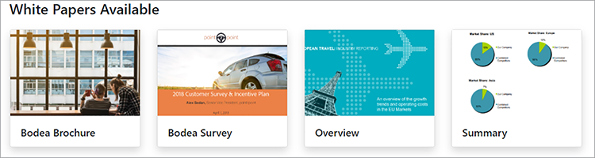
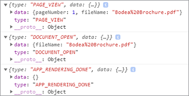

# Publication de documents numériques


Les documents électroniques sont partout - en fait, il y a probablement [billions de PDF](https://itextpdf.com/en/blog/technical-notes/do-you-know-how-many-pdf-documents-exist-world) dans le monde, et ce nombre augmente chaque jour. En incorporant une visionneuse de PDF dans vos pages web, vous permettez aux utilisateurs de visualiser les documents sans avoir à remanier votre HTML et votre feuille de style CSS, ni à entraver l’accès à votre site web.

Explorons un scénario populaire. Une entreprise publie [des livres blancs sur son site web](https://developer.adobe.com/document-services/use-cases/content-publishing/digital-content-publishing)
pour fournir du contexte pour leurs applications et services. Le spécialiste du marketing du site Web veut mieux comprendre comment les utilisateurs interagissent avec le contenu de leur PDF et l&#39;incorporer à leur page Web et à leur marque. Ils ont décidé de publier les livres blancs en tant que [contenu sécurisé](https://whatis.techtarget.com/definition/gated-content-ungated-content#:~:text=Gated%20content%20is%20online%20materials,about%20their%20jobs%20and%20organizations.), afin de contrôler qui peut les télécharger.

## Ce que vous pouvez apprendre

Dans ce tutoriel pratique, découvrez comment afficher des documents de PDF incorporés dans des pages web à l&#39;aide de l&#39;[API Adobe PDF Embed](https://developer.adobe.com/document-services/apis/pdf-embed), qui est gratuite et facile à utiliser. Ces exemples utilisent JavaScript, Node.js, Express.js, HTML et CSS. Vous pouvez afficher le code de projet complet sur [GitHub](https://www.google.com/url?q=https://github.com/marcelooliveira/EmbedPDF/tree/main/pdf-app&amp;sa=D&amp;source=editors&amp;ust=1617129543031000&amp;usg=AOvVaw2rzSwYuJ_JI7biVIgbNMw1).

## Ressources et API pertinentes

* [API PDF Embed](https://www.adobe.com/devnet-docs/dcsdk_io/viewSDK/index.html)

* [API PDF Services](https://opensource.adobe.com/pdftools-sdk-docs/release/latest/index.html)

* [Code de projet](https://www.google.com/url?q=https://github.com/marcelooliveira/EmbedPDF/tree/main/pdf-app&amp;sa=D&amp;source=editors&amp;ust=1617129543031000&amp;usg=AOvVaw2rzSwYuJ_JI7biVIgbNMw1)

## Création d&#39;une application web de nœud

Commençons par créer un site utilisant Node.js et Express qui utilise un joli modèle et propose plusieurs PDF en téléchargement.

Commencez par [télécharger et installer Node.js](https://nodejs.org/en/download/).

Pour créer facilement un projet Node.js avec une structure d&#39;application web minimale, installez l&#39;outil de générateur d&#39;applications `` `express-generator` ``.

```
npm install express-generator -g
```

Ensuite, créez la nouvelle application Express nommée pdf-app, en choisissant comme moteur d’affichage.

```
express pdf-app --view=ejs
```

Maintenant, passez au répertoire \\pdf-app et installez toutes les dépendances du projet.

```
cd pdf-app
npm install
```

Ensuite, démarrez le serveur web local et exécutez l’application.

```
npm start
```

Enfin, ouvrez le site Web à l&#39;adresse <http://localhost:3000>.


Vous avez maintenant un site Web de base.

## Rendu des données du livre blanc

Pour publier des livres blancs sur le site Web, les données du livre blanc sont définies et préparées sur le site Web pour afficher ces documents. Tout d’abord, créez un nouveau dossier \\data à la racine du projet. Les informations sur les livres blancs disponibles proviennent d&#39;un nouveau fichier nommé [data.json](https://github.com/marcelooliveira/EmbedPDF/blob/main/pdf-app/data/data.json), qui est placé dans le dossier des données.

Pour donner à l&#39;application web un aspect soigné, installez les bibliothèques front-end [Bootstrap](https://getbootstrap.com/) et [Font Awesome](https://fontawesome.com/).

```
npm install bootstrap
npm install font-awesome
```

Ouvrez le fichier app.js et incluez ces répertoires en tant que sources pour les fichiers statiques, en les plaçant après la ligne `` `express.static` `` existante.

```
app.use(express.static(path.join(__dirname, '/node_modules/bootstrap/dist')));
app.use(express.static(path.join(__dirname, '/node_modules/font-awesome')));
```

Pour inclure les documents du PDF, créez un dossier nommé \\pdfs sous le dossier \\public du projet. Au lieu de créer vous-même les mots de PDF et les vignettes, vous pouvez les copier à partir de ce [dossier de référentiel GitHub](https://github.com/marcelooliveira/EmbedPDF/tree/main/pdf-app/public) dans les dossiers \\pdfs et \\image.

Le dossier \\public\\pdfs contient désormais les documents du PDF :


Alors que le dossier \\public\\images doit contenir les vignettes de chacun des documents du PDF :


Ouvrez maintenant le fichier \\routes\\index.js, qui contient la logique de routage de la page d’accueil. Pour utiliser les données du livre blanc du fichier data.json, vous devez charger le module Node.js chargé de l’accès au système de fichiers et de l’interaction avec celui-ci. Ensuite, déclarez la constante `fs` dans la première ligne du fichier \\routes\\index.js, comme suit :

```
const fs = require('fs');
```

Ensuite, lisez et analysez le fichier data.json et stockez-les dans la variable papers :

```
let rawdata = fs.readFileSync('data/data.json');
let papers = JSON.parse(rawdata);
```

Modifiez maintenant la ligne pour appeler la méthode de rendu de la vue d’index, en passant la collection papers comme modèle de la vue d’index.

```
res.render('index', { title: 'Embedding PDF', papers: papers });
```

Pour afficher la collection de livres blancs sur la page d&#39;accueil, ouvrez le fichier \\views\\index.ejs et remplacez le code existant par le code du [fichier d&#39;index](https://github.com/marcelooliveira/EmbedPDF/blob/main/pdf-app/views/index.ejs) de votre projet.

Réexécutez maintenant npm start et ouvrez <http://localhost:3000> pour afficher votre collection de livres blancs disponibles.



Dans les sections suivantes, vous allez améliorer le site Web et utiliser l&#39;[API PDF Embed](https://developer.adobe.com/document-services/apis/pdf-embed) pour afficher les documents du PDF sur la page Web. L’API PDF Embed est gratuite : il vous suffit d’obtenir un identifiant d’API.

## Obtention des informations d’identification de l’API PDF Embed

Pour obtenir gratuitement des informations d’identification d’API Embed de PDF, consultez la page [Commencer](https://www.adobe.io/apis/documentcloud/dcsdk/gettingstarted.html) après vous être inscrit à un nouveau compte ou vous être connecté à votre compte actuel.

Cliquez sur **Créer de nouvelles informations d&#39;identification**, puis sur **Commencer :**


À ce stade, il vous est demandé de vous inscrire pour obtenir un compte gratuit si vous n&#39;en avez pas.

Sélectionnez **API PDF Embed**, puis saisissez votre nom d&#39;identification et le domaine d&#39;application. Utilisez le domaine **localhost** car l&#39;application web est testée localement.


Cliquez sur le bouton **Créer des informations d&#39;identification** pour accéder aux informations d&#39;identification de votre PDF et obtenir l&#39;ID client (CLÉ API).


Dans votre projet Node.js, créez un fichier nommé .ENV dans le dossier racine de l’application et déclarez la variable d’environnement de votre ID client Embed de PDF avec la valeur de l’identifiant de CLÉ API de l’étape précédente.

```
PDF_EMBED_CLIENT_ID=**********************************************
```

Vous utiliserez ensuite cet ID client pour accéder à l’API PDF Embed. Installez le package dotenv pour accéder à cette variable d’environnement à l’aide du code Node.js.

```
npm install dotenv
```

Ouvrez maintenant le fichier app.js et ajoutez la ligne suivante en haut du fichier afin que Node.js puisse charger le module dotenv :

```
require('dotenv').config();
```

## Affichage des mots de PDF dans l’application web

Utilisez désormais l’API PDF Embed pour afficher les PDF sur le site. Ouvrez la [démonstration API PDF Embed](https://documentcloud.adobe.com/view-sdk-demo/index.html#/view/FULL_WINDOW/Bodea%20Brochure.pdf) en direct.


Dans le panneau de gauche, vous pouvez choisir le mode d’intégration qui correspond le mieux aux besoins de votre site Web :

* **Fenêtre complète** : le PDF couvre tout l’espace de la page web

* **Conteneur dimensionné** : le PDF s&#39;affiche à l&#39;intérieur de la page Web, page par page, dans une division de taille limitée

* **En ligne** : le PDF entier s&#39;affiche sous forme de div dans la page Web

* **Lightbox** : le PDF s&#39;affiche sous forme de calque au-dessus de votre page Web

Il est recommandé d’utiliser le mode d’intégration en ligne pour les livres blancs et le générateur de code ultérieurement pour intégrer un PDF dans l’application.

## Création d’une page de mode d’incorporation en ligne

Pour incorporer une visionneuse de PDF dans votre page Web et afficher toutes les pages simultanément, vous devez créer une nouvelle page à l’aide du mode d’incorporation en ligne.

Créez une nouvelle vue dans le fichier \\views\\in-line.ejs à l’aide du moteur d’affichage EJS.

```
<! html DOCTYPE >
<html>
<head>
<title>
<%= title %>
</title>
<link rel='stylesheet' href='/stylesheets/style.css' />
<link rel='stylesheet' href='/css/bootstrap.min.css'/>
<link rel='stylesheet' href='/css/font-awesome.min.css' />
<style type="text/css">
p {
font-family: 'Gill Sans', 'Gill Sans MT', Calibri, 'Trebuchet MS', sans-serif
}
</style>
</head>
<body class="m-0">
<div>
<main>
<div class="row">
<div class="col-sm-3"></div>
<div class="col-sm-6">
<h3>
<p class="text-center">Grow your business, establish your brand,<br
/>
```

Et donnez la priorité à vos clients.

```
</p>
</h3>
<div>
<p class="text-center">Lorem ipsum dolor sit amet, consectetur adipiscing elit, sed do<br />
eiusmod tempor incididunt ut labore et dolore</p>
</div>
</div>
</main>
<footer>
<div class="row">
<div class="col-sm-3"></div>
<div class="col-sm-6">
<p class="text-center">Bodea Inc. Your trusted partner since 2008</p>
</div>
</div>
</footer>
</div>
</div>
</body>
</html>
```

Ensuite, modifiez \\views\\index.ejs pour créer un bouton afin d’ouvrir la vue en ligne.

```
<div class="card-body">
<h5 class="card-title">
<span>
<%= paper.title %>
</span>
</h5>
<p>
<a class="btn btn-sm btn btn-danger" href="/in-line/<%=
paper.id %>">
<span type="button"></span>
<span class="fa fa-file-pdf-o"></span>&nbsp;View Document</button>
</a>
</p>
</div>
```

Ouvrez le fichier app.js et déclarez un nouveau routeur après la déclaration indexRouter :

```
var indexRouter = require('./routes/index');
var inLineRouter = require('./routes/in-line');
```

Ajoutez ensuite ce code après app.use(&#39;/&#39;, indexRouter); pour associer la vue en mode incorporé en ligne à son routeur :

```
app.use('/', indexRouter);
app.use('/in-line', inLineRouter);
```

Maintenant, créez un nouveau fichier in-line.js sous \\routes pour créer une nouvelle logique de routeur. Incluez Express, un module Node qui active un back-end d’application web.

```
var express = require('express');
const fs = require('fs');
var router = express.Router();
```

Ensuite, créez un point de terminaison qui traite les demandes de GET pour un identifiant de livre blanc spécifique et rend la vue in-line.ejs.

```
router.all('/:id', function(req, res, next) {
let rawdata = fs.readFileSync('data/data.json');
let papers = JSON.parse(rawdata);
let paper = papers.filter(p => p.id == parseInt(req.params.id))[0];
res.render('in-line', { title: paper.title, paper: paper });
});
module.exports = router;
```

Examinez à nouveau la [démonstration en direct](https://documentcloud.adobe.com/view-sdk-demo/index.html#/view/FULL_WINDOW/Bodea%20Brochure.pdf) pour générer automatiquement le code API PDF Embed. Cliquez sur **En ligne** dans le panneau de gauche :


Cliquez sur **Générer le code** pour afficher le code de HTML requis pour afficher une visionneuse de PDF de conteneur dimensionné.


Cliquez sur **Copier le code** et collez le code dans le fichier in-line.ejs.

```
<div>
<p class="text-center">Lorem ipsum dolor sit amet, consectetur adipiscing elit, sed do<br />
eiusmod tempor incididunt ut labore et dolore</p>
</div>
<div class="row align-items-center border border-primary">
<div id="adobe-dc-view" style="width: 800px;"></div>
<script src="https://documentcloud.adobe.com/view-sdk/main.js"></script>
<script type="text/javascript">
document.addEventListener("adobe_dc_view_sdk.ready", function(){
var adobeDCView = new AdobeDC.View({clientId: "<YOUR_CLIENT_ID>", divId: "adobe-dc-view"});
adobeDCView.previewFile({
content:{location: {url: "https://documentcloud.adobe.com/view-sdk-demo/PDFs/Bodea Brochure.pdf"}},
metaData:{fileName: "Bodea Brochure.pdf"}
}, {embedMode: "IN_LINE"});
});
</script>
</div>
```

Cependant, les paramètres du document sont toujours codés en dur. Remplaçons-les par la syntaxe des crochets EJS (\&lt;%= someValue %\>) pour effectuer le rendu de la page en fonction des données du modèle du livre blanc.

```
<div id="adobe-dc-view" style="width: 800px;"></div>
<script src="https://documentcloud.adobe.com/view-sdk/main.js"></script>
<script type="text/javascript">
document.addEventListener("adobe_dc_view_sdk.ready", function () {
var adobeDCView = new AdobeDC.View({ clientId: "<%=process.env.PDF_EMBED_CLIENT_ID %>", divId: "adobe-dc-view" });
adobeDCView.previewFile({
content: { location: { url: "<%= paper.pdf %>" } },
metaData: { fileName: "<%= paper.fileName %>" }
}, {
embedMode: "IN_LINE"
});
});
</script>
```

Exécutez maintenant l&#39;application avec la commande npm start et ouvrez le site Web à l&#39;emplacement <http://localhost:3000>.


Enfin, choisissez un livre blanc et cliquez sur **Afficher le document** pour ouvrir une nouvelle page avec le PDF intégré en ligne :


Notez la présence des options Télécharger le PDF et Imprimer le PDF.


Vous souhaitez contrôler ces indicateurs à l’arrière-plan. Par la suite, vous pouvez mettre en œuvre des contrôles d’autorisation basés sur l’identité des utilisateurs et restreindre l’accès en fonction de vos règles métier. Cette complexité n&#39;est pas nécessaire ici, alors modifions simplement \\routes\\in-line.js pour inclure les propriétés authentifiées et d&#39;autorisations dans l&#39;objet modèle.

```
let authenticated = false;
res.render('in-line', {
title: paper.title,
paper: paper,
authenticated: authenticated,
permissions: {
showDownloadPDF: true,
showPrintPDF: true,
showFullScreen: true
}
});
```

Modifiez ensuite \\views\\in-line.ejs afin que votre page web puisse afficher les valeurs d’indicateur provenant du serveur principal.

```
embedMode: "IN_LINE",
showDownloadPDF: <%= permissions.showDownloadPDF %>,
showPrintPDF: <%= permissions.showPrintPDF %>,
showFullScreen: <%= permissions.showFullScreen %>
Now, open the in-line.js route file and modify it to disallow the printing, downloading, and full-screen controls.
permissions: {
showDownloadPDF: false,
showPrintPDF: false,
showFullScreen: false
}
```

Réexécutez ensuite l’application pour voir comment cette modification se reflète dans la visionneuse du PDF.


## Création de contenu contrôlé

Selon le scénario de l&#39;utilisateur final, le spécialiste du marketing du site Web de l&#39;entreprise souhaite mieux comprendre comment les utilisateurs interagissent avec leur contenu basé sur un PDF et incorporer le contenu au reste de leur page Web et de leur marque.

Nous nous concentrons sur l’intégration des mots de PDF. Vous ne créez donc pas de fonction d’authentification des utilisateurs. Il suffit d’installer un faux paywall simple à l’aide d’un formulaire web qui accepte des informations sur l’utilisateur et affiche le document du PDF une fois que l’utilisateur a envoyé le formulaire.

Remplacez le fichier \\routes\\in-line.js par le contenu ci-dessous pour fournir au modèle de vue les informations utilisateur :

```
var express = require('express');
const fs = require('fs');
var router = express.Router();
router.all('/:id', function(req, res, next) {
let rawdata = fs.readFileSync('data/data.json');
let papers = JSON.parse(rawdata);
let paper = papers.filter(p => p.id == parseInt(req.params.id))[0];
let authenticated = false;
let user = {};
if (req.body.firstName) {
user = {
firstName: req.body.firstName,
lastName: req.body.lastName,
jobTitle: req.body.jobTitle,
email: req.body.email,
};
authenticated = true;
}
res.render('in-line', {
title: paper.title,
paper: paper,
user: user,
authenticated: authenticated,
permissions: {
showDownloadPDF: false,
showPrintPDF: false,
showFullScreen: false
}
});
});
module.exports = router;
```

Remplacez ensuite le contenu \\views\\in-line.ejs par le code ci-dessous. Il affiche le formulaire de données utilisateur ou la visionneuse du PDF, selon qu’il s’agit d’un utilisateur authentifié ou non.

```
<!DOCTYPE html>
<html>
<head>
<title>
<%= title %>
</title>
<link rel='stylesheet' href='/css/bootstrap.min.css'/>
<link rel='stylesheet' href='/css/font-awesome.min.css' />
<style type="text/css">
p {
font-family: 'Gill Sans', 'Gill Sans MT', Calibri, 'Trebuchet MS', sans-serif
}
</style>
</head>
<body class="m-0">
<% if (authenticated) { %>
<header class="bg-dark text-white">
<div class="text-right mr-4">Hello, <%= user.firstName %> <%= user.lastName%></div>
</header>
<% } %>
<div>
<main>
<div class="row">
<div class="col-sm-3"></div>
<div class="col-sm-6">
<h3>
<p class="text-center">Grow your business, establish your brand,<br
/>
```

Et donnez la priorité à vos clients.

```
</p>
</h3>
<div>
<p class="text-center">Lorem ipsum dolor sit amet, consectetur adipiscing elit, sed do<br />
eiusmod tempor incididunt ut labore et dolore</p>
</div>
<% if (!authenticated) { %>
<div class="row">
<form method="POST" class="center-panel text offset-md-3 col-md-6 border">
<fieldset class="offset-md-1">
<legend>Submit your info to<br/>access the whitepaper</legend>
<p><input name="firstName" placeholder="first name"/></p>
<p><input name="lastName" placeholder="last name"/></p>
<p><input name="jobTitle" placeholder="job title"/></p>
<p><input name="email" placeholder="email"/></p>
<p><button type="submit" class="btn btn-sm btn btn-primary">Submit</button></p>
</fieldset>
</form>
</div>
<% } %>
<% if (authenticated) { %>
<div class="row align-items-center border border-primary">
<div id="adobe-dc-view" style="width: 800px;"></div>
<script src="https://documentcloud.adobe.com/view-sdk/main.js"></script>
<script type="text/javascript">
document.addEventListener("adobe_dc_view_sdk.ready", function () {
var adobeDCView = new AdobeDC.View({ clientId: "<%=process.env.PDF_EMBED_CLIENT_ID %>", divId: "adobe-dc-view" });
adobeDCView.previewFile({
content: { location: { url: "<%= paper.pdf %>" } },
metaData: { fileName: "<%= paper.fileName %>" }
}, {
embedMode: "IN_LINE",
showDownloadPDF: <%= permissions.showDownloadPDF %>,
showPrintPDF: <%= permissions.showPrintPDF %>,
showFullScreen: <%= permissions.showFullScreen %>
});
});
</script>
<% } %>
</div>
</div>
</main>
<footer>
<div class="row">
<div class="col-sm-3"></div>
<div class="col-sm-6">
<p class="text-center">Bodea Inc. Your trusted partner since 2008</p>
</div>
</div>
</footer>
</div>
</div>
</body>
</html>
```


Les visiteurs du site ne peuvent désormais accéder aux mots de PDF qu’après avoir envoyé leurs informations :


## Activation des événements

Voyons comment intégrer facilement des événements de visionneuse de PDF à votre application pour collecter des données d’analyse pour le marketeur. Pour étendre votre visionneuse à l’aide du PDF EmbedAPI, ajoutez les lignes de code suivantes après avoir déclaré la variable adobeDCView et avant d’appeler la méthode previewFile :

```
var adobeDCView = new AdobeDC.View({ clientId: "<%=process.env.PDF_EMBED_CLIENT_ID %>", divId: "adobe-dc-view" });
adobeDCView.registerCallback(
AdobeDC.View.Enum.CallbackType.EVENT_LISTENER,
function(event) {
console.log(event);
},
{ enablePDFAnalytics: true }
);
```

Maintenant, réexécutez l’application et ouvrez les outils de développement de votre navigateur Web pour afficher les données de l’événement.



Vous pouvez envoyer ces données à [Adobe Analytics](https://developer.adobe.com/document-services/docs/overview/pdf-embed-api) ou à d&#39;autres outils d&#39;analyse.

## Marche à suivre

Les API [!DNL Acrobat Services] aident les développeurs à résoudre facilement les problèmes de publication numérique à l’aide d’un workflow centré sur le PDF. Vous avez vu comment créer un exemple d&#39;application web Node pour afficher une collection de livres blancs. Ensuite, obtenez un [identifiant d&#39;API gratuit](https://www.adobe.io/apis/documentcloud/dcsdk/gettingstarted.html) et créez un accès restreint aux livres blancs, qui peuvent être affichés dans l&#39;un des quatre [modes incorporés](https://documentcloud.adobe.com/view-sdk-demo/index.html#/view/FULL_WINDOW/Bodea%20Brochure.pdf).

L&#39;assemblage de ce workflow aide le [spécialiste du marketing hypothétique](https://developer.adobe.com/document-services/use-cases/content-publishing/digital-content-publishing) à rassembler les coordonnées du responsable en exchange pour les téléchargements de livre blanc et à afficher des statistiques sur les personnes qui interagissent avec les PDF. Vous pouvez incorporer ces fonctionnalités à votre site Web pour piloter et surveiller l&#39;engagement des utilisateurs.

Si vous êtes développeur Angular ou React, vous aurez peut-être envie de tester [des exemples supplémentaires](https://github.com/adobe/pdf-embed-api-samples) expliquant comment intégrer l’API PDF Embed aux projets React et Angular.

Adobe vous permet de développer votre expérience client de bout en bout avec des solutions innovantes. Consultez [l&#39;API Adobe PDF Embed](https://developer.adobe.com/document-services/apis/pdf-embed/) gratuitement. Pour découvrir ce que vous pouvez faire d&#39;autre, essayez l&#39;API Adobe PDF Services avec [paiement à l&#39;acte](https://developer.adobe.com/document-services/pricing/main) [givrage](https://developer.adobe.com/document-services/pricing/main).

[Commencer](https://www.adobe.io/apis/documentcloud/dcsdk/gettingstarted.html) avec [!DNL Adobe Acrobat Services] API dès aujourd&#39;hui.
