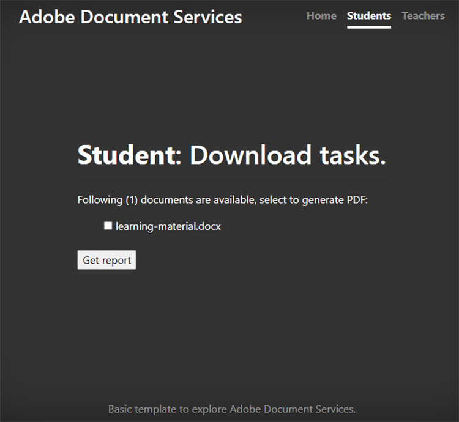
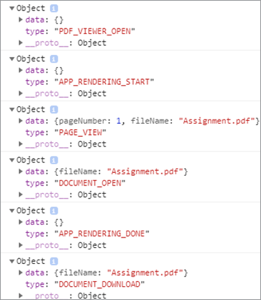

# Collaboration étudiant-enseignant


Les établissements d’enseignement utilisent des documents PDF pour partager du matériel pédagogique avec les étudiants. Le PDF est un format de document interchangeable pour les enseignants.

L&#39;intégration de l&#39;[API Adobe PDF Services](https://www.adobe.io/apis/documentcloud/dcsdk/pdf-tools.html) et de l&#39;[API Adobe PDF Embed](https://www.adobe.io/apis/documentcloud/dcsdk/pdf-embed.html) dans une application fournit aux enseignants et aux étudiants une plateforme unique sur laquelle ils peuvent enseigner et apprendre. Par exemple, votre application peut permettre aux étudiants de poser des questions sur leurs devoirs et bulletins, et de collaborer sur des devoirs de groupe.

Il existe un SDK officiel permettant aux applications Node.js d’accéder à l’API des services de PDF. Cela vous permet de convertir des documents tels que Microsoft Word ou Microsoft Excel en
PDF. Vous pouvez également effectuer des opérations plus avancées, telles que la combinaison de plusieurs rapports, la réorganisation des pages et la protection des mots de PDF. Pour plus de détails, consultez la [documentation du produit](https://www.adobe.io/apis/documentcloud/dcsdk/).

## Ce que vous pouvez apprendre

Dans ce tutoriel pratique, découvrez comment créer une plateforme d&#39;apprentissage en ligne qui [permet aux enseignants et aux étudiants de partager facilement des ressources](https://www.adobe.io/apis/documentcloud/dcsdk/student-teacher-collaboration.html) en PDF. Ce tutoriel utilise un [portail d&#39;apprentissage](https://github.com/afzaal-ahmad-zeeshan/adobe-pdf-tools-for-teachers) créé à l&#39;aide du moteur d&#39;exécution JavaScript Node.js et des services de PDF.

Le portail d’apprentissage offre les fonctionnalités suivantes :

* Permet aux enseignants de charger des ressources

* Permet aux étudiants de sélectionner plusieurs documents à convertir en PDF

* Active la conversion des documents en PDF

* Fournit aux étudiants un aperçu dans un PDF Web et leur permet d’annoter les documents sans logiciel supplémentaire.

* Permet aux étudiants de laisser des commentaires et de les télécharger sur leur ordinateur

Découvrez comment [!DNL Adobe Acrobat Services] offre une expérience enrichissante à vos étudiants avec les PDF. Les API [!DNL Acrobat Services] s&#39;intègrent de manière transparente dans vos applications existantes. Ainsi, les étudiants peuvent charger, convertir et afficher des fichiers, puis ajouter et enregistrer des commentaires, le tout dans votre configuration actuelle.

## Ressources et API pertinentes

* [API PDF Embed](https://www.adobe.com/devnet-docs/dcsdk_io/viewSDK/index.html)

* [API PDF Services](https://opensource.adobe.com/pdftools-sdk-docs/release/latest/index.html)

* [Code de projet](https://github.com/afzaal-ahmad-zeeshan/adobe-pdf-tools-for-teachers)

## Chargement des ressources sur le portail d’apprentissage

Dans la section des enseignants du portail d’apprentissage, les enseignants peuvent charger des documents tels que des devoirs et des tests. Les documents peuvent être dans n’importe quel format, tel que Microsoft Word, Microsoft Excel, HTML, divers formats d’image, etc.


Les documents chargés sont stockés et présentés aux étudiants lorsqu’ils ouvrent leur page Web.

Pour savoir comment l&#39;application charge les fichiers, consultez le [code de projet](https://github.com/afzaal-ahmad-zeeshan/adobe-pdf-tools-for-teachers).

## Conversion de documents en PDF

Les étudiants peuvent convertir un ou plusieurs documents de n’importe quel type en PDF, tels que Microsoft Word, Excel et PowerPoint, ainsi que d’autres types de fichiers texte et image courants. Le portail d’apprentissage utilise les services de PDF pour effectuer la conversion des fichiers en PDF.

Pour créer votre propre portail d’apprentissage, vous devez d’abord créer vos propres informations d’identification. [S&#39;inscrire](https://www.adobe.io/apis/documentcloud/dcsdk/gettingstarted.html) à
utilisez gratuitement l’API PDF Services pendant six mois et jusqu’à 1 000 transactions de document. Après cela, [prépayé](https://www.adobe.io/apis/documentcloud/dcsdk/pdf-pricing.html) à seulement \$0,05 par transaction de document pendant que la classe intensifie ses devoirs.

Lorsqu’un étudiant sélectionne un document dans le tableau de bord, il voit les éléments suivants :



L&#39;étudiant sélectionne simplement les documents pour la conversion et clique sur **Obtenir le rapport**.

Le portail d&#39;apprentissage convertit les documents en PDF et affiche une page de rapport, ainsi qu&#39;un aperçu du fichier du PDF.

Voici l’exemple de code pour cette étape :

```
async function createPdf(rawFile, outputPdf) {
    try {
            // configurations
            const credentials =  adobe.Credentials
            .serviceAccountCredentialsBuilder()
            .fromFile("./src/pdftools-api-credentials.json")
            .build();
 
            // Capture the credential from app and show create the context
            const executionContext = adobe.ExecutionContext.create(credentials),
            operation = adobe.CreatePDF.Operation.createNew();
 
            // Pass the content as input (stream)
            const input = adobe.FileRef.createFromLocalFile(rawFile);
            operation.setInput(input);
 
            // Async create the PDF
            let result = await operation.execute(executionContext);
            await result.saveAsFile(outputPdf);
    } catch (err) {
            console.log('Exception encountered while executing operation', err);
    }
}
```

L&#39;exemple de code appelle la méthode `createPdf` dans le gestionnaire d&#39;itinéraires Express pour générer le PDF.

Pour savoir comment cette méthode est appelée, consultez [le code du projet](https://github.com/afzaal-ahmad-zeeshan/adobe-pdf-tools-for-teachers/blob/master/src/helpers/pdf.js).

## Aperçu des ressources d’apprentissage

L’interface utilisateur utilise l’API PDF Embed pour afficher les PDF dans un navigateur web. Cette API est disponible gratuitement.

L’API PDF Embed utilise des informations d’identification différentes de celles de l’API PDF Services. Vous devez donc [créer des informations d’identification](https://www.adobe.io/apis/documentcloud/dcsdk/gettingstarted.html)
avant de pouvoir l’utiliser. Ensuite, vous pouvez utiliser PDF Embed complètement gratuitement.

Assurez-vous d’entrer l’URL du site Web correcte dans le jeton. Sinon, vous ne pourrez peut-être pas effectuer le rendu des PDF avec le jeton.

L&#39;interface utilisateur utilise le langage des modèles [guidons](https://handlebarsjs.com/). Le PDF s’affiche dans un navigateur web.

Voici le code de cette étape :

```
<div id="adobe-dc-view" style="height: 750px; width: 700px;"></div>
<script src="https://documentcloud.adobe.com/view-sdk/main.js"></script>
<script type="text/javascript">
    document.addEventListener("adobe_dc_view_sdk.ready", function () {
        var adobeDCView = new AdobeDC.View({ clientId: "<your-credentials-here>", divId: "adobe-dc-view" });
        adobeDCView.previewFile(
            {
                content: {
                    location: { url: "<file-url>" }
                },
                    metaData: { fileName: "<file-name>" }
            },
           );
    });
</script>
 
<p>Material has been generated, <a href="/students/download/{{filename}}" target="_blank">click here</a> to download it.
</p>
```

Ce code affiche la sortie du PDF et le lien permettant de télécharger le rapport du PDF, comme illustré dans la capture d’écran ci-dessous :


Les étudiants devraient pouvoir télécharger le rapport ou travailler sur le matériel ici.

## Annotation de documents PDF

Une plate-forme d’apprentissage doit prendre en charge les annotations, commentaires et discussions de base en PDF. L’API PDF Embed fournit toutes ces fonctionnalités. Cela active la prise en charge des annotations à l&#39;aide de `showAnnotationTools`, ce qui permet aux enseignants et aux étudiants de commenter les documents et d&#39;archiver les commentaires dans le cadre du PDF.

Pour activer les annotations dans les documents PDF, il vous suffit de transmettre l&#39;argument `showAnnotationTools` : true à la méthode `previewFile`. L’outil d’annotation s’affiche alors dans l’aperçu du PDF. Accédez à cet outil à partir du menu à trois points dans le coin supérieur droit de l’aperçu.


Dans les documents chargés par les enseignants, les étudiants peuvent mettre en surbrillance du texte, ajouter des commentaires, etc.


Dans la capture d’écran ci-dessus, l’utilisateur est étiqueté « Invité », mais vous pouvez configurer des profils pour les utilisateurs, tels que les étudiants et les enseignants.

Lorsqu&#39;un étudiant applique une annotation, l&#39;API PDF Embed affiche un bouton **Enregistrer** le long de la bannière supérieure. L’enregistrement ajoute les annotations au fichier. Essayez de cliquer sur **Enregistrer** pour voir comment le fichier est enregistré avec l&#39;annotation intégrée au rapport.

Les étudiants peuvent utiliser des annotations pour poser des questions ou partager leurs commentaires sur le matériel d’apprentissage.

## Suivi de l’utilisation du document

Il est important pour les enseignants et les écoles de voir comment les étudiants utilisent les plateformes en ligne. Cela aide les enseignants à soutenir leurs élèves avec des ressources qui les aident à mieux effectuer leurs devoirs. L’API PDF Embed s’intègre à des outils d’analyse que vous pouvez utiliser pour mesurer tous les événements qui se produisent, par exemple lorsque les utilisateurs ouvrent, lisent et ferment des documents. Avec l’API PDF Services, les enseignants peuvent également désactiver l’impression, le téléchargement et la modification des fichiers pour préserver l’intégrité académique.

Si vous disposez d&#39;une licence [Adobe Analytics](https://www.adobe.io/apis/experiencecloud/analytics.html), vous pouvez utiliser son [intégration prête à l&#39;emploi](https://experienceleague.adobe.com/docs/document-services/tutorials/pdfembed/controlpdfexperience.html?lang=en#adobe-analytics). Sinon, utilisez des rappels pour intégrer vos Services de PDF à d&#39;autres fournisseurs d&#39;analyses, tels que [Google](https://experienceleague.adobe.com/docs/document-services/tutorials/pdfembed/controlpdfexperience.html?lang=en#google-analytics).

Pour permettre la mesure des événements de document, associez les gestionnaires d&#39;événements à l&#39;aide de la méthode `registerCallback` avec l&#39;instance Adobe DC View. Vous pouvez afficher des mesures de base, telles que l’ouverture d’un document ou la lecture d’une page, sur la console. Vous pouvez également enregistrer les mesures dans un journal ou les publier dans d’autres magasins d’analyses.

Voici l&#39;exemple de code pour joindre les gestionnaires d&#39;événements :

```
adobeDCView.registerCallback(
    AdobeDC.View.Enum.CallbackType.EVENT_LISTENER,
    function(event) {
           console.log(event);
    },
    {
           enablePDFAnalytics: true
    }
);
```

Les enseignants peuvent voir combien d&#39;étudiants ont vu le devoir, combien ont parcouru toutes les pages de leurs notes et d&#39;autres détails précieux.

Voici une capture d’écran de la console du navigateur web :



Cette capture d’écran montre que l’étudiant a ouvert le fichier de devoirs, qu’il a lu la première page — soit il n’a pas fait défiler l’écran jusqu’à des pages supplémentaires, soit le document n’avait qu’une seule page — puis qu’il a téléchargé le fichier. Vous pouvez collecter ces mesures pour effectuer des analyses et étudier le comportement de vos élèves.

En outre, [Adobe Analytics](https://business.adobe.com/products/analytics/adobe-analytics.html) est intégré à l&#39;API PDF Embed, de sorte que si vous disposez d&#39;un abonnement à la suite Adobe Analytics, vous pouvez publier vos mesures dans votre abonnement. Pour publier les mesures dans Adobe Analytics, il vous suffit de transmettre votre ID de suite au constructeur d’API PDF Embed. (Notez que vous devez utiliser vos identifiants d’API PDF Embed, et non vos identifiants d’API PDF Services).

Voici un exemple de code qui montre comment transmettre l’ID de suite au constructeur d’API PDF Embed :

```
var adobeDCView = new AdobeDC.View({
    clientId: "<your-adobe-dc-credential>",
    divId: "<#element>"
    reportSuiteId: <your-id-here>,
}); 
```

## Marche à suivre

Ce tutoriel pratique explique comment utiliser l’API PDF Services et l’API PDF Embed pour créer un portail d’apprentissage, ce qui facilite une [collaboration efficace entre les étudiants et les enseignants](https://www.adobe.io/apis/documentcloud/dcsdk/student-teacher-collaboration.html). À l’aide de ce portail, les enseignants peuvent télécharger du matériel d’apprentissage dans n’importe quel format et le convertir en PDF à l’aide de l’API PDF Services. Les étudiants peuvent ensuite prévisualiser ces PDF à l’aide de l’API PDF Embed.

Maintenant que vous savez comment annoter des rapports de PDF, archiver les annotations et suivre l’utilisation des rapports de PDF, vous pouvez commencer à implémenter ces solutions dans vos propres projets.

Vous pouvez utiliser les API [!DNL Adobe Acrobat Services] pour créer des expériences de PDF interactives et conviviales sur votre site Web. Profitez de l’API des services Adobe PDF gratuitement pendant six mois, puis seulement [paiement à l’utilisation](https://www.adobe.io/apis/documentcloud/dcsdk/pdf-pricing.html) (via AWS ou un accord direct) pour seulement \$0,05 par transaction de document. Utilisez Adobe PDF Embed gratuitement sans limite de temps. Créez un compte gratuit pour [commencer](https://www.adobe.com/go/dcsdks_credentials) dès aujourd&#39;hui.
