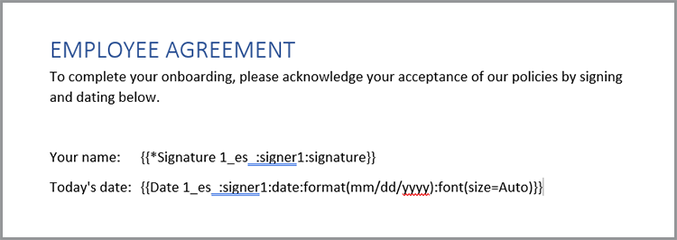

# Modernisation de l’intégration des employés


Dans une grande entreprise, l’intégration des employés peut être un processus long et long. Généralement, il existe une combinaison de documentation personnalisée et de documents standard qui doivent être présentés et signés par un nouvel employé. Cette combinaison de documents personnalisés et standard nécessite plusieurs étapes, ce qui enlève un temps précieux aux personnes impliquées dans le processus. [!DNL Adobe Acrobat Services] et Acrobat Sign peuvent moderniser et automatiser cette approche, libérant ainsi vos ressources humaines pour des tâches plus importantes. Voyons comment nous y sommes parvenus.

## Que sont les [!DNL Adobe Acrobat Services] ?

[[!DNL Adobe Acrobat Services]](https://developer.adobe.com/document-services/homepage) sont un ensemble d’API liées à l’utilisation de documents (et pas seulement de PDF). D&#39;une manière générale, cet ensemble de services se divise en trois grandes catégories :

* Il y a d&#39;abord l&#39;ensemble d&#39;outils des [services PDF](https://developer.adobe.com/document-services/apis/pdf-services/). Il s’agit de méthodes « utilitaires » pour travailler avec des PDF et d’autres documents. Les services incluent des éléments tels que la conversion vers et depuis le PDF, l’exécution de la ROC et de l’optimisation, la fusion et le fractionnement des PDF, etc. C’est la boîte à outils des fonctionnalités de traitement des documents.
* L&#39;[API PDF Extract](https://developer.adobe.com/document-services/apis/pdf-extract/) utilise de puissantes techniques d&#39;IA/ML pour analyser un PDF et renvoyer une quantité incroyable de détails sur le contenu. Cela inclut le texte, le style et les informations de position, et peut également retourner des données tabulaires au format CSV/XLS ainsi que récupérer des images.
* Enfin, l&#39;[API Document Generation](https://developer.adobe.com/document-services/apis/doc-generation/) permet aux développeurs d&#39;utiliser Microsoft Word comme « modèle », de combiner leurs données (à partir de n&#39;importe quelle source) et de générer des documents personnalisés dynamiques (PDF et Word).

Les développeurs peuvent [s&#39;inscrire](https://documentcloud.adobe.com/dc-integration-creation-app-cdn/main.html) et essayer tous ces services avec un essai gratuit. La plateforme [!DNL Acrobat Services] utilise une API REST, mais prend également en charge les SDK pour Node, Java, .NET et Python (Extract uniquement pour le moment).

Bien qu&#39;il ne s&#39;agisse pas d&#39;une API, les développeurs peuvent également utiliser l&#39;[API PDF Embed](https://developer.adobe.com/document-services/apis/pdf-embed/) gratuite, qui offre une expérience d&#39;affichage cohérente et flexible des documents avec vos pages Web.

## En quoi consiste Acrobat Sign ?

[Acrobat Sign](https://www.adobe.com/fr/sign.html) est le leader mondial des services de signature électronique. Vous pouvez envoyer des documents pour signature à l’aide de différents workflows, y compris plusieurs signatures. Acrobat Sign prend également en charge les workflows qui nécessitent des signatures et des informations supplémentaires. Toutes ces fonctionnalités sont prises en charge par un tableau de bord puissant doté d’un système de création flexible.

Comme pour [!DNL Acrobat Services], Acrobat Sign propose une [version d’essai gratuite](https://www.adobe.com/sign.html#sign_free_trial) qui permet aux développeurs de tester le processus de signature via le tableau de bord et avec une API REST facile à utiliser.

## Scénario d’intégration

Considérons un scénario concret qui montre comment les services de l&#39;Adobe peuvent aider. Lorsqu&#39;un nouvel employé rejoint une entreprise, il a besoin d&#39;informations personnalisées et adaptées à son rôle. En outre, ils ont également besoin de matériel à l&#39;échelle de l&#39;entreprise. Enfin, ils doivent prouver qu’ils acceptent les politiques de l’entreprise en signant les documents. Décomposons cela en étapes concrètes :

* Tout d&#39;abord, une lettre d&#39;accompagnement personnalisée qui accueille le nouvel employé par son nom est nécessaire. La lettre doit contenir des renseignements sur le nom, le rôle, le salaire et le lieu de travail de l&#39;employé.
* La lettre personnalisée doit être associée à un PDF contenant des informations de base à l’échelle de l’entreprise (par exemple, différentes politiques de RH, avantages sociaux, etc.)
* Un document final doit être inclus pour demander la signature et la date de l&#39;employé.
* Tous les éléments ci-dessus doivent être présentés sous la forme d’un document unique envoyé à l’employé pour signature.

Voyons en détail comment procéder.

## Génération de documents dynamiques

L&#39;API [Document Generation](https://developer.adobe.com/document-services/apis/doc-generation/) d&#39;Adobe permet aux développeurs de créer des documents dynamiques à l&#39;aide de Microsoft Word et d&#39;un langage de modèle simple, comme base pour générer des documents PDF et Word. Voici un exemple de la façon dont cela fonctionne.

Commençons par un document Word dont les valeurs sont codées en dur. Le document peut être mis en forme comme vous le souhaitez, inclure des graphiques, des tableaux, etc. Voici le document initial.


La génération de documents fonctionne en ajoutant des « jetons » à un document Word qui sont remplacés par vos données. Bien que ces jetons puissent être saisis manuellement, il existe un [complément Microsoft Word](https://developer.adobe.com/document-services/docs/overview/document-generation-api/wordaddin/) qui facilite cette opération. Son ouverture fournit un outil permettant aux auteurs de définir des balises ou des ensembles de données pouvant être utilisés dans votre document.


Vous pouvez soit télécharger des informations JSON à partir d’un fichier local, soit copier du texte JSON, soit sélectionner pour continuer avec les données initiales. Cela vous permet de définir vos balises de manière ad hoc en fonction de vos besoins particuliers. Dans cet exemple, seule une balise pour le nom, le rôle, le salaire et l’emplacement est nécessaire. Pour ce faire, utilisez le bouton **Créer une balise** :


Après avoir défini la première balise, vous pouvez continuer à en définir autant que nécessaire :


Une fois les balises définies, sélectionnez le texte dans votre document et remplacez-le par les balises appropriées. Dans cet exemple, des balises sont ajoutées pour le nom, le rôle et le salaire.


La génération de documents ne prend pas seulement en charge les balises simples, mais également les expressions logiques. Le deuxième paragraphe du document contient un texte qui ne s&#39;applique qu&#39;aux personnes en Louisiane. Vous pouvez ajouter une expression conditionnelle en accédant à l’onglet Avancé de la balise de document et en définissant une condition. Voici comment définir une condition d’égalité simple, mais notez que les comparaisons numériques et d’autres types de comparaison sont également pris en charge.


Il peut ensuite être inséré et habillé autour du paragraphe :


Pour tester comment cela fonctionne, sélectionnez **Générer le document**. La première fois que vous effectuez cette opération, vous devez vous connecter avec un Adobe ID. Une fois connecté, le fichier JSON par défaut s’affiche et peut être modifié manuellement.


Un PDF est généré et peut ensuite être consulté ou téléchargé.


Bien que le Balisage de document vous permette de concevoir et de tester rapidement, une fois l’opération terminée et en production, vous pouvez utiliser l’un des SDK pour automatiser ce processus. Bien que le code réel diffère en fonction de besoins spécifiques, voici un exemple de la façon dont ce code se présente dans Node.js :

```js
 const PDFServicesSdk = require('@adobe/pdfservices-node-sdk');

const credentials =  PDFServicesSdk.Credentials
    .serviceAccountCredentialsBuilder()
    .fromFile("pdfservices-api-credentials.json")
    .build();

// Data would be dynamic...
let data = {
    "name":"Raymond Camden",
    "role":"Lead Developer",
    "salary":9000,
    "location":"Louisiana"
}

// Create an ExecutionContext using credentials.
const executionContext = PDFServicesSdk.ExecutionContext.create(credentials);

// Create a new DocumentMerge options instance.
const documentMerge = PDFServicesSdk.DocumentMerge,
    documentMergeOptions = documentMerge.options,
    options = new documentMergeOptions.DocumentMergeOptions(jsonDataForMerge, documentMergeOptions.OutputFormat.PDF);

// Create a new operation instance using the options instance.
const documentMergeOperation = documentMerge.Operation.createNew(options);

// Set operation input document template from a source file.
const input = PDFServicesSdk.FileRef.createFromLocalFile('documentMergeTemplate.docx');
documentMergeOperation.setInput(input);

// Execute the operation and Save the result to the specified location.
documentMergeOperation.execute(executionContext)
    .then(result => result.saveAsFile('documentOutput.pdf'))
    .catch(err => {
        if(err instanceof PDFServicesSdk.Error.ServiceApiError
            || err instanceof PDFServicesSdk.Error.ServiceUsageError) {
            console.log('Exception encountered while executing operation', err);
        } else {
            console.log('Exception encountered while executing operation', err);
        }
    });
```

En bref, le code définit les informations d&#39;identification, crée un objet opération, définit l&#39;entrée et les options, puis appelle l&#39;opération. Enfin, il enregistre le résultat en tant que PDF. (Les résultats peuvent également être générés au format Word.)

La génération de documents prend en charge des cas d’utilisation beaucoup plus complexes, notamment la possibilité d’avoir des tableaux et des images entièrement dynamiques. Consultez la [documentation](https://developer.adobe.com/document-services/docs/overview/document-generation-api/) pour plus de détails.

## Exécution d’opérations de PDF

L&#39;[API des services de PDF](https://developer.adobe.com/document-services/apis/pdf-services/) fournit un grand nombre d&#39;« utilitaires » pour travailler avec les PDF. Ces opérations sont les suivantes :

* Création de PDF à partir de documents Office
* Exportation de PDF vers des documents Office
* Combinaison et fractionnement de PDF
* Application de la ROC aux PDF
* Définition, suppression et modification de la protection des mots de PDF
* Suppression, insertion, réorganisation et rotation de pages
* Optimisation des PDF par compression ou linéarisation
* Obtention des propriétés du PDF

Pour ce scénario, le résultat de l’appel Document Generation doit être fusionné avec un PDF standard. Cette opération est assez simple avec les SDK. Voici un exemple d’application dans Node.js :

```js
const PDFServicesSdk = require('@adobe/pdfservices-node-sdk');
 
// Initial setup, create credentials instance.
const credentials = PDFServicesSdk.Credentials
    .serviceAccountCredentialsBuilder()
    .fromFile("pdfservices-api-credentials.json")
    .build();
 
// Create an ExecutionContext using credentials and create a new operation instance.
const executionContext = PDFServicesSdk.ExecutionContext.create(credentials),
    combineFilesOperation = PDFServicesSdk.CombineFiles.Operation.createNew();
 
// Set operation input from a source file.
const combineSource1 = PDFServicesSdk.FileRef.createFromLocalFile('documentOutput.pdf'),
      combineSource2 = PDFServicesSdk.FileRef.createFromLocalFile('standardCorporate.pdf');

combineFilesOperation.addInput(combineSource1);
combineFilesOperation.addInput(combineSource2);
 
// Execute the operation and Save the result to the specified location.
combineFilesOperation.execute(executionContext)
    .then(result => result.saveAsFile('combineFilesOutput.pdf'))
    .catch(err => {
        if (err instanceof PDFServicesSdk.Error.ServiceApiError
            || err instanceof PDFServicesSdk.Error.ServiceUsageError) {
            console.log('Exception encountered while executing operation', err);
        } else {
            console.log('Exception encountered while executing operation', err);
        }
    });
```

Ce code prend les deux PDF, les fusionne et enregistre le résultat dans un nouveau PDF. Simple et facile ! Consultez les [documents](https://developer.adobe.com/document-services/docs/overview/pdf-services-api/) pour obtenir des exemples de ce qui peut être fait.

## Processus de signature

À l’étape finale du processus d’intégration, l’employé doit signer un accord indiquant qu’il a lu et accepte toutes les politiques définies dans. [Acrobat Sign](https://www.adobe.com/fr/sign.html) prend en charge de nombreux workflows et intégrations différents, y compris un workflow automatisé via une [API](https://opensource.adobe.com/acrobat-sign/developer_guide/index.html). D&#39;une manière générale, la dernière partie du scénario peut être complétée comme suit :

Commencez par créer le document qui inclut le formulaire à signer. Il existe plusieurs façons de le faire, y compris un visuel conçu dans le tableau de bord utilisateur d’Adobe Sign. Une autre option consiste à utiliser le complément Word Génération de document pour insérer les balises pour vous. Cet exemple montre comment demander une signature et une date.



Ce document peut être enregistré en tant que PDF, et en utilisant la même méthode décrite ci-dessus, joint à tous les documents ensemble. Ce processus crée un package cohérent qui contient un message d’accueil personnalisé, une documentation d’entreprise standard et une page finale apte à la signature.

Le modèle peut être téléchargé sur le tableau de bord Acrobat Sign, puis utilisé pour de nouveaux accords. À l’aide de l’API REST, ce document peut ensuite être envoyé à l’employé potentiel pour lui demander sa signature.


## Faites-le vous-même

Tout ce qui est décrit dans cet article peut être testé dès maintenant. L&#39;API [!DNL Adobe Acrobat Services] [essai gratuit](https://documentcloud.adobe.com/dc-integration-creation-app-cdn/main.html) vous donne actuellement 1 000 demandes gratuites sur une période de six mois. Acrobat Sign [version d’essai gratuite](https://www.adobe.com/sign.html#sign_free_trial) vous permet d’envoyer des accords filigranés à des fins de test.

Vous avez des questions ? Le [forum de support](https://community.adobe.com/t5/document-services-apis/ct-p/ct-Document-Cloud-SDK) est surveillé quotidiennement par les développeurs et les personnes chargées du support Adobe. Enfin, pour plus d&#39;inspiration, n&#39;oubliez pas d&#39;assister au prochain épisode de [Paper Clips](https://www.youtube.com/playlist?list=PLcVEYUqU7VRe4sT-Bf8flvRz1XXUyGmtF). Il y a régulièrement des réunions en direct avec des nouvelles, des démonstrations et des discussions avec les clients.
