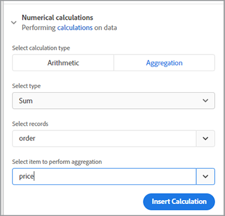

# Gestion des factures


C&#39;est formidable quand les affaires sont florissantes, mais la productivité en souffre quand vient le temps de préparer toutes ces factures. La génération manuelle de factures prend du temps et vous courez le risque de commettre une erreur, de perdre de l’argent ou d’irriter un client en lui indiquant un montant incorrect.

Pensez à Danielle, par exemple, qui travaille dans le [service de comptabilité](https://developer.adobe.com/document-services/use-cases/financial/invoices) [ d’une société de fournitures médicales](https://developer.adobe.com/document-services/use-cases/financial/invoices). C&#39;est la fin du mois, alors elle extrait des informations de plusieurs systèmes différents, vérifie leur exactitude et met en forme les factures. Après tout ce travail, elle est enfin prête à convertir les documents en PDF (afin que tout le monde puisse les consulter sans acheter de logiciel spécifique) et à envoyer à chaque client sa facture personnalisée.

Même lorsque la facturation mensuelle est terminée, Danielle ne peut pas échapper à ces factures. Certains clients ont des cycles de facturation non mensuels, elle crée donc toujours une facture pour quelqu&#39;un. Il arrive qu’un client modifie sa facture et qu’il ne paie pas suffisamment. Danielle passe ensuite du temps à résoudre cette incompatibilité de facture. À ce rythme, elle doit embaucher un assistant pour se tenir au courant de tout le travail !

Danielle a besoin d’un moyen de générer des factures rapidement et précisément, à la fois par lots à la fin du mois et de manière ad hoc à d’autres moments. Dans l’idéal, si elle pouvait protéger ces factures des modifications, elle n’aurait pas à s’inquiéter de la résolution des problèmes d’incompatibilité des montants.

## Ce que vous pouvez apprendre

Dans ce tutoriel pratique, découvrez comment utiliser l’API Adobe Document Generation pour générer automatiquement des factures, protéger les mots de PDF par mot de passe et envoyer une facture à chaque client. Il suffit de connaître un peu Node.js, JavaScript, Express.js, HTML et CSS.

Le code complet de ce projet est [disponible sur GitHub](https://github.com/afzaal-ahmad-zeeshan/adobe-pdf-invoice-generation). Vous devez configurer le répertoire public avec votre modèle et les dossiers de données brutes. En production, vous devez récupérer les données à partir d’une API externe. Vous pouvez également explorer cette version archivée de l’application qui contient les ressources du modèle.

## Ressources et API pertinentes

* [API PDF Services](https://opensource.adobe.com/pdftools-sdk-docs/release/latest/index.html)

* [API Document Generation Adobe](https://developer.adobe.com/document-services/apis/doc-generation)

* [API Adobe Sign](https://developer.adobe.com/adobesign-api/)

* [Code de projet](https://github.com/afzaal-ahmad-zeeshan/adobe-pdf-invoice-generation)

## Préparation des données

Ce tutoriel n’examine pas la façon dont les données sont importées à partir de vos entrepôts décisionnels. Vos commandes client peuvent exister dans une base de données, une API externe ou un logiciel personnalisé. L’API Adobe Document Generation attend un document JSON contenant les données de facturation, telles que des informations de votre gestion de la relation client (CRM) ou de votre plateforme de commerce électronique. Ce tutoriel suppose que les données sont déjà au format JSON.

Pour plus de simplicité, utilisez la structure JSON suivante pour la facturation :

```
{ 
    "customerName": "John Doe", 
    "customerEmail": "john-doe@example.com", 
    "order": [ 
        { 
            "productId": 26, 
            "productTitle": "Bandages", 
            "price": 15.82 
        }, 
        { 
            "productId": 54, 
            "productTitle": "Masks", 
            "price": 25 
        }, 
        { 
            "productId": 76, 
            "productTitle": "Gloves", 
            "price": 7.59 
        } 
    ] 
} 
```

Le document JSON contient les détails du client ainsi que les informations de commande. Utilisez ce document structuré pour créer votre facture et afficher les éléments au format PDF.

## Création d’un modèle de facture

L’API Adobe Document Generation attend d’un modèle Microsoft Word et d’un document JSON qu’ils créent un PDF dynamique ou un document Word. Créez un modèle Microsoft Word pour votre application de facturation et utilisez le [complément gratuit Document Generation Tagger](https://opensource.adobe.com/pdftools-sdk-docs/docgen/latest/wordaddin.html#add-in-demo) pour générer les balises de modèle. Installez le complément et ouvrez l’onglet dans Microsoft Word.


Une fois le contenu JSON collé dans le complément, comme indiqué ci-dessus, cliquez sur Générer des balises. Désormais, ce plug-in affiche le format de votre objet. Votre modèle de base peut utiliser le nom et l’adresse e-mail du client, mais n’affiche pas les informations de commande. Les informations relatives à l’ordre sont abordées plus loin dans ce tutoriel.


Commencez à écrire le modèle de facture dans votre document Microsoft Word. Laissez le curseur à l’endroit où vous devez insérer les données dynamiques, puis sélectionnez la balise dans la fenêtre du complément Adobe. Cliquez sur **Insérer du texte** afin que le complément Adobe Document Generation Tagger puisse générer et insérer les balises. Pour la personnalisation, insérez le nom et l’adresse e-mail du client.

Passez maintenant aux données qui changent à chaque nouvelle facture. Sélectionnez l&#39;onglet **Avancé** du complément. Pour afficher les options disponibles pour générer un tableau dynamique en fonction des produits commandés par un client, cliquez sur **Tableaux et listes** .

Sélectionnez **Commander** dans la première liste déroulante. Dans la deuxième liste déroulante, sélectionnez les colonnes de ce tableau. Dans ce tutoriel, sélectionnez les trois colonnes de l’objet pour afficher le tableau.


L’API Document Generation peut également effectuer des opérations complexes telles que l’agrégation d’éléments à l’intérieur d’un tableau. Dans l&#39;onglet **Avancé**, sélectionnez **Calculs numériques**, puis dans l&#39;onglet **Agrégation**, sélectionnez le champ dans lequel vous souhaitez appliquer le calcul.



Cliquez sur le bouton **Insérer un calcul** pour insérer cette balise à l&#39;endroit voulu dans le document. Le texte suivant apparaît maintenant dans votre fichier Microsoft Word :


Cet exemple de facture contient des informations sur le client, les produits commandés et le montant total dû.

## Génération d’une facture à l’aide de l’API Adobe Document Generation

Utilisez le kit de développement logiciel (SDK) Adobe PDF Services Node.js pour combiner les documents Microsoft Word et JSON. Créez une application Node.js pour créer la facture à l’aide de l’API Document Generation.

L’API des services PDF inclut le service Document Generation, ce qui vous permet d’utiliser les mêmes informations d’identification pour les deux applications. Profitez d&#39;un essai gratuit de [six mois](https://developer.adobe.com/document-services/pricing/main), puis payez seulement 0,05 $ par transaction de document.

Voici le code pour fusionner le PDF :

```
async function compileDocFile(json, inputFile, outputPdf) { 
    try { 
        // configurations 
        const credentials =  adobe.Credentials 
            .serviceAccountCredentialsBuilder() 
            .fromFile("./src/pdftools-api-credentials.json") 
            .build(); 

        // Capture the credential from app and show create the context 
        const executionContext = adobe.ExecutionContext.create(credentials); 
  
        // create the operation 
        const documentMerge = adobe.DocumentMerge, 
            documentMergeOptions = documentMerge.options, 
            options = new documentMergeOptions.DocumentMergeOptions(json, documentMergeOptions.OutputFormat.PDF);

        const operation = documentMerge.Operation.createNew(options); 
  
        // Pass the content as input (stream) 
        const input = adobe.FileRef.createFromLocalFile(inputFile); 
        operation.setInput(input); 
  
        // Async create the PDF 
        let result = await operation.execute(executionContext); 
        await result.saveAsFile(outputPdf); 
    } catch (err) { 
        console.log('Exception encountered while executing operation', err); 
    } 
} 
```

Ce code prend des informations du document JSON d’entrée et du fichier de modèle d’entrée. Il effectue ensuite une opération de fusion de documents pour regrouper les fichiers dans un seul rapport de PDF. Enfin, il exécute l’opération avec vos identifiants d’API. Si vous ne les avez pas déjà, [créez des informations d’identification](https://opensource.adobe.com/pdftools-sdk-docs/release/latest/index.html#getting-credentials) (l’API Document Generation et les services de PDF utilisent les mêmes informations d’identification).

Utilisez ce code à l’intérieur du routeur Express pour gérer la demande de document :

```
// Create one report and send it back
try {
    console.log(\`[INFO] generating the report...\`);
    const fileContent = fs.readFileSync(\`./public/documents/raw/\${vendor}\`,
    'utf-8');
    const parsedObject = JSON.parse(fileContent);

    await pdf.compileDocFile(parsedObject,
    \`./public/documents/template/Adobe-Invoice-Sample.docx\`,
    \`./public/documents/processed/output.pdf\`);

    await pdf.applyPassword("p@55w0rd", './public/documents/processed/output.pdf',
    './public/documents/processed/output-secured.pdf');

    console.log(\`[INFO] sending the report...\`);
    res.status(200).render("preview", { page: 'invoice', filename: 'output.pdf' });
} catch(error) {
    console.log(\`[ERROR] \${JSON.stringify(error)}\`);
    res.status(500).render("crash", { error: error });
}
```

Une fois que ce code est exécuté, il fournit un document de PDF contenant la facture générée dynamiquement en fonction des données fournies. Avec les exemples de données JSON (fournis ci-dessus), la sortie de ce code est :


Cette facture inclut vos données dynamiques du document JSON.

## Protéger les factures par mot de passe

Puisque Danielle, la comptable, s&#39;inquiète que les clients modifient la facture, appliquez un mot de passe pour restreindre la modification. L&#39;API [Services de mots de PDF](https://opensource.adobe.com/pdftools-sdk-docs/release/latest/index.html) peut appliquer automatiquement un mot de passe aux documents. Ici, vous pouvez utiliser le SDK Adobe PDF Services pour protéger les documents avec un mot de passe. Le code est le suivant :

```
async function applyPassword(password, inputFile, outputFile) {
    try {
        // Initial setup, create credentials instance.
        const credentials = adobe.Credentials
        .serviceAccountCredentialsBuilder()
        .fromFile("./src/pdftools-api-credentials.json")
        .build();

        // Create an ExecutionContext using credentials
        const executionContext = adobe.ExecutionContext.create(credentials);
        // Create new permissions instance and add the required permissions
        const protectPDF = adobe.ProtectPDF,
        protectPDFOptions = protectPDF.options;
        // Build ProtectPDF options by setting an Owner/Permissions Password, Permissions,
        // Encryption Algorithm (used for encrypting the PDF file) and specifying the type of content to encrypt.
        const options = new protectPDFOptions.PasswordProtectOptions.Builder()
        .setOwnerPassword(password)
        .setEncryptionAlgorithm(protectPDFOptions.EncryptionAlgorithm.AES_256)
        .build();

        // Create a new operation instance.
        const protectPDFOperation = protectPDF.Operation.createNew(options);

        // Set operation input from a source file.
        const input = adobe.FileRef.createFromLocalFile(inputFile);
        protectPDFOperation.setInput(input);

        // Execute the operation and Save the result to the specified location.
        let result = await protectPDFOperation.execute(executionContext);

        result.saveAsFile(outputFile);
    } catch (err) {
        console.log('Exception encountered while executing operation', err);
    }
}
```

Lorsque vous utilisez ce code, il protège votre document avec un mot de passe et télécharge une nouvelle facture sur le système. Pour en savoir plus sur l&#39;utilisation de ce code ou pour l&#39;essayer, consultez l&#39;[exemple de code](https://github.com/afzaal-ahmad-zeeshan/adobe-pdf-invoice-generation).

Une fois la facture terminée, vous pouvez l’envoyer automatiquement par e-mail au client. Il existe plusieurs façons de procéder pour envoyer automatiquement des e-mails à vos clients. Le moyen le plus rapide est d&#39;utiliser une API de messagerie tierce avec une bibliothèque d&#39;assistant telle que [sendgrid-nodejs](https://github.com/sendgrid/sendgrid-nodejs). Si vous avez déjà accès à un serveur SMTP, vous pouvez également utiliser [nodemailer](https://www.npmjs.com/package/nodemailer) pour envoyer des e-mails via SMTP.

## Marche à suivre

Dans ce tutoriel pratique, vous avez créé une application simple pour aider Danielle à gérer la [facturation](https://developer.adobe.com/document-services/use-cases/financial/invoices). À l’aide de l’API PDF Services et du SDK Document Generation, vous avez renseigné un modèle Microsoft Word avec les informations de commande client d’un document JSON, en créant une facture PDF. Ensuite, protégez chaque document par mot de passe à l&#39;aide des services de protection par mot de passe par [API des services de PDF](https://opensource.adobe.com/pdftools-sdk-docs/release/latest/index.html).

Étant donné que Danielle peut générer des factures automatiquement et n’a pas à s’inquiéter que les clients modifient leurs factures, elle n’aura pas besoin d’embaucher un assistant pour l’aider à effectuer tout le travail manuel. Elle peut utiliser son temps supplémentaire pour trouver des économies de coûts dans les dossiers des comptes fournisseurs.

Maintenant que vous avez vu à quel point c’est facile, vous pouvez développer cette application simple à l’aide d’autres outils Adobes pour intégrer des factures sur votre site Web. Par exemple, pour que les clients puissent consulter leurs factures ou leur solde à tout moment. [L&#39;API Adobe PDF Embed](https://developer.adobe.com/document-services/apis/pdf-embed) est gratuite. Vous pouvez même passer au service des ressources humaines ou des ventes, ce qui permet d’automatiser leurs accords et de collecter des signatures électroniques.

Pour explorer toutes les possibilités et commencer à créer votre propre application pratique, créez un compte gratuit [[!DNL Adobe Acrobat Services]](https://www.adobe.io/apis/documentcloud/dcsdk/gettingstarted.html) pour commencer dès aujourd’hui. Profitez d&#39;un essai gratuit de six mois, puis de [paiements à l&#39;acte](https://developer.adobe.com/document-services/pricing/main)
à seulement 0,05 $ par transaction de document à mesure que votre entreprise prend de l&#39;expansion.
