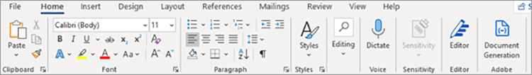

# Création d’un accord de confidentialité


Les organisations collaborent avec des contributeurs externes pour créer leurs services et produits. Une entente de non-divulgation (EDN) est un élément important de ces collaborations. Elle interdit à toutes les parties de divulguer des informations confidentielles susceptibles de nuire à l&#39;une ou l&#39;autre des entités.

Le format NDA le plus utilisé est un document PDF. Les organisations préparent un accord de confidentialité et l&#39;envoient à toutes les parties. Ensuite, une fois que tout le monde a signé, ils lancent le contrat. Dans une équipe à grande vitesse, la création manuelle du PDF ralentit la progression.

## Ce que vous pouvez apprendre

Ce tutoriel pratique explique comment créer un modèle d’accord de confidentialité Microsoft Word spécialisé pour votre société. Le complément gratuit d&#39;Adobe pour Microsoft Word, [Balisage de génération de document Adobe](https://opensource.adobe.com/pdftools-sdk-docs/docgen/latest/wordaddin.html#add-in-demo), insère des « balises » pour saisir les valeurs dynamiques. Découvrez comment transmettre les données JSON au modèle et créer un PDF dynamique. Le PDF qui en résulte peut être envoyé par e-mail ou affiché à vos collaborateurs dans leur navigateur, en fonction des exigences et des objectifs de votre entreprise. Pour suivre, vous avez juste besoin d’une petite expérience avec Node.js, JavaScript, Express.js, HTML et CSS.

## Ressources et API pertinentes

Avec [!DNL Adobe Acrobat Services], vous pouvez générer des documents de PDF à la volée à l&#39;aide de données dynamiques. [!DNL Acrobat Services] offre une suite d&#39;outils de PDF, notamment l&#39;API Adobe Document Generation pour automatiser la [création d&#39;un accord de confidentialité](https://www.adobe.io/apis/documentcloud/dcsdk/nda-creation.html).

* [API Document Generation Adobe](https://www.adobe.io/apis/documentcloud/dcsdk/doc-generation.html)

* [API Adobe Sign](https://www.adobe.io/apis/documentcloud/sign.html)

* [Balisage de génération de document Adobe](https://opensource.adobe.com/pdftools-sdk-docs/docgen/latest/wordaddin.html#add-in-demo)

* [Code de projet](https://github.com/afzaal-ahmad-zeeshan/adobe-docugen-sample)

* [[!DNL Acrobat Services] touches](https://opensource.adobe.com/pdftools-sdk-docs/release/latest/index.html#getcred)

## Création du modèle JSON

Le modèle Microsoft Word dépend du modèle JSON, vous devez donc d’abord le créer. Pour ce tutoriel, vous utilisez une structure JSON de base qui contient des détails sur la société, tels que les coordonnées.

```
{
"vendor": {
"companyName": "GlobalCorp",
"street": "123 Any Street",
"street2": "",
"city":"Anywhere",
"state":"CA",
"primaryContact": {
"firstName":"John",
"lastName":"Doe",
"email":"john-doe@example.com",
"phone":"123-456-7890"
}
},
"authorizedSigner": {
"firstName": "Sarah",
"lastName": "Rose",
"email": "sarah@example.com",
"phone":"555-555-1234"
}
}
```

Utilisez cette structure dans Microsoft Word pour générer un modèle. Ces données peuvent provenir de n’importe quelle source de données, à condition qu’elles soient au format JSON. Pour plus de simplicité, vous créez plusieurs fichiers dans l&#39;application Node.js, mais votre cas d&#39;utilisation peut nécessiter une connexion à la base de données pour extraire les informations sur le fournisseur.

## Création du modèle Microsoft Word

Créez le modèle NDA dans un document Microsoft Word. L’API Adobe PDF Services s’attend à ce que le document Microsoft Word contienne des balises où le service peut injecter des valeurs à partir de documents JSON. Bien que le modèle soit le même pour toutes les demandes d’Adobe, les données dynamiques dans JSON changent. Ces balises permettent de créer des documents PDF pour chaque fournisseur dans ce cas, à l’aide d’un modèle Microsoft Word unique et d’accélérer le processus en automatisant la génération des documents NDA.

Vous pouvez installer le [complément gratuit Document Generation Tagger](https://opensource.adobe.com/pdftools-sdk-docs/docgen/latest/wordaddin.html#add-in-demo) à Microsoft Word. Si vous faites partie d’une organisation, vous pouvez demander à votre administrateur Microsoft Office d’installer le complément gratuit pour tout le monde.

Une fois le complément installé, vous pouvez le retrouver dans l’onglet Accueil sous la catégorie Adobe. Pour ouvrir l&#39;onglet, sélectionnez **Génération du document** :



Dans l’onglet, vous pouvez charger l’exemple de document JSON. Ce document peut être un exemple, car vous ne l’utilisez que pour créer un modèle Microsoft Word.


Sélectionnez **Générer des balises** pour afficher les éléments que vous pouvez utiliser dans votre modèle. Voici les propriétés extraites de la structure JSON, prêtes à être utilisées dans le modèle :


Voici les fonctionnalités du champ `authorizedSigner`. Les autres champs sont enchaînés et vous pouvez développer l’affichage dans Microsoft Word. Le complément offre également des options de données avancées, telles que les tableaux, les listes, les valeurs calculées, etc.

## Création des balises

N&#39;hésitez pas à créer un modèle ou à importer un [modèle existant](https://www.adobe.io/apis/documentcloud/dcsdk/doc-generation.html#sample-blade) dans Microsoft Word. Une fois que vous avez configuré votre document, ajoutez des balises à chaque champ en cliquant sur les jetons correspondants dans le complément.

Le modèle suivant dans un fichier Microsoft Word :


Ce fichier contient plusieurs balises. Lorsque vous exécutez le programme, ces champs sont remplis avec les informations sur le fournisseur.

Document Generation Tagger s’intègre à l’API Adobe Sign. Grâce à cette intégration, vous pouvez créer automatiquement des balises de texte Sign afin que le document généré puisse être envoyé à Adobe Sign pour signature.

## Génération de l&#39;accord de confidentialité pour les fournisseurs

Dans l’exemple d’application, vous avez préparé des dossiers pour les entrées et les sorties. Comme indiqué précédemment, vous utilisez des fichiers JSON, de sorte qu’il existe deux fichiers pour afficher les fournisseurs disponibles dans le système. Les fichiers sont affichés dans un formulaire qui s’imprime dans le navigateur :

```
<h1><b>NDA</b>: Generate for vendor.</h1>
<hr />
<p>Following ({{files.length}}) vendors are ready, select to generate NDA and deliver for signature:</p>
<form method="POST">
<ul>
{{#each files }}
<li><input type="checkbox" name="vendor" value="{{this}}" id="file-{{@index}}" /> <label for="file-{{@index}}">{{this}}</label></li>
{{/each}}
</ul>
<input type="submit" value="Create NDA" />
</form>
```

Ce code génère l’interface utilisateur suivante dans le navigateur :


Lorsque l’administrateur sélectionne une personne, l’application utilise les services Adobe PDF pour générer l’accord de confidentialité en déplacement.

```
async function compileDocFile(json, inputFile, outputPdf) {
try {
// configurations
const credentials = adobe.Credentials
.serviceAccountCredentialsBuilder()
.fromFile("./src/pdftools-api-credentials.json")
.build();
// Capture the credential from app and show create the context
const executionContext = adobe.ExecutionContext.create(credentials);
// create the operation
const documentMerge = adobe.DocumentMerge,
documentMergeOptions = documentMerge.options,
options = new documentMergeOptions.DocumentMergeOptions(json, documentMergeOptions.OutputFormat.PDF);
const operation = documentMerge.Operation.createNew(options);
// Pass the content as input (stream)
const input = adobe.FileRef.createFromLocalFile(inputFile);
operation.setInput(input);
// Async create the PDF
let result = await operation.execute(executionContext);
await result.saveAsFile(outputPdf);
} catch (err) {
console.log('Exception encountered while executing operation', err);
}
}
```

Utilisez ce code à l’intérieur du routeur Express :

```
// Create one report and send it back
try {
console.log(`[INFO] generating the report...`);
const fileContent = fs.readFileSync(`./public/documents/raw/${vendor}`, 'utf-8');
const parsedObject = JSON.parse(fileContent);
await pdf.compileDocFile(parsedObject, `./public/documents/template/Adobe-NDA-Sample.docx`, `./public/documents/processed/output.pdf`);
console.log(`[INFO] sending the report...`);
res.status(200).render("preview", { page: 'nda', filename: 'output.pdf' });
} catch(error) {
console.log(`[ERROR] ${JSON.stringify(error)}`);
res.status(500).render("crash", { error: error });
}
```

Vous pouvez afficher [l&#39;exemple de code complet](https://github.com/afzaal-ahmad-zeeshan/adobe-docugen-sample) sur GitHub.

Ce code utilise un document JSON et le modèle Microsoft Word dans l&#39;appel API au SDK [!DNL Adobe Acrobat Services]. Dans la réponse, vous recevez la sortie et l’enregistrez dans le système de fichiers de l’application. Vous pouvez transférer le document généré à vos clients par e-mail ou leur afficher un aperçu dans le navigateur à l&#39;aide de l&#39;[API Adobe PDF Embed](https://www.adobe.io/apis/documentcloud/dcsdk/pdf-embed.html) gratuite.

Cet appel crée le document NDA suivant :


Les API [!DNL Adobe Acrobat Services] insèrent du contenu pour créer un document de PDF. Sans ces outils, vous devrez peut-être écrire le code pour traiter les documents Office et travailler avec des formats de fichiers Raw PDF. Avec l’aide des services Adobe PDF, vous pouvez effectuer toutes ces étapes avec un seul appel API.

Utilisez désormais l&#39;[API Adobe Sign](https://www.adobe.io/apis/documentcloud/sign.html) pour demander des signatures sur les avis de confidentialité et remettre le document final signé à toutes les parties. Adobe Sign vous avertit de l&#39;[utilisation d&#39;un webhook](https://www.adobe.io/apis/documentcloud/sign/docs.html#!adobedocs/adobe-sign/master/webhooks.md). À l’aide de ce webhook, vous pouvez récupérer l’état de l’accord de confidentialité.

Pour une explication plus détaillée du processus d&#39;Adobe Sign, [consultez la documentation](https://www.adobe.io/apis/documentcloud/sign/docs.html) ou lisez cet article de blog détaillé.

## Marche à suivre

Dans ce tutoriel pratique, le Baliseur de génération de documents Adobe a été utilisé pour générer dynamiquement des documents de PDF à l’aide de modèles Microsoft Word et de fichiers de données JSON. Le complément a permis de [créer automatiquement des avis de conformité](https://www.adobe.io/apis/documentcloud/dcsdk/nda-creation.html) personnalisés pour chaque partie, puis de recueillir des signatures à l’aide de l’API Sign.

Vous pouvez utiliser ces techniques pour créer dynamiquement vos propres avis de confidentialité ou d’autres documents, ce qui permet à votre équipe de se concentrer sur un travail productif. Explorez [[!DNL Adobe Acrobat Services]](https://www.adobe.io/apis/documentcloud/dcsdk/pdf-tools.html) pour trouver des API et des SDK pour la langue et le runtime de votre choix afin de pouvoir ajouter des fonctions de PDF directement à vos applications pour créer rapidement des documents de PDF. [Commencez](https://www.adobe.io/apis/documentcloud/dcsdk/gettingstarted.html) avec un essai gratuit de six mois, puis
[paiement à l&#39;utilisation](https://www.adobe.io/apis/documentcloud/dcsdk/pdf-pricing.html) pour seulement 0,05 $ par transaction de document.
