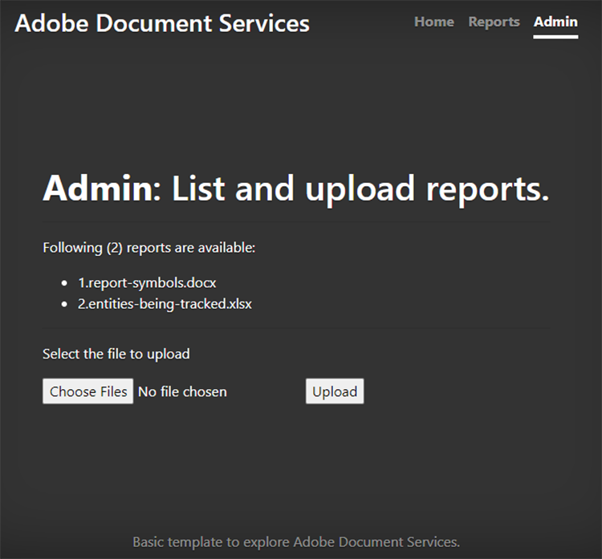

# Création et modification de rapports


Les secteurs de la finance, de l’éducation, du marketing et autres utilisent les PDF pour partager des données avec leurs clients et parties prenantes. Les PDF facilitent le partage de documents riches, avec des tableaux, des graphiques et du contenu interactif, dans un format accessible à tous. Les API [!DNL Adobe Acrobat Services] aident ces sociétés à générer des rapports de PDF partageables à partir de Microsoft Word, Microsoft Excel, de graphiques et d’autres formats de documents divers.

Supposons que vous [teniez une entreprise de suivi des réseaux sociaux](https://www.adobe.io/apis/documentcloud/dcsdk/on-demand-report-creation.html). Vos clients se connectent à une partie de votre site protégée par un mot de passe pour consulter leurs analyses de campagne. Ils veulent souvent partager ces statistiques avec leurs dirigeants, leurs actionnaires, leurs donateurs ou d’autres parties prenantes. Les documents téléchargeables du PDF sont un excellent moyen pour vos clients de partager des chiffres, des graphiques, etc.

En incorporant l&#39;[API PDF Services](https://www.adobe.io/apis/documentcloud/dcsdk/pdf-tools.html) à votre site Web, vous pouvez générer des rapports de PDF où que vous soyez pour chaque client. Vous pouvez créer des mots de PDF, puis les regrouper en un seul rapport pratique que vos clients pourront télécharger et transmettre à leurs parties prenantes.

## Ce que vous pouvez apprendre

Dans ce tutoriel pratique, découvrez comment utiliser le SDK des services PDF dans un environnement Node.js et Express.js (avec seulement quelques éléments JavaScript, HTML et CSS) pour ajouter rapidement et facilement des fonctionnalités orientées PDF à un site web. Ce site Web dispose d’une page où les administrateurs chargent les rapports, d’une zone où les clients affichent une liste des rapports disponibles et sélectionnent les documents à convertir en PDF, et de points d’entrée utiles pour télécharger les PDF générés par le système.

## Ressources et API pertinentes

* [API PDF Services](https://opensource.adobe.com/pdftools-sdk-docs/release/latest/index.html)

* [API PDF Embed](https://www.adobe.com/devnet-docs/dcsdk_io/viewSDK/index.html)

## Tableau de bord des rapports de campagne pour les clients

>[!NOTE]
>
>Ce tutoriel ne traite pas des bonnes pratiques de Node.js ni de la sécurisation de vos applications web. Certaines zones du site Web sont accessibles au public et la dénomination des documents peut ne pas être conviviale pour la production. Pour discuter de la meilleure approche possible pour concevoir un système comme celui-ci, consultez vos architectes et ingénieurs.

Vous disposez ici d’une application web Express.js de base comprenant une zone Rapports client et une section Administrateur. Cette application peut présenter des rapports pour des campagnes sur les médias sociaux. Par exemple, il peut indiquer le nombre de clics sur une publicité.


Vous pouvez télécharger ce projet à partir du [référentiel GitHub](https://github.com/afzaal-ahmad-zeeshan/express-adobe-pdf-tools).

Voyons maintenant comment publier les rapports.

## Chargement des rapports

Pour simplifier, utilisez uniquement le chargement et le traitement basés sur le système de fichiers ici. Dans Express.js, vous pouvez utiliser le module fs pour répertorier tous les fichiers disponibles dans un répertoire.

Sur la même page, activez l’option permettant à l’administrateur de télécharger des fichiers de rapport sur le serveur afin que les clients puissent les consulter. Ces fichiers peuvent être dans de nombreux formats différents, tels que Microsoft Word, Microsoft Excel, HTML et [d&#39;autres formats de données]https://opensource.adobe.com/pdftools-sdk-docs/release/latest/howtos.html#create-a-pdf), y compris des fichiers graphiques. La page d’administration se présente comme suit :



>[!NOTE]
>
>Protégez vos URL par mot de passe ou utilisez le pack de passeport de npm pour sécuriser votre application derrière la couche d’authentification et d’autorisation.

Lorsque l’administrateur sélectionne et télécharge un fichier, celui-ci est déplacé vers un référentiel public où d’autres personnes peuvent y accéder. Utilisez le même référentiel pour publier des documents à partir de la page d’administration et répertorier les rapports marketing disponibles pour les clients. Ce code est :

```
router.get('/', (req, res) => {
try {
let files = fs.readdirSync('./public/documents/raw') // read the files
res.status(200).render("reports", { page: 'reports', files: files });
} catch (error) {
res.status(500).render("crash", { error: error });
}
});
```

Ce code répertorie tous les fichiers et affiche une vue de la liste des fichiers.

## Sélection de rapports

Du côté de l’utilisateur, vous disposez d’un formulaire permettant aux clients de sélectionner les documents qu’ils souhaitent inclure dans leur rapport de campagne sur les réseaux sociaux. Pour plus de simplicité, sur votre page d’exemple, affichez uniquement le nom du document et une case à cocher pour sélectionner le document. Les clients peuvent sélectionner un ou plusieurs rapports à regrouper dans un seul document de PDF.

Pour une interface utilisateur plus avancée, vous pouvez également afficher un aperçu du rapport ici.


## Génération d’un rapport de PDF

Utilisez le SDK des services de PDF pour créer les rapports de PDF à partir de vos entrées de données. Les données (comme illustré dans les captures d’écran ci-dessus) peuvent provenir de divers formats de données tels que Microsoft Word, Microsoft Excel, HTML, des graphiques, etc. Commencez par installer le package npm pour le SDK des services PDF.

```
$ npm install --save @adobe/documentservices-pdftools-node-sdk
```

Avant de commencer, vous devez disposer d&#39;identifiants d&#39;API [Adobe gratuit](https://opensource.adobe.com/pdftools-sdk-docs/release/latest/index.html#getcred). Utilisez votre compte [!DNL Acrobat Services] [gratuit pendant six mois, puis prépayé](https://www.adobe.io/apis/documentcloud/dcsdk/pdf-pricing.html) pour seulement \$0,05 par transaction de document.

Téléchargez le fichier d’archive et extrayez le fichier JSON pour obtenir les informations d’identification et la clé privée. Dans le projet d’exemple, placez le fichier dans le répertoire src.


Maintenant que les informations d’identification sont configurées, vous pouvez écrire la tâche de conversion du PDF. Pour cette démonstration, vous devez effectuer deux opérations dans l’application :

* Conversion de documents bruts en fichiers de PDF

* Combinaison de plusieurs fichiers de PDF dans un seul rapport

La procédure globale est similaire pour exécuter n’importe quelle opération. La seule différence est le service que vous utilisez. Dans le code ci-dessous, vous convertissez le document brut en fichier PDF :

```
async function createPdf(rawFile, outputPdf) {
try {
// configurations
const credentials = adobe.Credentials
.serviceAccountCredentialsBuilder()
.fromFile("./src/pdftools-api-credentials.json")
.build();
// Capture the credential from app and show create the context
const executionContext = adobe.ExecutionContext.create(credentials),
operation = adobe.CreatePDF.Operation.createNew();
// Pass the content as input (stream)
const input = adobe.FileRef.createFromLocalFile(rawFile);
operation.setInput(input);
// Async create the PDF
let result = await operation.execute(executionContext);
await result.saveAsFile(outputPdf);
} catch (err) {
console.log('Exception encountered while executing operation', err);
}
}
```

Dans le code ci-dessus, vous lisez les informations d’identification et créez le contexte d’exécution. Le SDK PDF Services nécessite le contexte d’exécution pour authentifier vos demandes.

Ensuite, exécutez l’opération Créer un PDF qui convertit les documents bruts au format PDF. Enfin, vous utilisez le paramètre `outputPdf` pour copier le rapport du PDF. Dans l’exemple de code, vous trouverez ce code sous le fichier src/helpers/pdf.js. Plus loin dans ce tutoriel, vous allez importer le module PDF et appeler cette méthode.

Comme indiqué dans la section précédente, vos clients peuvent accéder à la page suivante pour sélectionner les rapports qu’ils souhaitent convertir en PDF :


Lorsqu’un client sélectionne un ou plusieurs de ces rapports, vous créez le fichier de PDF.

Tout d’abord, voyons un fichier de PDF unique en action. Lorsque l’utilisateur sélectionne un seul rapport, il vous suffit de le convertir en PDF et de fournir le lien de téléchargement.

```
try {
console.log(`[INFO] generating the report...`);
await pdf.createPdf(`./public/documents/raw/${reports}`, `./public/documents/processed/output.pdf`);
console.log(`[INFO] sending the report...`);
res.status(200).render("download", { page: 'reports', filename: 'output.pdf' });
} catch(error) {
console.log(`[ERROR] ${JSON.stringify(error)}`);
res.status(500).render("crash", { error: error });
}
```

Ce code crée un rapport et partage l’URL de téléchargement avec le client. Voici la page web de sortie :


Et voici le PDF de sortie :


Les clients peuvent sélectionner plusieurs fichiers pour générer un rapport combiné. Lorsque le client sélectionne plusieurs documents, vous effectuez deux opérations : la première consiste à créer un PDF partiel pour chaque document et la seconde à les regrouper dans un seul rapport de PDF.

```
async function combinePdf(pdfs, outputPdf) {
try {
// configurations
const credentials = adobe.Credentials
.serviceAccountCredentialsBuilder()
.fromFile("./src/pdftools-api-credentials.json")
.build();
// Capture the credential from app and show create the context
const executionContext = adobe.ExecutionContext.create(credentials),
operation = adobe.CombineFiles.Operation.createNew();
// Pass the PDF content as input (stream)
for (let pdf of pdfs) {
const source = adobe.FileRef.createFromLocalFile(pdf);
operation.addInput(source);
}
// Async create the PDF
let result = await operation.execute(executionContext);
await result.saveAsFile(outputPdf);
} catch (err) {
console.log('Exception encountered while executing operation', err);
}
}
```

Cette méthode est disponible sous le fichier src/helpers/pdf.js et exposée dans le cadre de l’exportation du module.

```
try {
console.log(`[INFO] creating a batch report...`);
// Create a batch report and send it back
let partials = [];
for (let index in reports) {
const name = `partial-${index}-${reports[index]}`;
await pdf.createPdf(`./public/documents/raw/${reports[index]}`, `./public/documents/processed/${name}`);
partials.push(`./public/documents/processed/${name.replace('docx', 'pdf').replace('xlsx', 'pdf')}`);
}
await pdf.combinePdf(partials, `./public/documents/processed/output.pdf`);
console.log(`[INFO] sending the combined report...`);
res.status(200).render("download", { page: 'reports', filename: 'output.pdf' });
} catch(error) {
console.log(`[ERROR] ${JSON.stringify(error)}`);
res.status(500).render("crash", { error: error });
}
```

Ce code génère un rapport compilé pour plusieurs documents d’entrée. La seule fonction ajoutée est la méthode `combinePdf` qui prend une liste de noms de chemin d&#39;accès de fichier de PDF et renvoie un seul PDF de sortie.

Désormais, les clients de votre tableau de bord de médias sociaux peuvent sélectionner des rapports pertinents à partir de leur compte et les télécharger en tant que PDF pratique. Ce tableau de bord leur permet de montrer à la direction et aux autres parties prenantes le succès de leurs campagnes avec des données, des tableaux et des graphiques dans un format universellement facile à ouvrir.

## Marche à suivre

Ce tutoriel pratique explique comment utiliser l’API des services de PDF pour aider les clients à télécharger des rapports pertinents sous forme de PDF faciles à partager. Vous avez créé une application Node.js pour présenter la puissance de l’API des services de PDF pour les services de rapport et de lecture des PDF. L’application a montré à vos clients comment télécharger un seul document de rapport ou combiner et fusionner plusieurs documents dans un seul rapport de PDF.

Cette application basée sur l&#39;Adobe aide vos [clients des tableaux de bord des médias sociaux](https://www.adobe.io/apis/documentcloud/dcsdk/on-demand-report-creation.html) à obtenir et à partager les rapports dont ils ont besoin, sans se soucier du fait que les destinataires disposent tous de Microsoft Office ou d&#39;un autre logiciel installé sur leur appareil. Vous pouvez utiliser les mêmes techniques dans votre propre application pour aider vos utilisateurs à afficher, combiner et télécharger des documents. Vous pouvez également consulter les nombreuses autres API d’Adobe pour ajouter et suivre les signatures et bien plus encore.

Pour commencer, réclamez votre compte gratuit [[!DNL Adobe Acrobat Services]](https://www.adobe.io/apis/documentcloud/dcsdk/gettingstarted.html), puis créez des expériences de création de rapports attrayantes pour vos employés et vos clients. Profitez de votre compte gratuitement pendant six mois, puis [payez au fur et à mesure](https://www.adobe.io/apis/documentcloud/dcsdk/pdf-pricing.html) à mesure que vos efforts de marketing se développent, à raison de 0,05 $ par transaction de document.
